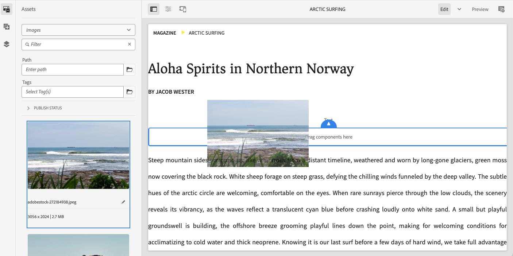

# Metoder för att skapa innehåll i AEM {#authoring-methods}

Lär dig olika sätt att skapa innehåll i AEM, hur de skiljer sig åt och när du kan använda det ena över det andra.

## AEM flexibla redigeringsmöjligheter {#authoring-flexibility}

AEM as a Cloud Service erbjuder flera olika redigeringsprogram för att redigera olika typer av innehåll och har stöd för olika redigeringsanvändningsområden.

* [WYSIWYG-redigering med den universella redigeraren](#universal-editor) - Den universella redigeraren är ett modernt användargränssnitt där du kan skapa AEM-innehåll på ett innehållsmedvetet sätt och som är tillgängligt för AEM-projekt som utnyttjar Edge Delivery Services.
* [WYSIWYG-redigering med sidredigeraren](#page-editor) - Sidredigeraren är den klassiska redigeraren för redigering av innehåll i AEM, som har testats och är betrodd för tusentals webbplatser.
* [Dokumentbaserad redigering](#document-based) - Om du använder Edge Delivery-tjänster kan du välja att redigera ditt innehåll som vanliga dokument som Microsoft Word eller Google Docs helt utanför AEM-konsoler.
* [AEM Content Fragment Editor](#cf-editor) - Det här är den valfria redigeraren för att skapa rubrikfritt innehåll.

På grund av AEM integrerade och skalbara natur kan dessa metoder användas exklusivt eller i kombination med varandra beroende på projektets behov.

Kontakta systemadministratören eller projektledaren om du är osäker på vilka redigeringsalternativ som är tillgängliga för dig eller om du vill utforska nya alternativ för att skapa ditt innehåll.

## WYSIWYG Authoring using the Universal Editor {#universal-editor}

Universal Editor är ett modernt användargränssnitt som gör att du kan skapa AEM-innehåll på ett innehållsmedvetet sätt och som är det första valet för AEM-projekt som utnyttjar Edge Delivery Services.

Den universella redigeraren nås via Sites-konsolen i AEM, men den kraftfulla och innehållsmedvetna flexibiliteten gör att du inte bara kan skapa ditt AEM-innehåll utan även korrekt instrumenterat externt innehåll.

Mer information om den universella redigeraren finns i dokumentet [Skapa innehåll med den universella redigeraren](/help/sites-cloud/authoring/universal-editor/authoring.md).

## WYSIWYG Authoring using the Page Editor {#page-editor}

Detta är den klassiska redigeraren för framtagning av innehåll i traditionella AEM-projekt, som har testats och betygsatts för tusentals eller tusentals webbplatser.

AEM sidredigerare utgör en integrerad miljö för att skapa innehåll med hjälp av ett WYSIWYG-gränssnitt (what-you-see-is-what-you-get). Dra-och-släpp fördefinierade komponenter för att skapa sidan och redigera innehållet på plats.

Mer information om sidredigeraren i AEM finns i dokumentet [Sidredigeraren i AEM](/help/sites-cloud/authoring/page-editor/introduction.md).

## Dokumentbaserad redigering  {#document-based}

Om du använder Edge Delivery tjänster kan du välja att redigera ditt innehåll som konventionella dokument som Microsoft Word eller Google Docs helt utanför [AEM **Sites** -konsolen](/help/sites-cloud/authoring/sites-console/introduction.md).

Med dokumentbaserad redigering kan man använda de verktyg man redan känner till och ändå dra nytta av AEM Edge Delivery Services snabbhet och prestanda för att publicera sitt material. Dokumentbaserad redigering kräver ingen användning av AEM-konsolen.

Mer information om dokumentbaserad redigering finns i [Skapa och publicera innehåll](/help/edge/docs/authoring.md).

## AEM Content Fragment Editor {#cf-editor}

AEM Content Fragment Editor är den självklara redigeraren för att skapa rubrikfritt innehåll.

AEM Content Fragment Editor har ett tydligt gränssnitt för att skapa och hantera strukturerat innehåll, idealiskt för headless-leverans.

Mer information om AEM Content Fragment Editor finns i dokumenten [Hantera innehållsfragment](/help/sites-cloud/administering/content-fragments/managing.md) och [Skapa innehållsfragment](/help/sites-cloud/administering/content-fragments/managing.md).

>[!NOTE]
>
>Redigeraren *new* som markeras i det här avsnittet är inte tillgänglig vid lokal utveckling för AEM as a Cloud Service.
>
>[*Originalredigeraren* för innehållsfragment](/help/assets/content-fragments/content-fragments-variations.md) är också tillgänglig.
