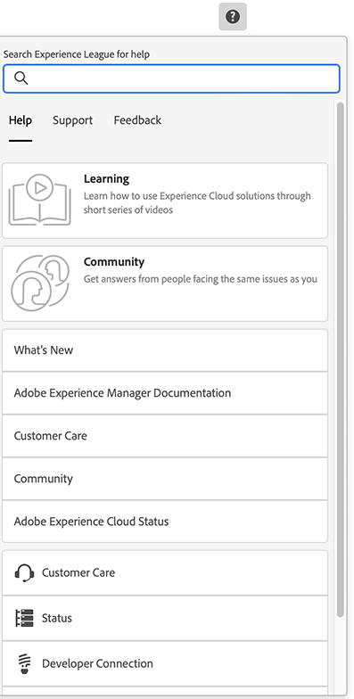

# Grundläggande hantering {#basic-handling}

Det här dokumentet är utformat för att ge en översikt över grundläggande hantering när du använder AEM redigeringsmiljö.

>[!TIP]
>
>Kortkommandon är tillgängliga i hela AEM. I synnerhet när [med webbplatskonsolen](/help/sites-cloud/authoring/sites-console/keyboard-shortcuts.md) och [sidredigeraren](/help/sites-cloud/authoring/page-editor/keyboard-shortcuts.md).

{{edge-delivery-authoring}}

## Ett pekaktiverat användargränssnitt {#a-touch-enabled-ui}

AEM användargränssnitt har aktiverats för beröring. Med ett pekaktiverat gränssnitt kan du använda touchfunktioner för att interagera med programmet med gester som att trycka, trycka och hålla ned och svepa. Eftersom användargränssnittet för AEM är pekaktiverat kan du använda pekgester på enheter med pekskärm som mobiltelefonen eller surfplattan. Det finns dock även musåtgärder på en traditionell stationär enhet, vilket ger dig flexibilitet när det gäller hur du väljer att skapa ditt innehåll.

## Steg 1 {#first-steps}

Omedelbart efter att du loggat in kommer du till [Navigeringspanelen](#navigation-panel). Om du väljer något av alternativen öppnas respektive konsol.

För att få en bättre förståelse för AEM basanvändning är det här dokumentet baserat på **Webbplatser** konsol. Välj på **Webbplatser** för att komma igång.

## Produktnavigering {#product-navigation}

När en användare först kommer åt en konsol startas en produktnavigeringssjälvstudie. Ta en minut att välja igenom och få en bra översikt över den grundläggande hanteringen av AEM.

Välj **Nästa** för att gå vidare till nästa sida i översikten. Välj **Stäng** eller välj utanför den översiktsdialogruta som du vill stänga.

Översikten startas om nästa gång du öppnar en konsol, såvida du inte antingen visar alla bilder eller markerar alternativet **Visa inte det här igen**.

## Global navigering {#global-navigation}

Du kan navigera mellan konsolerna med den globala navigeringspanelen. Detta aktiveras som en listruta i helskärmsläge när du väljer **Adobe Experience Manager** i skärmens övre vänstra hörn.

Du kan stänga den globala navigeringspanelen genom att klicka eller trycka på **Stäng** för att återgå till din tidigare plats.

Global navigering har två paneler, som representeras av ikoner i skärmens vänstra marginal:

* **[Navigering](#navigation-panel)** - Representeras av en kompass och standardpanelen när du loggar in på AEM
* **[verktyg](#tools-panel)** - Representeras av en hammare

De alternativ som är tillgängliga på dessa paneler beskrivs nedan.

### Navigeringspanel {#navigation-panel}

The **Navigering** panel:

Titeln på webbläsarfliken uppdateras för att återspegla din position när du navigerar genom konsolerna och innehållet.

Följande konsoler finns i Navigation:

| Konsol | Syfte |
|---|---|
| Projekt | Med projektkonsolen får du direktåtkomst till dina projekt. [Projekt är virtuella kontrollpaneler](/help/sites-cloud/authoring/projects/overview.md) som kan användas för att bygga ett team. Sedan kan ni ge teamet tillgång till resurser, arbetsflöden och uppgifter och på så sätt låta andra arbeta mot ett gemensamt mål. |
| Sites | [Konsolen Platser](/help/sites-cloud/authoring/sites-console/introduction.md) gör att du kan skapa, visa och hantera webbplatser som körs på AEM. Med den här konsolen kan du skapa, redigera, kopiera, flytta och ta bort sidor, starta arbetsflöden och publicera sidor. |
| Upplevelsefragment | An [Experience Fragment](/help/sites-cloud/authoring/fragments/content-fragments.md) är en fristående upplevelse som kan återanvändas i olika kanaler och som har variationer, vilket besparar dig problem med att kopiera och klistra in upplevelser eller delar av upplevelser. |
| Assets | Med Resurskonsolen kan du importera och hantera [digitalt material som bilder, videoklipp, dokument och ljudfiler](/help/assets/overview.md). Dessa resurser kan sedan användas av alla webbplatser som körs på samma AEM. Du kan också skapa och hantera [Innehållsfragment](/help/assets/content-fragments/content-fragments.md) från Assets-konsolen. |
| Personalisering | Den här konsolen innehåller ett ramverk med verktyg för [skapa riktat innehåll och presentera personaliserade upplevelser](/help/sites-cloud/authoring/personalization/overview.md). |
| Innehållsfragment | [Innehållsfragment](/help/sites-cloud/administering/content-fragments/overview.md) Med kan du utforma, skapa, strukturera och publicera sidoberoende innehåll. De gör att du kan ta fram strukturerat innehåll som är klart för användning på flera platser/i flera kanaler, och som är idealiskt för både sidutveckling och headless-leverans. |

## Panelen Verktyg {#tools-panel}

I **verktyg** Panelen har en sidopanel som innehåller ett urval kategorier, som grupperar liknande konsoler. The **verktyg** -konsoler ger tillgång till flera specialiserade verktyg och konsoler som hjälper dig att administrera dina webbplatser, digitala resurser och andra aspekter av innehållsdatabasen. <!--The [Tools consoles](/help/sites-administering/tools-consoles.md) provide access to several specialized tools and consoles that help you administer your websites, digital assets, and other aspects of your content repository.-->

## Sidhuvudet {#the-header}

Rubriken visas alltid längst upp på skärmen. De flesta alternativen i huvudet är desamma oavsett var du befinner dig i systemet, men vissa är sammanhangsspecifika.

* [Global navigering](#global-navigation) - Välj **Adobe Experience Manager** för att navigera mellan konsoler.

  

* Feedback

  

* Din IMS-organisation - välj att ändra om det behövs.

* [Lösningar](https://www.adobe.com/experience-cloud.html) - Välj detta för att få tillgång till dina andra Adobe-lösningar.

  

* [Sök](/help/sites-cloud/authoring/search.md) - Du kan även använda [kortkommando](/help/sites-cloud/authoring/sites-console/keyboard-shortcuts.md) `/` (snedstreck) för att starta sökning från en konsol.

  

* [Hjälp](#accessing-help)

  

* [Meddelanden](/help/sites-cloud/authoring/inbox.md) - Den här ikonen är märkt med antalet för närvarande tilldelade ofullständiga meddelanden.

  

* [Användaregenskaper](/help/sites-cloud/authoring/account-environment.md) - Välj det här om du vill ändra dina användarinställningar.

  

## Få hjälp {#accessing-help}

Det finns ett antal hjälpresurser och några sätt att komma åt dem.

* **Verktygsfält** - Beroende på var du befinner dig **Hjälp** ikon öppnar lämpliga resurser:

  

* **Konsol** - Första gången du navigerar i systemet, [en serie bilder AEM navigering](#product-navigation).

  

* **Page Editor** - Första gången du redigerar en sida innehåller en serie bilder en sidredigerare.

  

   * Navigera i den här översikten precis som i [produktnavigering - översikt](#product-navigation) vid första åtkomst till en konsol.
   * Från [**Sidinformation** meny som du kan välja **Hjälp**](#accessing-help) för att visa detta igen när som helst.

* **Verktygskonsol** - Från **verktyg** konsolen som du också kan komma åt externt **Resurs**:

   * **Dokumentation** - Visa dokumentationen för Web Experience Management
   * **Resurser för utvecklare** - Resurser och nedladdningar för utvecklare

>[!TIP]
>
>Du kan när som helst få tillgång till en översikt över kortkommandon via snabbtangenten `?` (frågetecken) i en konsol.
>
>En översikt över alla kortkommandon finns i följande dokumentation:
>
>* [Kortkommandon för redigering av sidor](/help/sites-cloud/authoring/page-editor/keyboard-shortcuts.md)
>* [Kortkommandon för konsoler](/help/sites-cloud/authoring/sites-console/keyboard-shortcuts.md)
