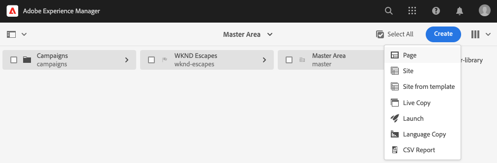
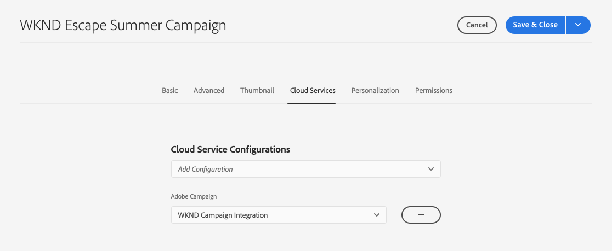
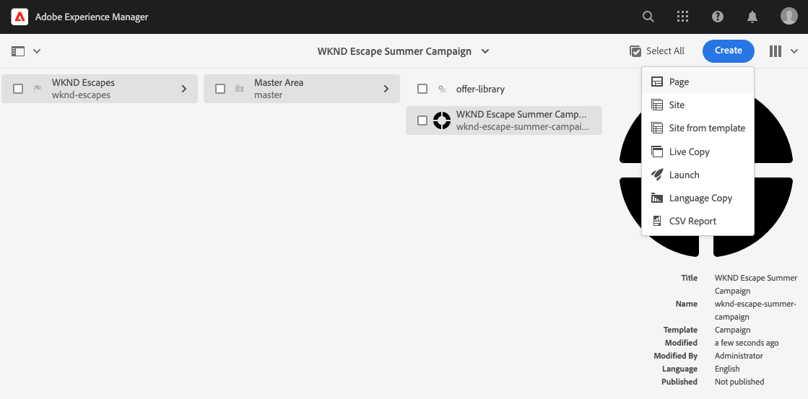
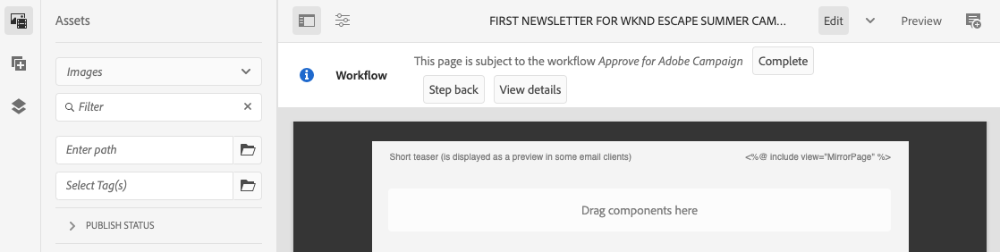
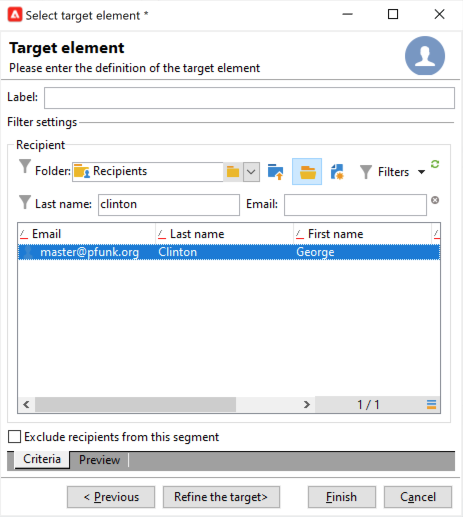

# Skapa kampanjnyhetsbrev med AEM {#creating-newsletters}

I det här dokumentet får du lära dig att använda AEM as a Cloud Service för att skapa nyhetsbrev som kan skickas med Adobe Campaign Classic.

Genom att utnyttja integreringen mellan AEM as a Cloud Service och Adobe Campaign Classic kan du skapa nyhetsbrev med AEM kraftfulla verktyg. När du sedan är redo att skicka nyhetsbrevet kan du använda Campaigns funktioner för mottagarhantering och distribution för att skicka det.

## Förutsättningar {#prerequisites}

Innan du kan skapa ett nyhetsbrev med AEM och skicka det med Campaign måste du först [integrera Adobe Campaign Classic och AEM as a Cloud Service.](/help/sites-cloud/integrating/integrating-campaign-classic.md)

## Skapar struktur för nyhetsbrev {#create-structure}

Innehåll i nyhetsbrev hanteras i AEM på ungefär samma sätt som du hanterar webbplatsinnehållet. Du börjar med att skapa en&quot;webbplats&quot; för ditt innehåll. På den här&quot;webbplatsen&quot; kan du samla in nyhetsbrev per varumärke.

1. Logga in i din AEM författarinstans.

1. Öppna **Webbplatser** konsol.

1. I en standardinstallation av AEM finns det en **Campaign** mapp. Markera den och klicka på **Skapa** och sedan **Sida**.

   

1. Välj **Varumärke** som webbplatsmall och klicka på **Nästa**.

   

1. Ange **Titel** och klicka **Skapa** och sedan **Klar**.

   

Nu har ni en grundläggande innehållsstruktur för att skapa era kampanjer.

## Skapa en kampanj {#create-campaign}

Nu när ni har en grundläggande innehållsstruktur för er kampanj kan ni skapa själva kampanjen. Kampanjen kommer att användas för att ordna eventuellt flera nyhetsbrev.

1. Använda [kolumnvy](/help/sites-cloud/authoring/getting-started/basic-handling.md#viewing-and-selecting-resources) i webbplatskonsolen väljer du det varumärke du tidigare skapade (i det här fallet **WKND Escapes**) och sedan markera **Överordnad område** som skapades automatiskt och sedan klickar du på **Skapa** och sedan **Sida**.

   

1. Välj **Campaign** som mall klickar du sedan på **Nästa** och **Klar**.

   

1. Ange **Titel** för kampanjen och klicka sedan på **Skapa** och **Klar**.

   

Nu finns det en kampanj där du kan skapa nyhetsbrev.

## Välja kampanjkonfiguration {#campaign-configuration}

AEM har stöd för flera integreringskonfigurationer. För den nya kampanjen måste du definiera vilka konfigurationer som ska användas för att skicka nyhetsbrevet.

1. Använda [kolumnvy](/help/sites-cloud/authoring/getting-started/basic-handling.md#viewing-and-selecting-resources) i webbplatskonsolen hittar du den kampanj du tidigare skapade (i det här fallet **WKND Escape, sommarkampanj**) och sedan markera den i kryssrutan och klicka sedan på **Egenskaper** i verktygsfältet.

   

1. I **Egenskaper** väljer du **Cloud Service** för att definiera den integration som ska användas med kampanjen.

   * Välj **Adobe Campaign** från **Cloud Service Configurations** nedrullningsbar lista.
   * Välj önskad Adobe Campaign-integrationskonfiguration i **Adobe Campaign** nedrullningsbar lista.
   * Klicka **Spara och stäng**.

   

Din kampanj är nu kopplad till er Adobe Campaign-integrering. Du kan skapa ett nyhetsbrev i AEM och skicka det med Adobe Campaign.

## Skapa ett nyhetsbrev {#create-newsletter}

Ni skapar och hanterar era nyhetsbrev under den struktur för kampanjinnehåll som ni redan har skapat och konfigurerat.

1. Använda [kolumnvy](/help/sites-cloud/authoring/getting-started/basic-handling.md#viewing-and-selecting-resources) i webbplatskonsolen letar du reda på kampanjen som du tidigare konfigurerade (i det här fallet **WKND Escape, sommarkampanj**), markera den och klicka sedan på **Skapa** och sedan **Sida**.

   

1. I guiden Skapa sida väljer du **Adobe Campaign Email (AC 6.1)** mall och klicka på **Nästa**.

   

1. För **Egenskaper** steg i guiden anger du **Titel** för nyhetsbrevet klickar du på **Skapa** och **Öppna**.

   

1. Redigera nyhetsbrevet precis som andra AEM.

Nu har du ett nyhetsbrev som du kan skicka med Adobe Campaign.

## Publicera nyhetsbrevet {#publishing-newsletter}

Du måste publicera nyhetsbrevet för att göra det tillgängligt för Adobe Campaign att skicka.

1. Använda [kolumnvy](/help/sites-cloud/authoring/getting-started/basic-handling.md#viewing-and-selecting-resources) i webbplatskonsolen kan du hitta det nyhetsbrev som du skapade tidigare (i det här fallet **Första nyhetsbrevet för WKND:s sommarkampanj**), markera den och klicka sedan på **Sidinformation** överst till vänster och klicka på **Publicera sida**.

1. Välj konfigurationen/konfigurationerna som sidan ska publiceras för och klicka på **Publicera**.

   

Nyhetsbrevsidan publiceras nu till den AEM publiceringsinstansen och visas i Adobe Campaign Classic. För att kunna välja programmet i Adobe Campaign måste det godkännas.

1. Klicka på **Sidinformation** knappen för nyhetsbrevet ännu en gång och välj **Starta arbetsflöde**.

1. Välj **Godkänn för Adobe Campaign** som arbetsflödesmodell (ange en beskrivning om du vill) och klicka på **Starta arbetsflöde** -knappen.

   

1. En banderoll visas högst upp i sidredigeraren för nyhetsbrevet och visar nästa steg i godkännandeprocessen. Klicka **Slutförd**.

   

1. I **Slutför arbetsuppgift** dialogruta, välja **Granskning av nyhetsbrev (administratör)** i **Nästa steg** nedrullningsbar lista och klicka på **OK** -knappen.

   

1. Klicka en gång till på den banderoll som visas högst upp i sidredigeraren för nyhetsbrev **Slutförd**.

1. I **Slutför arbetsuppgift** dialogruta, välja **Godkännande av nyhetsbrev** i **Nästa steg** nedrullningsbar lista och klicka på **OK** -knappen.

   

1. När dialogrutan stängs försvinner den banderoll som visades högst upp i redigeraren för nyhetsbrevets sida eftersom arbetsflödet för godkännande är slutfört.

Nyhetsbrevet har nu publicerats i AEM och godkänts för användning i Adobe Campaign.

>[!TIP]
>
>Arbetsflödesstegen som beskrivs är förenklade här för att illustrera processen. I ett normalt arbetsflöde är det normalt olika roller att skapa nyhetsbrevet och godkänna det
>
>Se dokumentet [Arbeta med arbetsflöden](/help/sites-cloud/authoring/workflows/overview.md) om du vill ha mer information om hur du använder arbetsflöden.

## Skapa en mottagare {#creating-recipient}

För att kunna skicka nyhetsbrevet som du skapade i AEM måste du först definiera dina mottagare i Adobe Campaign Classic.

1. Logga in på Adobe Campaign Classic med klientkonsolen.

1. Välj **verktyg** -> **Utforskaren** på menyraden.

1. I Utforskaren går du till **Profiler och mål** -> **Mottagare** nod.

   

1. Klicka på **Nytt** i verktygsfältet och ange information om mottagaren.

   * Förnamn
   * Efternamn
   * E-postadress

1. Klicka **Spara**.

Nu har du en mottagare som du kan skicka nyhetsbrevet till med Adobe Campaign Classic.

## Skapa en e-postleverans {#create-delivery}

Det sista steget är att skicka ut det nyhetsbrev du skapade i AEM till mottagaren du lade till i Adobe Campaign Classic.

1. Logga in på Adobe Campaign Classic med klientkonsolen.

1. Välj **verktyg** -> **Utforskaren** på menyraden.

1. I Utforskaren går du till **Campaign Management** -> **Leveranser** nod och klicka **Nytt**.

   

1. I **Leverans** dialogruta, välja **E-postleverans med AEM** som **Leveransmall** i listrutan och klicka på **Fortsätt**.

   

1. I **E-postparametrar** klickar du på **Från** och ange avsändarens information och klicka på **OK**.

   * Avsändarens adress
   * Från fält

   

1. I **E-postparametrar** klickar du på **Till** länk för att öppna **Välj mål** och sedan klicka **Lägg till**.

   

1. I **Markera målelement** dialogruta, välja **En mottagare** och klicka **Nästa**.

   

1. Använd filtren för att välja den mottagare du vill använda [tidigare](#creating-recipient) och klicka **Slutför**.

   

1. Tillbaka i **Välj mål** dialogruta, klicka **OK**.

1. I leveransfönstret klickar du på **Synkronisera**.

   

1. I **Synkronisera med AEM innehåll** väljer du nyhetsbrevet som du skapade tidigare från listan och klickar på **OK**.

1. E-postinnehållet i Adobe Campaign synkroniseras med det nyhetsbrev som du skapade i AEM.

   * Klicka **Uppdatera innehåll** om innehållet inte läses in automatiskt.

1. Klicka **Skicka** för att skicka e-postmeddelandet.

1. I **Skicka till huvudleveransmål** dialogruta, välja **Leverera så snart som möjligt** och sedan klicka **Analysera**.

   

1. Analyssteget bygger leveransen och kombinerar innehållet med mottagarna. Nu när leveransen är klar klickar du på **Bekräfta leverans** för att skicka e-postmeddelandet. Klicka **Ja** för att bekräfta.

1. Leveransen har startat. Klicka **Stäng**.

   

1. Klicka **Spara** för att spara på leveransen.

Ditt nyhetsbrev har skickats!

>[!TIP]
>
>I det här exemplet visades en förenklad leverans av ett nyhetsbrev till en mottagare. En normal leverans innehåller förstås många olika mottagare, vilket Adobe Campaign gör enkelt att hantera. Se [Adobe Campaign Classic-dokumentation](https://experienceleague.adobe.com/docs/campaign-classic.html) för mer information om leverans och hantering av mottagare.
