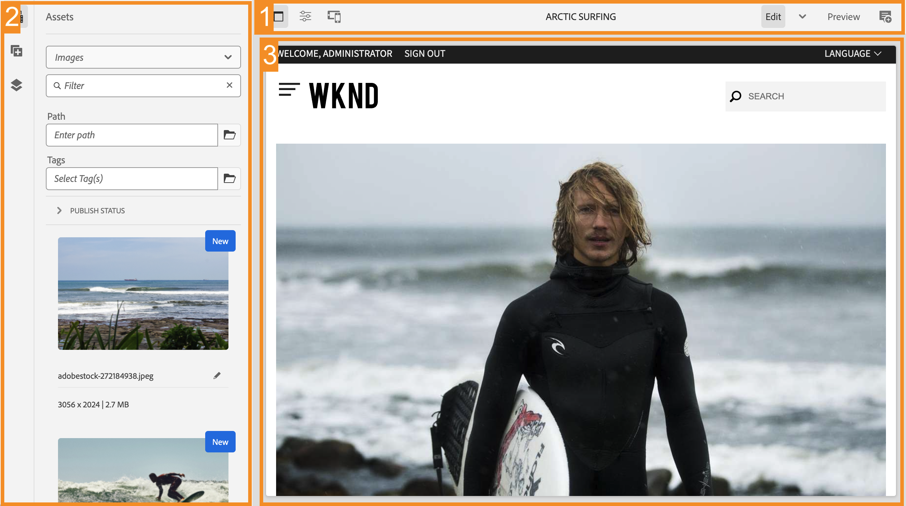

# AEM sidredigeraren {#editing-page-content}

När sidan har skapats i [**Webbplatser** konsol,](/help/sites-cloud/authoring/sites-console/introduction.md) Du kan redigera innehållet på sidan med AEM sidredigeraren, ett kraftfullt verktyg för att skapa innehåll.

>[!NOTE]
>
>När du redigerar en sida i [**Webbplatser** konsol,](/help/sites-cloud/authoring/sites-console/introduction.md) konsolen öppnar den redigerare som passar sidans [mall:](/help/sites-cloud/authoring/sites-console/templates.md) antingen sidredigeraren som beskrivs i det här dokumentet, eller [Universal Editor.](/help/sites-cloud/authoring/universal-editor/authoring.md)

>[!NOTE]
>
>Ditt konto behöver rätt behörighet för att kunna redigera sidor. Kontakta systemadministratören om du inte har behörighet.

## Orientering {#orientation}

Den AEM sidredigeraren består huvudsakligen av tre avsnitt:

1. [Verktygsfältet](#toolbar) - Med verktygsfältet kan du snabbt ändra sidläge och få tillgång till ytterligare sidinställningar.
1. [Sidpanelen](#side-panel) - På sidopanelen får du tillgång till sidkomponenter, resurser och andra redigeringsverktyg.
1. [Redigeraren](#editor) - I redigeraren gör du ändringar i innehållet och förhandsgranskar det.

Innehåll läggs till med [komponenter](/help/sites-cloud/authoring/components-console.md) (anpassat till innehållstypen) som kan dras till sidan. Du kan sedan redigera dem på plats, flytta eller ta bort dem.

### Verktygsfält {#page-toolbar}

Sidans verktygsfält ger åtkomst till sammanhangsberoende funktioner beroende på sidkonfigurationen.

#### Side Panel {#side-panel-button}

Då öppnas/stängs [sidopanel,](/help/sites-cloud/authoring/page-editor/editor-side-panel.md) som innehåller Resursläsaren, Komponentbläddraren och Innehållsträdet.

#### Sidinformation {#page-information}

Detta ger tillgång till detaljerad sidinformation, inklusive sidinformation och åtgärder som kan vidtas på sidan, inklusive visning och redigering av sidinformation, visning av sidegenskaper samt publicering/avpublicering av sidan.

**Sidinformation** öppnar en nedrullningsbar meny med information om den senaste redigeringen och den senaste publikationen för den valda sidan. Ytterligare åtgärder är tillgängliga beroende på sidans egenskaper, dess plats och din instans.

* [Öppna egenskaper](/help/sites-cloud/authoring/sites-console/page-properties.md)
* [Utrullningssida](/help/sites-cloud/administering/msm/overview.md#msm-from-the-ui)
* [Starta arbetsflöde](/help/sites-cloud/authoring/workflows/applying.md#starting-a-workflow-from-the-page-editor)
* [Lås sida](/help/sites-cloud/authoring/page-editor/introduction.md#locking-unlocking)
* [Publicera sida](/help/sites-cloud/authoring/sites-console/publishing-pages.md#publishing-pages-1)
* [Avpublicera sida](/help/sites-cloud/authoring/sites-console/publishing-pages.md#unpublishing-pages)
* [Redigera mall](/help/sites-cloud/authoring/sites-console/templates.md)
* [Visa som publicerad](/help/sites-cloud/authoring/page-editor/introduction.md#view-as-published)
* [Visa i Admin](/help/sites-cloud/authoring/basic-handling.md#viewing-and-selecting-resources)
* [Hjälp](/help/sites-cloud/authoring/basic-handling.md#accessing-help)
* [Promote Launch](/help/sites-cloud/authoring/launches/promoting.md) (endast om sidan är en startsida)

Dessutom **Sidinformation** kan ge tillgång till analyser och rekommendationer, när så är lämpligt.

#### Emulator {#emulator}

Detta växlar [emulatorverktygsfält](/help/sites-cloud/authoring/page-editor/responsive-layout.md#selecting-a-device-to-emulate), som används för att emulera sidans utseende och känsla på en annan enhet. Detta aktiveras automatiskt i layoutläge.

#### ContextHub {#context-hub}

Då öppnas [ContextHub.](/help/sites-cloud/authoring/personalization/contexthub.md) Det finns bara i **Förhandsgranska** läge.

#### Sidrubrik {#page-title}

Det här är sidans titel, med versaler som information.

#### Lägesväljare {#mode-selector}

Lägesväljaren visar den aktuella [läge](/help/sites-cloud/authoring/page-editor/introduction.md#mode-selector) och låter dig välja ett annat läge, t.ex. redigering, layout, tidsförvrängning eller målinriktning.

Det finns olika lägen när du redigerar en sida som tillåter olika åtgärder:

* [Redigera](/help/sites-cloud/authoring/page-editor/edit-content.md) - Det läge som ska användas när sidinnehållet redigeras
* [Layout](/help/sites-cloud/authoring/page-editor/responsive-layout.md) - Gör att du kan skapa och redigera din responsiva layout beroende på enhet (om sidan är baserad på en layoutbehållare)
* [Målinriktning](/help/sites-cloud/authoring/personalization/targeted-content.md) - Förbättrar innehållets relevans genom målinriktning och mätning i alla kanaler
* [Timewarp](/help/sites-cloud/authoring/sites-console/page-versions.md#timewarp) - Visa ett sidläge vid en viss tidpunkt
* [Live Copy-status](/help/sites-cloud/authoring/page-editor/introduction.md#live-copy-status) - En snabb översikt över live-kopians status och vilka komponenter som ärvs/inte ärvs
* [Utvecklarläge](/help/implementing/developing/tools/developer-mode.md)
* [Förhandsgranska](/help/sites-cloud/authoring/page-editor/introduction.md#previewing-pages) - Visa sidan så som den visas i publiceringsmiljön, eller navigera med hjälp av länkar i innehållet
* [Anteckna](/help/sites-cloud/authoring/page-editor/annotations.md) - Lägga till eller visa anteckningar på sidan

>[!NOTE]
>
>* Beroende på sidans egenskaper kanske vissa lägen inte är tillgängliga.
>* Åtkomst till vissa lägen kräver lämplig behörighet/behörighet.
>* Utvecklarläget är inte tillgängligt på mobila enheter på grund av utrymmesbegränsningar.
>* Det finns en [kortkommando](/help/sites-cloud/authoring/sites-console/keyboard-shortcuts.md) ( `Ctrl-Shift-M`) för att växla mellan **Förhandsgranska** och det valda läget (till exempel **Redigera**, **Layout** och så vidare).

#### Förhandsgranska {#preview}

The **Förhandsgranska** knappar aktiverar [förhandsgranskningsläge.](#preview-mode), visar sidan så som den kommer att visas när den publiceras.

#### Anteckna {#annotate}

**Anteckna** läge gör att du kan lägga till [anteckningar](/help/sites-cloud/authoring/page-editor/annotations.md) till sidan när du granskar en sida. Efter den första anteckningen växlar ikonen till ett nummer som anger antalet anteckningar på sidan.

### Side Panel {#side-panel}

På sidopanelen får du tillgång till tre olika flikar.

* Komponentwebbläsaren för att lägga till nytt innehåll på sidan
* Resursläsaren för att lägga till nya resurser på sidan
* Innehållsträdet för att bläddra i sidans struktur

Se dokumentet [Sidredigeraren, sidopanel](/help/sites-cloud/authoring/page-editor/editor-side-panel.md) för mer information.

### Redigerare {#editor}

I redigeraren gör du ändringar direkt i sidinnehållet. Sidan återges som du vill och du kan dra och släppa nytt innehåll med hjälp av resurserna eller komponentwebbläsarna på sidopanelen samt redigera innehåll på plats.

## Redigera innehåll {#editing-content}

Nu när du förstår sidredigeraren kan du redigera innehållet.

Se dokumentet [Redigera innehåll med AEM sidredigeraren](/help/sites-cloud/authoring/page-editor/edit-content.md) för mer information.

## Statusmeddelande {#status-notification}

Om en sida är en del av en [arbetsflöde](/help/sites-cloud/authoring/workflows/overview.md) för flera arbetsflöden visas den här informationen i ett meddelandefält nedanför verktygsfältet när du redigerar sidan.

>[!NOTE]
>
>Statusfältet är bara synligt för användarkonton med lämplig behörighet.

I meddelandet visas arbetsflödet som körs mot sidan. Om användaren är involverad i det aktuella arbetsflödessteget kan du välja [påverka arbetsflödets status](/help/sites-cloud/authoring/workflows/participating.md) och det finns även mer information om arbetsflödet:

* **Complete** - Öppnar **Slutför arbetsuppgift** dialog
* **Delegera** - Öppnar **Slutför arbetsuppgift** dialog
* **Visa detaljer** - Öppnar **Information** arbetsflödets fönster

Att slutföra och delegera arbetsflödessteg via meddelandefältet fungerar som när [delta i arbetsflöden](/help/sites-cloud/authoring/workflows/participating.md) från meddelandeinkorgen.

Om sidan har flera arbetsflöden visas antalet arbetsflöden till höger om meddelandet tillsammans med pilknapparna så att du kan bläddra igenom arbetsflödena.

## Live Copy-status {#live-copy-status}

The **Live Copy-status** I sidläget får du en snabb översikt över live-kopians status och vilka komponenter som ärvs/inte ärvs:

* Grön kant: Ärvd
* Rosa kantlinje: Arvet har avbrutits

Till exempel:

## Förhandsgranska sidor {#previewing-pages}

Det finns två alternativ för att förhandsgranska en sida:

* [Förhandsgranskningsläge](#preview-mode) - En snabb förhandsgranskning på plats
* [Visa som publicerad](#view-as-published) - En fullständig förhandsgranskning som öppnar sidan på en ny flik

>[!TIP]
>
>* Länkarna i innehållet är synliga, men inte tillgängliga i **Redigera** läge.
>* Använd något av förhandsvisningsalternativen om du vill navigera med hjälp av länkarna.
>* Använd [kortkommando](/help/sites-cloud/authoring/sites-console/keyboard-shortcuts.md) `Ctrl-Shift-M` om du vill växla mellan förhandsvisning och det senast markerade läget.

>[!NOTE]
>
>WCM-lägets cookie är inställd för båda förhandsvisningsalternativen.

### Förhandsgranskningsläge {#preview-mode}

När du redigerar innehåll kan du förhandsgranska sidan i förhandsgranskningsläget. Det här läget:

* Döljer olika redigeringsmekanismer så att du snabbt kan se hur sidan kommer att se ut vid publiceringen.
* Gör att du kan använda länkar för att navigera.
* Gör **not** uppdatera sidinnehållet.

Vid redigering är förhandsgranskningsläget tillgängligt med hjälp av ikonen längst upp till höger i sidredigeraren:

### Visa som publicerad {#view-as-published}

The **Visa som publicerad** är tillgängligt från [Sidinformation](#page-information) -menyn. Sidan öppnas på en ny flik, innehållet uppdateras och sidan visas exakt som den kommer att visas i publiceringsmiljön.

## Låsa och låsa upp en sida {#locking-unlocking}

AEM kan du låsa en sida så att ingen annan kan redigera innehållet. Låsning är användbart när du gör flera ändringar på en viss sida, eller när du behöver frysa en sida en kort stund.

1. Välj **Sidinformation** -ikonen för att öppna menyn.
1. Välj **Lås sida** alternativ.

När den är låst visas en låssymbol i verktygsfältet i sidredigeraren.

Låsa upp en sida påminner mycket om [låsa sidan](#locking-a-page). När sidan är låst ersätts låsalternativen av upplåsningsåtgärder.

>[!CAUTION]
>
>* Du kan låsa en sida när du personifierar en användare. En sida som är låst på det här sättet kan bara låsas upp (av kunder) med den användare som personifierats.
>* Sidorna kan inte låsas upp genom att den användare som låste sidan personifieras.
>* Om användaren som låste sidan inte är tillgänglig för att låsa upp sidan, kontaktar du kundsupport för att utvärdera alternativen för att ta bort låset.

## Ångra och göra om sidredigeringar {#undoing-and-redoing-page-edits}

Med följande ikoner kan du ångra eller göra om en åtgärd. Dessa visas i verktygsfältet när det är lämpligt:

>[!TIP]
>
>* The [kortkommando](/help/sites-cloud/authoring/sites-console/keyboard-shortcuts.md) `Ctrl-Z` kan även ångra sidredigeringsåtgärder.
>* Kortkommandot `Ctrl-Y` är även tillgängligt för att göra om sidredigeringsåtgärder.

>[!NOTE]
>
>Se dokumentet [Ångra och Gör om begränsningar](/help/sites-cloud/authoring/page-editor/undo-redo.md) om du vill ha fullständig information om vad som är möjligt när du ångrar och gör om sidredigeringar.
