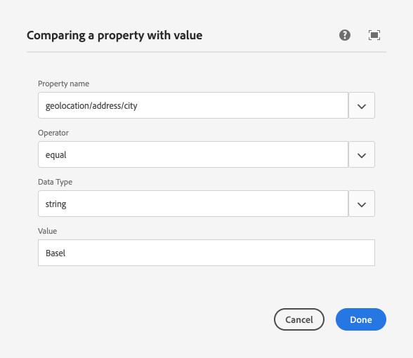

# Konfigurera segmentering med ContextHub{#configuring-segmentation-with-contexthub}

Segmentering är en viktig faktor när man skapar en kampanj. Mer information om hur segmentering fungerar och nyckeltermer finns i [Förstå segmentering](segmentation.md).

Beroende på den information du redan har samlat in om webbplatsbesökarna och vilka mål du vill uppnå, måste du definiera de segment och strategier som behövs för målinnehållet.

Dessa segment används sedan för att förse en besökare med specifikt riktat innehåll. [De ](activities.md) aktiviteter som definieras här kan läggas in på alla sidor och definiera vilka besökarsegment det specialiserade innehållet ska användas för.

AEM gör att ni enkelt kan personalisera användarnas upplevelser. Du kan även kontrollera resultatet av segmentdefinitionerna.

## Åtkomst till segment {#accessing-segments}

Konsolen [Publiker](audiences.md) används för att hantera segment för ContextHub samt målgrupper för ditt Adobe Target-konto. I den här dokumentationen beskrivs hur du hanterar segment för ContextHub.

Om du vill komma åt dina segment väljer du **Navigering > Personalisering > Publiker** i den globala navigeringen.


## Segmentredigerare {#segment-editor}

<!--The **Segment Editor** allows you to easily modify a segment. To edit a segment, select a segment in the [list of segments](/help/sites-administering/segmentation.md#accessing-segments) and click the **Edit** button.-->
Med **segmentredigeraren** kan du enkelt ändra ett segment. Om du vill redigera ett segment markerar du det i listan och klickar på knappen **Redigera**.


Med komponentwebbläsaren kan du lägga till behållare för **AND** och **OR** för att definiera segmentlogiken, och sedan lägga till ytterligare komponenter för att jämföra egenskaper och värden eller referensskript och andra segment för att definiera urvalskriterierna (se [Skapa ett nytt segment](#creating-a-new-segment)) för att definiera det exakta scenariot för markering av segmentet.

När hela programsatsen utvärderas till true är segmentet löst. Om flera segment är tillämpliga används även **Förstärkningsfaktorn**. Mer information om förstärkningsfaktorn finns i [Skapa ett nytt segment](#creating-a-new-segment).

>[!CAUTION]
>
>Segmentredigeraren söker inte efter några cirkelreferenser. Segment A refererar till exempel till ett annat segment B, som i sin tur refererar till segment A. Du måste se till att dina segment inte innehåller några cirkelreferenser.

### Behållare {#containers}

Följande behållare är tillgängliga när de är klara och gör att du kan gruppera jämförelser och referenser tillsammans för boolesk utvärdering. De kan dras från komponentwebbläsaren till redigeraren. Mer information finns i följande avsnitt [Använda OCH ELLER behållare](#using-and-and-or-containers).

|  |  |
|---|---|
| Behållare OCH | Operatorn boolesk AND |
| Behållare ELLER | Operatorn boolesk OR |

### Jämförelser {#comparisons}

Följande segmentjämförelser är tillgängliga när du vill utvärdera segmentegenskaperna. De kan dras från komponentwebbläsaren till redigeraren.

|  |  |
|---|---|
| Property-Value | Jämför en egenskap i en butik med ett definierat värde |
| property-property | Jämför en egenskap i en butik med en annan egenskap |
| Referens för egenskapssegment | Jämför en egenskap i en butik med ett annat refererat segment |
| Referens för egenskapsskript | Jämför en egenskap i en butik med resultatet av ett skript |
| Referens för segmentreferens-Script | Jämför ett hänvisat segment med resultatet av ett skript |

>[!NOTE]
>
>Om datatypen för jämförelsen inte är inställd (d.v.s. inställd på automatisk identifiering) vid jämförelse av värden, kommer segmenteringsmotorn för ContextHub helt enkelt att jämföra värdena som javascript skulle göra. Den konverterar inte värden till de förväntade typerna, vilket kan leda till missvisande resultat. Till exempel:
>
>`null < 30 // will return true`
>
>När du skapar [ett segment](#creating-a-new-segment) bör du därför välja en **datatyp** när typerna av jämförda värden är kända. Till exempel:
>
>När du jämför egenskapen `profile/age` vet du redan att den jämförda typen kommer att vara **number**, så även om `profile/age` inte är inställd kommer en jämförelse `profile/age` som är mindre än 30 att returnera **false**, som du skulle kunna förvänta dig.

### Referenser {#references}

Följande referenser är tillgängliga när du vill länka direkt till ett skript eller ett annat segment. De kan dras från komponentwebbläsaren till redigeraren.

|  |  |
|---|---|
| Segmentreferens | Utvärdera det refererade segmentet |
| Skriptreferens | Utvärdera det refererade skriptet. Mer information finns i följande avsnitt [Använda skriptreferenser](#using-script-references). |

## Skapa ett nytt segment {#creating-a-new-segment}

Så här definierar du det nya segmentet:

1. Efter [åtkomst till segmenten](#accessing-segments), [navigerar du till mappen](#organizing-segments) där du vill skapa segmentet, eller låter det vara kvar i roten.

1. Tryck eller klicka på knappen **Skapa** och välj **Skapa ContextHub-segment**.

   

1. I **New ContextHub Segment** anger du en rubrik för segmentet samt ett boostvärde om det behövs och trycker eller klickar sedan på **Skapa**.

   

   Varje segment har en startparameter som används som viktningsfaktor. Ett högre värde anger att segmentet väljs framför ett segment med ett lägre värde i de fall där flera segment är giltiga.

   * Minsta värde: `0`
   * Högsta värde: `1000000`

1. I segmentkonsolen redigerar du det nya segmentet och öppnar det i segmentredigeraren.
1. Dra en jämförelse eller referens till segmentredigeraren som den visas i standardbehållaren OCH.
1. Dubbelklicka på eller tryck på konfigurationsalternativet för den nya referensen eller segmentet för att redigera de specifika parametrarna. I det här exemplet testar vi för folk i Basel.

   

   Ange alltid en **datatyp** om möjligt för att försäkra dig om att dina jämförelser utvärderas korrekt. Mer information finns i [Jämförelser](#comparisons).

1. Klicka på **Klar** för att spara definitionen:
1. Lägg till fler komponenter efter behov. Du kan formulera booleska uttryck med behållarkomponenterna för AND- och OR-jämförelser (se [Använda OCH och eller behållare](#using-and-and-or-containers) nedan). Med segmentredigeraren kan du ta bort komponenter som inte längre behövs eller dra dem till nya positioner i programsatsen.

### Använda AND- och OR-behållare {#using-and-and-or-containers}

Med hjälp av komponenterna AND och OR kan du skapa komplexa segment i AEM. När du gör detta är det bra att tänka på några grundläggande saker:

* Definitionens översta nivå är alltid den AND-behållare som skapas från början. Detta kan inte ändras, men påverkar inte resten av segmentdefinitionen.
* Se till att det är rimligt att kapsla behållaren. Behållarna kan ses som parenteser i ditt booleska uttryck.

Följande exempel används för att välja besökare som beaktas i vår schweiziska målgrupp:

```text
 People in Basel

 OR

 People in Zürich
```

Du börjar med att placera en OR-behållarkomponent i standardbehållaren AND. I ELLER-behållaren kan du lägga till egenskaps- eller referenskomponenterna.


Du kan kapsla in flera AND- och OR-operatorer efter behov.

### Använda skriptreferenser {#using-script-references}

Genom att använda komponenten Skriptreferens kan utvärderingen av en segmentegenskap delegeras till ett externt skript. När skriptet har konfigurerats korrekt kan det användas som en annan komponent i ett segmentvillkor.

#### Definiera ett skript som ska referera {#defining-a-script-to-reference}

1. Lägg till filen i klientlib `contexthub.segment-engine.scripts`.
1. Implementera en funktion som returnerar ett värde. Till exempel:

   ```javascript
   ContextHub.console.log(ContextHub.Shared.timestamp(), '[loading] contexthub.segment-engine.scripts - script.profile-info.js');
   
   (function() {
       'use strict';
   
       /**
        * Sample script returning profile information. Returns user info if data is available, false otherwise.
        *
        * @returns {Boolean}
        */
       var getProfileInfo = function() {
           /* let the SegmentEngine know when script should be re-run */
           this.dependOn(ContextHub.SegmentEngine.Property('profile/age'));
           this.dependOn(ContextHub.SegmentEngine.Property('profile/givenName'));
   
           /* variables */
           var name = ContextHub.get('profile/givenName');
           var age = ContextHub.get('profile/age');
   
           return name === 'Joe' && age === 123;
       };
   
       /* register function */
       ContextHub.SegmentEngine.ScriptManager.register('getProfileInfo', getProfileInfo);
   
   })();
   ```

1. Registrera skriptet med `ContextHub.SegmentEngine.ScriptManager.register`.

Om skriptet är beroende av ytterligare egenskaper bör skriptet anropa `this.dependOn()`. Om skriptet till exempel är beroende av `profile/age`:

```javascript
this.dependOn(ContextHub.SegmentEngine.Property('profile/age'));
```

#### Referera till ett skript {#referencing-a-script}

1. Skapa ContextHub-segment.
1. Lägg till **skriptreferens**-komponenten på önskad plats i segmentet.
1. Öppna redigeringsdialogrutan för komponenten **Skriptreferens**. Om [är korrekt konfigurerad](#defining-a-script-to-reference) bör skriptet vara tillgängligt i listrutan **Skriptnamn**.

## Ordna segment {#organizing-segments}

Om du har många segment kan det bli svårt att hantera dem som en platt lista. I sådana fall kan det vara användbart att skapa mappar för att hantera dina segment.

### Skapa en ny mapp {#create-folder}

1. När du har [öppnat segmenten](#accessing-segments) klickar eller trycker du på knappen **Skapa** och väljer **Mapp**.

   

1. Ange en **titel** och ett **namn** för mappen.
   * **Titeln** ska vara beskrivande.
   * **Namnet** blir nodnamnet i databasen.
      * Den genereras automatiskt baserat på titeln och justeras enligt [AEM namnkonventioner.](/help/implementing/developing/introduction/naming-conventions.md)
      * Den kan vid behov justeras.

   

1. Tryck eller klicka på **Skapa**.

   

1. Mappen visas i segmentlistan.
   * Hur du sorterar kolumnerna påverkar var i listan den nya mappen visas.
   * Du kan justera sorteringen genom att trycka eller klicka på kolumnrubrikerna.
      

### Ändra befintliga mappar {#modify-folders}

1. När du har [öppnat segmenten](#accessing-segments) klickar eller trycker du på den mapp du vill ändra för att markera den.

   

1. Tryck eller klicka på **Byt namn på** i verktygsfältet för att byta namn på mappen.

1. Ange en ny **mapptitel** och tryck eller klicka på **Spara**.

   

>[!NOTE]
>
>När du byter namn på mappar kan du bara ändra titeln. Namnet kan inte ändras.

### Ta bort en mapp

1. När du har [öppnat segmenten](#accessing-segments) klickar eller trycker du på den mapp du vill ändra för att markera den.

   

1. Tryck eller klicka på **Ta bort** i verktygsfältet för att ta bort mappen.

1. En dialogruta innehåller en lista med mappar som har markerats för borttagning.

   

   * Tryck eller klicka på **Ta bort** för att bekräfta.
   * Tryck eller klicka på **Avbryt** om du vill avbryta.

1. Om någon av de markerade mapparna innehåller undermappar eller segment måste borttagningen bekräftas.

   

   * Tryck eller klicka på **Tvinga borttagning** för att bekräfta.
   * Tryck eller klicka på **Avbryt** om du vill avbryta.

>[!NOTE]
>
> Det går inte att flytta ett segment från en mapp till en annan.

## Testa tillämpningen av ett segment {#testing-the-application-of-a-segment}

När segmentet har definierats kan potentiella resultat testas med hjälp av **[ContextHub](contexthub.md).**

1. Förhandsgranska en sida
1. Klicka på ikonen ContextHub för att visa kontextHub-verktygsfältet
1. Välj en profil som matchar segmentet du skapade
1. ContextHub löser de segment som är tillämpliga för den valda personen

Vår enkla segmentdefinition för att identifiera användare i Basel baseras till exempel på var användaren befinner sig. När du läser in en specifik profil som matchar dessa villkor visas om segmentet har matchats:


Eller om den inte är löst:


>[!NOTE]
>
>Alla egenskaper åtgärdas omedelbart, men de flesta ändras bara vid sidinläsning.

Sådana tester kan även utföras på innehållssidor och i kombination med riktat innehåll och relaterade **aktiviteter** och **upplevelser**.

Om du har konfigurerat en aktivitet och upplevelse kan du enkelt testa ditt segment med aktiviteten. Mer information om hur du konfigurerar en aktivitet finns i den relaterade [dokumentationen om hur du skapar målinnehåll](targeted-content.md).

1. I redigeringsläget för en sida där du har konfigurerat riktat innehåll kan du se att innehållet har angetts som mål via en pilikon i innehållet.
1. Växla till förhandsgranskningsläget och använd kontextnavet för att växla till en profil som inte matchar den segmentering som har konfigurerats för upplevelsen.
1. Byt till en persona som matchar den segmentering som konfigurerats för upplevelsen och se att upplevelsen ändras i enlighet med detta.

## Använda ditt segment {#using-your-segment}

Segment används för att styra det faktiska innehåll som ses av specifika målgrupper. Se [Hantera målgrupper](audiences.md) för mer information om målgrupper och segment och [Skapa riktat innehåll](targeted-content.md) om hur du använder målgrupper och segment för att rikta innehåll.
