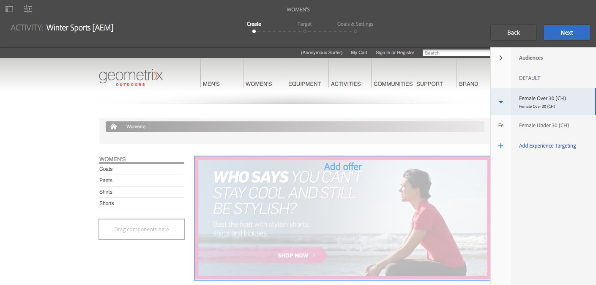
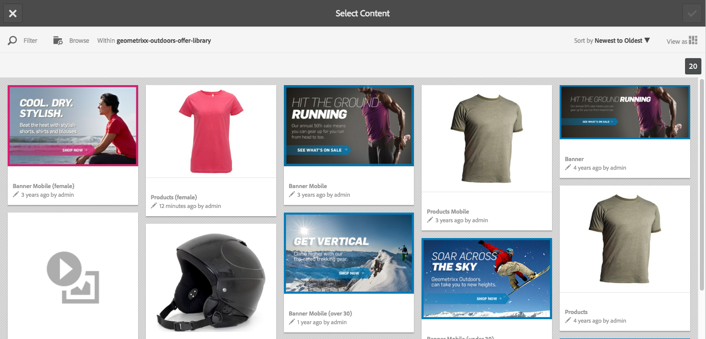

# Skapa riktat innehåll med målläge {#authoring-targeted-content-using-targeting-mode}

Skapa riktat innehåll med målläget AEM. Målinriktningsläget och Target-komponenten innehåller verktyg för att skapa innehåll för upplevelser:

* Identifiera enkelt målinnehållet på sidan. En prickad linje bildar en kant runt allt innehåll som är avsett för det.
* Välj ett varumärke och en aktivitet för att se upplevelserna.
* Lägg till upplevelser i en aktivitet eller ta bort upplevelser.
* Utför A/B-tester och konvertera vinnare (endast Adobe Target).
* Lägg till erbjudanden till en upplevelse genom att skapa erbjudanden eller använda erbjudanden från ett bibliotek.
* Konfigurera mål och övervaka prestanda.
* Simulera användarupplevelsen.
* Konfigurera Target-komponenten om du vill ha mer anpassning.

Du kan använda antingen AEM eller Adobe Target som målmotor (du måste ha ett giltigt Adobe Target-konto för att kunna använda Adobe Target). Om du använder Adobe Target måste du först konfigurera integreringen. Se instruktionerna för integrering med Adobe Target. <!--See the[instructions for integrating with Adobe Target](/help/sites-administering/target.md).-->

De aktiviteter och upplevelser som du ser i målläge återspeglar aktivitetskonsolen [a1/>:](/help/sites-cloud/authoring/personalization/activities.md)

* Ändringar som du gör i aktiviteter och upplevelser med målläget visas i aktivitetskonsolen.
* Ändringar som görs i aktivitetskonsolen återspeglas i målläget.

>[!NOTE]
>
>När du skapar en kampanj i Adobe Target tilldelas varje kampanj en egenskap med namnet `thirdPartyId`. När du tar bort kampanjen i Adobe Target tas inte thirdPartyId bort. Du kan inte återanvända `thirdPartyId` för kampanjer av olika typer (AB, XT) och den kan inte tas bort manuellt. För att undvika detta bör varje kampanj namnges med ett unikt namn. kampanjnamn kan därför inte återanvändas i olika kampanjtyper.
>
>Om du använder samma namn i samma kampanjtyp skriver du över den befintliga kampanjen.
>
>Om du får felmeddelandet&quot;Begäran misslyckades&quot; under synkroniseringen. `thirdPartyId` finns redan&quot;, ändrar namnet på kampanjen och synkroniserar igen.

>[!NOTE]
>
>Vid målgruppsanpassning behålls varumärknings- och aktivitetskombinationen på användarnivå, inte på kanalnivå.

## Växla till målläge {#switching-to-targeting-mode}

Växla till målläget för att komma åt verktygen för att skapa riktat innehåll.

Så här växlar du till målläge:

1. Öppna sidan som du vill skapa riktat innehåll för.
1. Klicka eller tryck på listrutan Läge i verktygsfältet högst upp på sidan för att visa de tillgängliga lägestyperna.

   

1. Klicka eller tryck på **Mål**. Målinställningarna visas högst upp på sidan.

   

## Lägga till en aktivitet med målläget {#adding-an-activity-using-targeting-mode}

Använd målinriktningsläget för att lägga till en aktivitet till ett varumärke. När du lägger till en aktivitet innehåller den standardupplevelsen. När du har lagt till aktiviteten startar du målprocessen för innehållet för aktiviteten.

Du kan också skapa och hantera Adobe Target-aktiviteter från AEM genom att välja målmotor - antingen AEM eller Adobe Target - och välja aktivitetstyp - Experience Targeting eller A/B Test.

Dessutom kan ni hantera mål och mätvärden för alla Adobe Target-aktiviteter och hantera era Adobe Target-målgrupper. Adobe Target aktivitetsrapportering, inklusive konvertering av vinnare för A/B-tester, ingår också.

När du lägger till en aktivitet visas den också i [aktivitetskonsolen](/help/sites-cloud/authoring/personalization/activities.md).

Så här lägger du till en aktivitet:

1. Använd listrutan **Varumärke** för att välja det varumärke som du vill skapa aktiviteten för.

   >[!NOTE]
   >
   >Du bör [skapa varumärken via aktivitetskonsolen](/help/sites-cloud/authoring/personalization/activities.md#creating-a-brand-using-the-activities-console).
   >
   >
   >Om du skapar ett varumärke på något annat sätt måste du kontrollera att noden `/campaigns/<brand>/master` finns eller att ett fel uppstår när du försöker skapa en aktivitet.

1. Klicka eller tryck på + bredvid listrutan **Aktivitet**.
1. Ange ett namn för aktiviteten.

   >[!NOTE]
   >
   >När du skapar en ny aktivitet och har en Adobe Target-molnkonfiguration kopplad till sidan eller någon av dess överordnade sidor, antar AEM automatiskt Adobe Target som motor.

1. Välj målmotor i listrutan **Målmotor**.

   * Om du väljer **ContextHub AEM** är de återstående fälten nedtonade och inte tillgängliga. Klicka eller tryck på **Skapa**.

   * Om du väljer **Adobe Target** kan du välja en konfiguration (som standard är det den konfiguration du angav när du konfigurerade kontot) och aktivitetstyp. <!--If you select **Adobe Target**, you can select a configuration (by default, it is the configuration you provided when you [configured the account](/help/sites-administering/opt-in.md)) and Activity Type.-->

1. Välj antingen **Experience Targeting** eller **A/B Test** på menyn Aktivitet.

   * Målinriktning - hantera Adobe Target-aktiviteter från AEM.
   * A/B-test - skapa/hantera A/B-testaktiviteter i Adobe Target från AEM.

## Målprocessen: Skapa, ange mål och inställningar {#the-targeting-process-create-target-and-goals-settings}

I målinriktningsläget kan du konfigurera flera aspekter av en aktivitet. Använd följande trestegsprocess för att skapa riktat innehåll för en varumärkesaktivitet:

1. [Skapa](#create-authoring-the-experiences): Lägg till eller ta bort upplevelser och lägg till erbjudanden för varje upplevelse.
1. [Mål](#target-configuring-the-audiences): Ange målgruppen för varje upplevelse. Ni kan inrikta er på en viss målgrupp och om ni använder A/B-tester avgör hur stor procentandel av trafiken som går till vilken upplevelse.
1. [Mål och inställningar](#goals-settings-configuring-the-activity-and-setting-goals): Schemalägg aktiviteten och ange prioritet. Ni kan också ställa in mätmål för framgång.

Använd följande procedur för att starta innehållsriktningsprocessen för en aktivitet.

>[!NOTE]
>
>Om du vill använda målprocessen måste du vara medlem i användargruppen Författare för målaktivitet.

Så här lägger du till en aktivitet:

1. I listrutan **Varumärke** väljer du det varumärke som innehåller aktiviteten som du arbetar med.
1. I listrutan **Aktivitet** väljer du aktiviteten som du skapar målinnehåll för.
1. Om du vill visa de kontroller som vägleder dig genom målprocessen klickar eller trycker du på **Starta mål**.

   

   >[!NOTE]
   >
   >Om du vill ändra aktiviteten som du arbetar med klickar eller trycker du på **Tillbaka**.

## Skapa: Om du skriver upplevelserna {#create-authoring-the-experiences}

Det kreativa steget i innehållsanpassningen innefattar att skapa upplevelser. Under det här steget kan du skapa eller ta bort aktivitetens upplevelser och lägga till erbjudanden för varje upplevelse.

### Upplevelserbjudanden visas i målläge {#seeing-experience-offers-in-targeting-mode}

När du har [påbörjat målprocessen](#the-targeting-process-create-target-and-goals-settings) väljer du en upplevelse för att se erbjudandena som finns för den upplevelsen. När du väljer en upplevelse ändras målkomponenterna på sidan så att erbjudandet för den upplevelsen visas.

>[!CAUTION]
>
>Var försiktig när du inaktiverar mål för en komponent som redan är avsedd i författarinstansen. Aktiviteten raderas automatiskt även från publiceringsinstansen.

>[!NOTE]
>
>Ett erbjudande är innehållet i en riktad komponent.

Upplevelserna visas i rutan Målgrupper. I följande exempel finns upplevelserna **Standard**, **Kvinna**, **Kvinna över 30** och **Kvinna under 30**. I det här exemplet visas standarderbjudandet för en riktad **bildkomponent**.

När en annan upplevelse väljs visas erbjudandet för den upplevelsen i bildkomponenten.

När en upplevelse väljs och målkomponenten inte innehåller något erbjudande för den upplevelsen, visas **Lägg till erbjudande** ovanpå det halvgenomskinliga standarderbjudandet. När inget erbjudande har skapats för en upplevelse visas **standarderbjudandet** för det segment som är mappat till upplevelsen.

Standardupplevelsen visas också när besökaregenskaperna inte matchar några segment som är mappade till upplevelserna. Se [Lägga till upplevelser med målläge](#adding-and-removing-experiences-using-targeting-mode).

### Anpassade erbjudanden och bibliotekserbjudanden {#custom-offers-and-library-offers}

Erbjudanden som är [skapade på sidan](#adding-a-custom-offer) och som används för en upplevelse kallas anpassade erbjudanden. Följande bild läggs ovanpå innehållet i ett anpassat erbjudande:

Erbjudanden som [har lagts till från ett erbjudandebibliotek](#adding-an-offer-from-an-offer-library) läggs över med följande bild:

Du kan spara anpassade erbjudanden i ett erbjudandebibliotek om du bestämmer dig för att återanvända dem. Du kan också konvertera ett bibliotekserbjudande till ett anpassat erbjudande om du vill ändra innehållet för en upplevelse. Efter redigeringen kan du spara erbjudandet i biblioteket igen.

### Lägga till och ta bort upplevelser med målläget {#adding-and-removing-experiences-using-targeting-mode}

Med steget Skapa i [målprocessen](#the-targeting-process-create-target-and-goals-settings) kan du lägga till och ta bort upplevelser. Dessutom kan du duplicera en upplevelse och ändra namn på den.

#### Lägga till upplevelser med målläget {#adding-experiences-using-targeting-mode}

Så här lägger du till en upplevelse:

1. Om du vill lägga till en upplevelse klickar eller trycker du på **+** **Add Experience Targeting** som visas under befintliga upplevelser i rutan **Publiker**.
1. Välj och få en målgrupp. Som standard är det namnet på upplevelsen. Om du vill kan du skriva ett annat namn. Klicka eller tryck på **OK**.

#### Ta bort upplevelser med målläget {#removing-experiences-using-targeting-mode}

Så här tar du bort en upplevelse:

1. Klicka eller tryck på pilen bredvid upplevelsens namn.

   

1. Klicka på **Ta bort**.

#### Byta namn på upplevelser med målläget {#renaming-experiences-using-targeting-mode}

Så här byter du namn på upplevelser med målläget:

1. Klicka eller tryck på pilen bredvid upplevelsens namn.
1. Klicka på **Byt namn på upplevelsen** och skriv in det nya namnet.
1. Klicka eller tryck någon annanstans på skärmen för att spara ändringarna.

#### Redigera målgrupper med målläget {#editing-audiences-using-targeting-mode}

Så här redigerar du målgrupper med målläget:

1. Klicka eller tryck på pilen bredvid upplevelsens namn.
1. Klicka på **Redigera målgrupp** och välj en ny målgrupp.
1. Klicka på **OK**.

#### Duplicera upplevelser med målläget {#duplicating-experiences-using-targeting-mode}

Så här kopierar du upplevelser med målläget:

1. Klicka eller tryck på pilen bredvid upplevelsens namn.
1. Klicka på **Duplicera** och välj målgrupp.
1. Byt namn på upplevelsen om du vill och klicka på **OK**.

### Skapa erbjudanden med målläget {#creating-offers-using-targeting-mode}

Rikta en komponent mot att skapa erbjudanden för upplevelser. Målinriktade komponenter tillhandahåller det innehåll som används som erbjudanden för upplevelser.

* [Aktivera en befintlig komponent](#creating-a-default-offer-by-targeting-an-existing-component). Innehållet blir erbjudandet om standardupplevelsen.
* [Lägg till en Target-komponent](#creating-an-offer-by-adding-a-target-component) och lägg sedan till innehåll i komponenten.

När en komponent har valts kan du lägga till erbjudanden för varje upplevelse:

* [Lägg till anpassade erbjudanden](#adding-a-custom-offer).
* [Lägg till erbjudanden från ett bibliotek](#adding-an-offer-from-an-offer-library).

Följande verktyg är tillgängliga för att arbeta med erbjudanden:

* [Lägg till ett specialerbjudande i ett](#adding-a-custom-offer-to-a-library) erbjudandebibliotek.
* [Konvertera ett bibliotekserbjudande till ett anpassat erbjudande](#converting-a-library-offer-to-a-custom-library).
* [Öppna ett bibliotekserbjudande och redigera innehållet](#editing-a-library-offer).

#### Skapa ett standarderbjudande genom att rikta in en befintlig komponent {#creating-a-default-offer-by-targeting-an-existing-component}

Aktivera en komponent på sidan för att använda den som erbjudande för aktivitetens standardupplevelse. När du riktar in dig på en komponent omges den av en Target-komponent och dess innehåll blir ett erbjudande för standardupplevelsen.

När du har en målkomponent som mål kan bara den komponenten användas i erbjudandet. Du kan inte ta bort komponenten från erbjudandet eller lägga till andra komponenter i erbjudandet.

Utför följande procedur när [målprocessen](#the-targeting-process-create-target-and-goals-settings) har startats.

1. Klicka på eller tryck på den komponent som du vill ha som mål. Verktygsfältet för komponenten visas, ungefär som i följande exempel.

   

1. Klicka på eller tryck på målikonen.

   

   Komponentinnehållet är erbjudandet för standardupplevelsen. När en komponent har valts replikeras dess standardnod för varje upplevelse. Detta behövs för att redigera rätt innehållsnod vid upplevelsespecifik redigering. För de här icke-standardupplevelserna kan du antingen [lägga till ett anpassat erbjudande](#adding-a-custom-offer) eller [lägga till ett bibliotekserbjudande](#adding-an-offer-from-an-offer-library).

#### Skapa ett erbjudande genom att lägga till en målkomponent {#creating-an-offer-by-adding-a-target-component}

Lägg till en Target-komponent för att skapa erbjudandet för standardupplevelsen. Målkomponenten är en behållare för andra komponenter, och komponenter som placeras i den blir mål. När du använder Target-komponenten kan du lägga till flera komponenter för att skapa ett erbjudande. Ni kan också använda olika komponenter i varje upplevelse för att skapa olika erbjudanden.

Mer information om hur du anpassar den här komponenten finns i [Konfigurera alternativ för målkomponent](#configuring-target-component-options).

>[!NOTE]
>
>Erbjudanden som du skapar med [Erbjudandekonsolen](/help/sites-cloud/authoring/personalization/offers.md) kan även innehålla flera komponenter. Erbjudandena tillhör ett erbjudandebibliotek och kan användas för flera olika upplevelser.

Eftersom Target-komponenten är en behållare visas den som ett släppområde för andra komponenter.

I målläget har Target-komponenten en blå ram och drop-target-meddelandet anger måltypen.

I redigeringsläget har målkomponenten en punktningsikon.

När du drar komponenter till Target-komponenten är de målkomponenter.

När du lägger till en komponent i Target-komponenten får den innehåll för en viss upplevelse. Du anger upplevelsen genom att välja upplevelsen innan du lägger till komponenterna.

Du kan lägga till en Target-komponent på sidan i redigeringsläge eller i målläge. Du kan bara lägga till komponenter i Target-komponenten i Target-läge. Målkomponenten tillhör komponentgruppen Personalisering.

Om du redigerar målinnehåll måste du klicka eller trycka på **Starta mål** innan du kan göra det.

1. Dra Target-komponenten till sidan där du vill att erbjudandet ska visas.
1. Som standard har inget plats-ID angetts. Klicka på eller tryck på konfigurationshjulet för att ange platsen.

   >[!NOTE]
   >
   >Om det anges av administratören kan du behöva ange platsen explicit.
   >
   >Administratörer kan bestämma om den här konfigurationen måste anges på `https://<host>:<port>/system/console/configMgr/com.day.cq.personalization.impl.servlets.TargetingConfigurationServlet`
   >
   >Om du vill att användare ska ange en plats markerar du kryssrutan **Tvinga plats**.

1. Välj den upplevelse som du vill skapa erbjudandet för.
1. Skapa erbjudandet:

   * För standardupplevelsen drar du komponenter till målsläppsområdet och redigerar komponentegenskaperna som vanligt för att skapa innehållet för erbjudandet.
   * För upplevelser som inte är standard kan du antingen [lägga till ett anpassat erbjudande](#adding-a-custom-offer) eller [lägga till ett bibliotekserbjudande](#adding-an-offer-from-an-offer-library).

#### Lägga till ett anpassat erbjudande {#adding-a-custom-offer}

Skapa ett erbjudande genom att skapa innehållet i en målkomponent i målinriktningsläget. När du skapar ett anpassat erbjudande används det som ett erbjudande för en enda upplevelse.

Om du bestämmer dig för att erbjudandet kan användas för andra upplevelser kan du skapa ett anpassat erbjudande och [lägga till det i biblioteket](#adding-a-custom-offer-to-a-library). Mer information om hur du använder erbjudandekonsolen för att skapa ett återanvändbart erbjudande finns i [Lägg till ett erbjudande i ett erbjudandebibliotek](/help/sites-cloud/authoring/personalization/offers.md#add-an-offer-to-an-offer-library).

1. Välj den upplevelse som du lägger till erbjudandet till.
1. Om du vill visa komponentmenyn klickar eller trycker du på den målkomponent som du vill lägga till erbjudandet i.

   

1. Klicka eller tryck på ikonen +.

   Innehållet i standarderbjudandet används som erbjudande för den aktuella upplevelsen.

1. Klicka på eller tryck på erbjudandet för att visa erbjudandemenyn och klicka eller tryck sedan på redigeringsikonen.

   

1. Redigera komponentens innehåll.

#### Lägga till ett erbjudande från ett erbjudandebibliotek {#adding-an-offer-from-an-offer-library}

Lägg till ett erbjudande från [erbjudandebiblioteket](/help/sites-cloud/authoring/personalization/offers.md) till en upplevelse. Ni kan lägga till alla erbjudanden från varumärkesbiblioteket som ni nu riktar er mot.

Du kan inte lägga till bibliotekserbjudanden i standardupplevelsen.

1. Välj den upplevelse som du lägger till erbjudandet till.
1. Om du vill visa komponentmenyn klickar eller trycker du på den målkomponent som du vill lägga till erbjudandet i.

   

1. Klicka på eller tryck på mappikonen.

   

1. Välj erbjudandet från biblioteket och klicka eller tryck sedan på bockmarkeringsikonen.

   

   Med erbjudandeväljaren kan du bläddra eller filtrera efter erbjudanden. När du bläddrar eller filtrerar kanske du också vill sortera erbjudandena och ändra hur du ser dem. Siffran i det övre högra hörnet visar hur många erbjudanden som är tillgängliga i det aktuella biblioteket.

   * Klicka eller tryck på **Bläddra** för att navigera till en annan mapp. Navigeringsrutan öppnas och du klickar på pilen för att gå ned i mapparna. Klicka eller tryck på **Bläddra** igen för att stänga navigeringsrutan.

   

   * Klicka eller tryck på **Filter** för att filtrera erbjudandena mot nyckelord eller taggar. Du anger nyckelord och väljer taggar i listrutan. Klicka eller tryck på **Filter** igen för att stänga filtreringsrutan.

   

   * Ändra hur du sorterar erbjudandena genom att klicka eller trycka på pilen bredvid **Nyaste till Äldst**. Erbjudandena kan sorteras från nyaste till äldsta eller äldsta till nyaste.

   

   Klicka på eller tryck på ikonen bredvid **Visa som** för att visa erbjudanden som rutor eller som en lista.

   

#### Lägga till ett anpassat erbjudande i ett bibliotek {#adding-a-custom-offer-to-a-library}

Lägg till ett anpassat erbjudande i [erbjudandebiblioteket](/help/sites-cloud/authoring/personalization/offers.md) när du vill återanvända det som erbjudande för flera upplevelser. Ni kan lägga till erbjudanden i biblioteket för det aktuella varumärket ni riktar er mot.

Mer information om hur du använder erbjudandekonsolen för att skapa ett återanvändbart erbjudande finns i [Lägg till ett erbjudande i ett erbjudandebibliotek](/help/sites-cloud/authoring/personalization/offers.md#add-an-offer-to-an-offer-library).

1. Välj upplevelsen för att visa det anpassade erbjudandet.
1. Klicka på eller tryck på det anpassade erbjudandet för att visa erbjudandemenyn och klicka eller tryck sedan på ikonen **Spara erbjudande till erbjudandebibliotek**.

   

1. Skriv ett namn för erbjudandet, markera det bibliotek som du vill lägga till erbjudandet till och klicka eller tryck sedan på bockmarkeringsikonen.

#### Konvertera ett bibliotekserbjudande till ett anpassat bibliotek {#converting-a-library-offer-to-a-custom-library}

Konvertera ett bibliotekserbjudande till ett anpassat erbjudande för att ändra erbjudandet för den aktuella upplevelsen utan att ändra erbjudandet i andra upplevelser.

1. Välj den upplevelse du vill visa bibliotekserbjudandet.
1. Klicka på eller tryck på bibliotekserbjudandet för att visa erbjudandemenyn och klicka eller tryck sedan på ikonen Konvertera till infogat erbjudande.

   

#### Redigera ett bibliotekserbjudande {#editing-a-library-offer}

Öppna ett bibliotekserbjudande från en upplevelse i målläge för att redigera erbjudandet. De ändringar ni gör visas i alla upplevelser som använder erbjudandet.

1. Välj den upplevelse du vill visa bibliotekserbjudandet.
1. Konvertera bibliotekserbjudandet till ett lokalt/anpassat erbjudande. Se [Konvertera ett bibliotekserbjudande till ett anpassat bibliotek](#converting-a-library-offer-to-a-custom-library).
1. Redigera innehållet i erbjudandet.

1. Spara den i biblioteket igen. Se [Lägga till ett anpassat erbjudande i ett bibliotek](#adding-a-custom-offer-to-a-library).

## Mål: Konfigurera publikerna {#target-configuring-the-audiences}

Målsteget [målprocessen](#the-targeting-process-create-target-and-goals-settings) innebär att mappa målgrupper med de upplevelser du arbetade med i steget Skapa. Målsidan visar vilka målgrupper varje upplevelse riktar sig till. Ni kan ange eller ändra målgruppen för varje upplevelse. Om du använder Adobe Target kan du även skapa A/B-tester som gör att du kan ange en procentandel av trafiken för en viss målgrupp för en viss upplevelse.

### Om du använder AEM målinriktning eller Adobe Target (upplevelseanpassning) {#if-you-are-using-aem-targeting-or-adobe-target-experience-targeting}

Publiken visas till vänster i mappningsdiagrammet, och upplevelserna visas till höger.

Definiera en målgrupp med ett segment. Molnkonfigurationen för sidan avgör vilka segment som är tillgängliga för dig. När sidan inte är kopplad till en molnkonfiguration från Adobe Target finns AEM segment tillgängliga för att definiera målgrupper. När sidan är kopplad till en Adobe Target-molnkonfiguration använder du målsegment.

Mer information om målmotorer finns i [Målmotor](/help/sites-cloud/authoring/personalization/overview.md#targeting-engine).

En målgrupp får inte användas av mer än en upplevelse. En varningssymbol visas bredvid en upplevelse när den kopplas till en målgrupp som kopplas till en annan upplevelse.

### Associera upplevelser med målgrupper (AEM eller Adobe Target) {#associating-experiences-with-audiences-aem-or-adobe-target}

Använd följande procedur för att associera en upplevelse med en målgrupp när du använder AEM (eller Adobe Target Experience targeting):

1. Klicka på eller tryck på den nedrullningsbara pilen bredvid den målgruppsruta som är kopplad till upplevelsen.
1. (Valfritt) Klicka eller tryck på **Redigera** och ange sedan ett nyckelord för att söka efter det önskade segmentet.
1. Markera målgruppen i listan över målgrupper och klicka eller tryck på **OK**.

### Om du använder A/B-testning (Adobe Target) {#if-you-are-using-a-b-testing-adobe-target}

Om ni har en A/B-testaktivitet finns målgrupperna till vänster, procentandelen som varje upplevelse visas i mitten och upplevelserna till höger.

Du kan ändra procentsatserna så länge de adderar till 100 procent. En målgrupp kan användas av flera olika upplevelser i A/B-tester.

### Associera målgrupper och trafikprocent med A/B-tester {#associating-audiences-and-traffic-percentages-with-a-b-testing}

1. Klicka på eller tryck på listrutan bredvid målgruppen som är kopplad till upplevelsen.
1. (Valfritt) Klicka på **Redigera** och skriv ett nyckelord för att söka efter det önskade segmentet.
1. Klicka på eller tryck på **OK.**
1. Ange i procent för att konfigurera hur målgruppstrafiken dirigeras till varje upplevelse. Det totala talet måste vara lika med 100.
1. (Valfritt) Redigera upplevelsens namn genom att klicka på den nedrullningsbara menyn bredvid upplevelsens namn.

## Mål och inställningar: Konfigurera mål för aktivitet och inställning {#goals-settings-configuring-the-activity-and-setting-goals}

Målet och inställningarna i [målsättningsprocessen](#the-targeting-process-create-target-and-goals-settings) innebär att varumärkesaktivitetens beteende konfigureras. Ange när aktiviteten startar och avslutas samt aktivitetsprioriteten. Dessutom håller du också koll på målen. Du kan bestämma vad du vill mäta med dina aktiviteter.

Måttvärden är bara tillgängliga om du använder Adobe Target för målmotorn. Du måste definiera minst ett målmått. Om du har konfigurerat Adobe Analytics och har en A4T Analytics-molnkonfiguration kan du välja om du vill att rapportkällan ska vara Adobe Target eller Adobe Analytics.

Måtten mäts bara för den publicerade kampanjen.

Om du använder AEM som målmotor:

Om du använder Adobe Target som målmotor:

Om du använder Adobe Target som målinriktningsmotor och har A4T Analytics konfigurerat för kontot har du en extra listruta för **Rapportkälla**:

Följande framgångsmått är tillgängliga (används endast för publicering):

| Mått | Beskrivning | Alternativ |
|---|---|---|
| Konvertering | Andelen besökare som klickade på någon del av upplevelsen som testades. En konvertering kan antingen räknas en gång per besökare eller varje gång en besökare slutför en konvertering. Konverteringsmåttet är inställt på något av följande | Visad sida - Du kan definiera vilken sida målgruppen ska visa genom att välja antingen URL-adress och sedan definiera URL-adressen eller flera URL-adresser, eller genom att markera URL-adressen och sedan lägga till en sökväg eller ett nyckelord. Visad mbox - Du kan definiera vilken mbox som din publik ska visa genom att ange namnet på mbox. Du kan ange flera rutor genom att klicka på Lägg till en Mbox. |
| Intäkter | Intäkter från besöket. Du kan välja bland de angivna intäktsmåtten. För något av dessa alternativ anger om en mbox visades att målet har uppnåtts. Du kan definiera mbox eller flera mbox. | Intäkter per besökare, genomsnittligt ordervärde (AOV), total försäljning, order |
| Engagemang | Ni kan mäta tre typer av engagemang | Sidvyer, anpassad poängsättning, tid på plats |

Dessutom finns det avancerade inställningar som gör att du kan avgöra hur många framgångsmått som ska räknas. Du kan välja att räkna måtten per intryck eller en gång per besökare och välja om användaren ska vara kvar i aktiviteten eller ta bort dem.

Använd de avancerade inställningarna för att avgöra vad som händer **efter** när en användare påträffar målmåttet. I följande tabell visas de tillgängliga alternativen.

| När en användare har påträffat detta målmått.. | Du väljer att följande ska hända.. |
|---|---|
| Öka antal och behåll användare i aktivitet | Ange hur antalet ska ökas: En gång per deltagare, vid varje intryck, förutom siduppdatering, vid varje intryck |
| Ökning, frigör användare och Tillåt återinträde | Välj den upplevelse besökaren ser om de återupptar aktiviteten: Samma upplevelse, Slumpmässig upplevelse, Osynlig upplevelse |
| Ökningsantal, återinträde av användare och fält | Bestäm vad användaren ser i stället för aktivitetsinnehållet: Samma upplevelse, utan spårning, standardinnehåll eller annat aktivitetsinnehåll |

Mer information om framgångsmått finns i [Adobe Target-dokumentation](https://docs.adobe.com/content/help/en/target/using/activities/success-metrics/success-metrics.html).

### Konfigurerar inställningar (AEM mål) {#configuring-settings-aem-targeting}

Så här konfigurerar du inställningar om du använder AEM mål:

1. Om du vill ange när aktiviteten startar använder du listrutan **Start** och väljer något av följande värden:

   * **Vid aktivering**: Aktiviteten startar när sidan som innehåller målinnehållet aktiveras.
   * **Angivet datum och tid**: En viss tid. När du väljer det här alternativet klickar eller trycker du på kalenderikonen, väljer ett datum och anger vilken tid aktiviteten ska starta.

1. Om du vill ange när aktiviteten avslutas använder du den nedrullningsbara menyn **Slut** och väljer något av följande värden:

   * **Vid inaktivering**: Aktiviteten avslutas när sidan som innehåller målinnehållet inaktiveras.
   * **Angivet datum och tid**: En viss tid. När du väljer det här alternativet klickar eller trycker du på kalenderikonen, väljer ett datum och anger tidpunkten för att avsluta aktiviteten.

1. Om du vill ange en prioritet för aktiviteten använder du skjutreglaget för att antingen **Låg**, **Normal** eller **Hög**.

### Konfigurera mål och inställningar (Adobe Target) {#configuring-goals-settings-adobe-target}

Så här konfigurerar du mål och inställningar om du använder Adobe Target:

1. Om du vill ange när aktiviteten startar använder du listrutan **Start** och väljer något av följande värden:

   * **Vid aktivering**: Aktiviteten startar när sidan som innehåller målinnehållet aktiveras.
   * **Angivet datum och tid**: En viss tid. När du väljer det här alternativet klickar eller trycker du på kalenderikonen, väljer ett datum och anger vilken tid aktiviteten ska starta.

1. Om du vill ange när aktiviteten avslutas använder du den nedrullningsbara menyn **Slut** och väljer något av följande värden:

   * **Vid inaktivering**: Aktiviteten avslutas när sidan som innehåller målinnehållet inaktiveras.
   * **Angivet datum och tid**: En viss tid. När du väljer det här alternativet klickar eller trycker du på kalenderikonen, väljer ett datum och anger tidpunkten för att avsluta aktiviteten.

1. Om du vill ange en prioritet för aktiviteten använder du skjutreglaget för att antingen **Låg**, **Normal** eller **Hög**.
1. Om du har konfigurerat Adobe Analytics med ert Adobe Target-konto visas listrutan **Rapportkälla**. Välj **Adobe Target** eller **Adobe Analytics** som källa.

   Om du väljer **Adobe Analytics** väljer du företaget och rapporterar sviten. Om du väljer **Adobe Target** krävs ingen åtgärd.

   

1. I området **Målmått**, under **Mitt primära mål** väljer du det framgångsmått som du vill spåra – som konvertering, intäkter eller engagemang – och anger hur mätningen görs (eller vilka åtgärder målgruppen vidtar för att ange att ett mål har nåtts). Definitioner av målmått anges i föregående tabell och [Adobe Target-dokumentationen](https://docs.adobe.com/content/help/en/target/using/activities/success-metrics/success-metrics.html) innehåller mer information om framgångsmått.

   Du kan byta namn på målet genom att klicka på de tre punkterna i det övre högra hörnet och välja **Byt namn**.

   Om du vill rensa alla fält klickar du på de tre punkterna i det övre högra hörnet och väljer **Rensa alla fält**.

   Alla mätvärden har också avancerade inställningar som du kan definiera. Välj **Avancerade inställningar** för att komma åt dem. Se en definition av hur framgångsmått räknas i föregående tabell och se [Adobe Target-dokumentation](https://docs.adobe.com/content/help/en/target/using/activities/success-metrics/success-metrics.html).

   >[!NOTE]
   >
   >Du måste ha minst ett definierat mål.

   

   >[!NOTE]
   >
   >Om det saknas information i måttet omges mätningen av en röd linje.

1. Klicka på **Lägg till ett nytt mått** för att konfigurera ytterligare framgångsmått.

   

   >[!NOTE]
   >
   >Du kan ta bort ytterligare mål genom att klicka eller trycka på de tre punkterna och klicka eller trycka på **Ta bort**. AEM kräver att du har minst ett definierat mål.

1. Om du vill ha mer kontroll över hur framgångsmått räknas klickar eller trycker du på **Avancerade inställningar** för att få åtkomst till dem.
1. Klicka på **Spara**.

När du har konfigurerat kan du [visa resultatet för dina aktiviteter](/help/sites-cloud/authoring/personalization/activities.md#viewing-performance-and-converting-winning-experiences-a-b-test) som använder Adobe Target (antingen upplevelse eller A/B-testmål). Med A/B-tester som mål kan du dessutom [konvertera vinnarna.](/help/sites-cloud/authoring/personalization/activities.md#viewing-performance-and-converting-winning-experiences-a-b-test)

## Simulera en upplevelse {#simulating-an-experience}

Simulera en besökares upplevelse för att verifiera att sidinnehållet visas som förväntat enligt designen för det valda innehållet. När du simulerar läser du in olika användarprofiler och ser målinnehållet för den användaren.

Följande kriterier avgör vilket innehåll som visas när en besökares upplevelse simuleras:

* Data i användarens sessionsarkiv (via kontextnavet).
* De [aktiviteter som är På](/help/sites-cloud/authoring/personalization/activities.md).
* [reglerna som definierar segmenten](/help/sites-cloud/authoring/personalization/segmentation.md).
* Innehållet i upplevelserna i Target-komponenterna.
* [konfigurationen för målmotorn](/help/sites-cloud/authoring/personalization/activities.md).

Om oväntat innehåll visas på sidan när du läser in en profil kontrollerar du konfigurationen för varje objekt i listan.

>[!NOTE]
>
>Om ni använder A/B-testning visas upplevelser baserat på trafikprocenten när ni simulerar upplevelser. Detta styrs av Adobe Target, vilket kan leda till oväntade resultat för författare. (Aktiviteten _author synkroniseras med specifika inställningar som tillåter omvärdering under simulering.) Författare kan behöva uppdatera för att se de andra upplevelserna baserat på deras trafikinställningar.

Använd följande verktyg för att simulera besökarens upplevelse:

* Simuleringsaktiviteten i målläge: På sidan visas erbjudandena för användaren som är markerad i kontextnavet. Du kan redigera erbjudanden som riktar sig till användaren.
* Förhandsgranskningsläge: Använd kontextnavet för att välja de användare och platser som uppfyller villkoren för de segment som era upplevelser bygger på. När dina kontextnavmarkeringar ändras, ändras målinnehållet i enlighet med detta.

1. Om du vill växla till förhandsgranskningsläget klickar du på eller trycker på **Förhandsgranska** i verktygsfältet.
1. Klicka på eller tryck på ikonen för snabbpanelen i verktygsfältet.

   

1. Använd kontextnavet för att ändra kontextegenskaper. Du kan till exempel klicka på eller trycka på egenskapen Persona för att välja en annan användare.

   

   Sidan ändras för att visa innehållet som är avsett för den aktuella kontexten.

1. Om du vill ändra de erbjudanden som visas växlar du till målläget. När simuleringsaktiviteten är markerad redigerar du erbjudandena för den kontext som du konfigurerade i förhandsgranskningsläget.

## Konfigurerar alternativ för målkomponent {#configuring-target-component-options}

Du kan anpassa Target-komponenten genom att komma åt komponentens alternativ på ett av två sätt:

1. När du har angett komponenten som mål klickar eller trycker du på komponenten i Target och sedan på inställningsikonen (kugghjulet).

   

   AEM visar fönstret Alternativ för målkomponent.

   

1. Du kan även komma åt dessa inställningar i helskärmsläge genom att klicka på eller trycka på helskärmsikonen i alternativfönstret för målkomponenten.

   

   AEM visar alternativfönstret för målkomponenten i helskärmsläge.

   

1. Konfigurera inställningarna för målkomponenten enligt beskrivningen i följande tabeller.

| Alternativ | Beskrivning |
|---|---|
| Plats | Platsen är en sträng som ger målinnehållsplatsen ett namn och kopplar erbjudanden till platser (eller platser eller komponenter) på sidan där erbjudandena ska placeras. Det här fältet är ett generiskt värde. Om du lägger ett erbjudande i en komponent kommer erbjudandet ihåg plats-ID:t. När sidan körs utvärderar motorn användarens segment och utifrån detta löser den upplevelsen från de aktiva kampanjer som ska visas. Sedan kontrolleras plats-ID:n på sidan och försöker matcha erbjudanden med dessa plats-ID:n till dem. |
| Motor | Välj mellan klientsidoregler (utan spårning), Adobe Target, ContextHub och Adobe Campaign beroende på vilken motor du vill använda. |

Om du väljer Adobe Target som motor:

| Alternativ | Beskrivning |
|---|---|
| Exakt målinriktning | Om du aktiverar korrekt målinriktning anger du att komponenten ska vänta på att klientkontext eller kontextnav ska vara tillgängliga innan begäran skickas till Adobe Target. Det kan öka inläsningstiden. För redigering är korrekt målinriktning alltid aktiverat. Om du markerar kryssrutan Exakt målinriktning utför mboxDefine först och mboxUpdate senare, vilket resulterar i en Ajax-begäran när data är tillgängliga. Om du inte markerar kryssrutan Exakt målinriktning utför mboxCreate-funktionen, vilket resulterar i en synkron begäran direkt (i det här fallet är inte alla kontextdata tillgängliga än). Obs! Om du aktiverar eller inaktiverar korrekt målinriktning för en viss komponent påverkas inte inställningarna som du har angett globalt. Du kan alltid åsidosätta globala inställningar genom att välja Exakt målanpassning i komponenten. |
| Inkludera lösta segment | Om du markerar den här kryssrutan inkluderas alla lösta segment i mbox-anropet och alla parametrar som har konfigurerats på sidan och i ramverket. Detta fungerar bara i situationer med XML API där du synkroniserar AEM segment. Om du har segment i AEM som inte hanteras av Adobe Target (som skriptsegment) kan du med det här alternativet lösa segmentet i AEM och skicka information till Adobe Target om att segmentet är aktivt. |
| Ärvda kontextparametrar | Visar kontextparametrar som ärvts från Adobe Target-ramverket, om sådana finns, och som är kopplade till den valda sidan. |
| Kontextparametrar | Klicka på eller tryck på fältet Lägg till om du vill konfigurera ytterligare kontextparametrar (samma som finns i Target Framework). Sammanhangsparametrar som läggs till i komponenten gäller bara för komponenten och inte för andra komponenter, vilket skulle vara fallet om du lade till kontextparametrar direkt i ramverket. |
| Statiska parametrar | Klicka på eller tryck på fältet Lägg till om du vill konfigurera ytterligare statiska parametrar (samma som finns i Target Framework). Statiska parametrar som läggs till i komponenten gäller bara för komponenten och inte för andra komponenter, vilket skulle vara fallet om du lade till statiska parametrar direkt i ramverket. Statiska parametrar kommer inte från kontext (klientkontext för innehållsnavet). |

>[!NOTE]
>
>När du markerar en komponent och gör den målbar, ersätter AEM även komponenten och injicerar en Adobe Target-komponent. (Adobe Target-komponenten används inte bara när du lägger till den manuellt på sidan, utan även när du aktiverar en befintlig komponent.)
>
>Du väljer **Adobe Campaign** som motor om du integrerar AEM med Adobe Campaign. Mer information finns i Integrera AEM med Adobe Campaign.
>
>Välj **ContextHub** som motor om du använder ContextHub för målinriktning. Mer information finns i Konfigurera ContextHub.
<!--You select **Adobe Campaign** as the engine if you are integrating AEM with Adobe Campaign. See [Integrating AEM with Adobe Campaign](/help/sites-administering/campaign.md) for more information.-->
<!--Select **ContextHub** as the engine if you are using ContextHub for targeting. See [Configuring ContextHub.](/help/sites-administering/contexthub-config.md)-->
