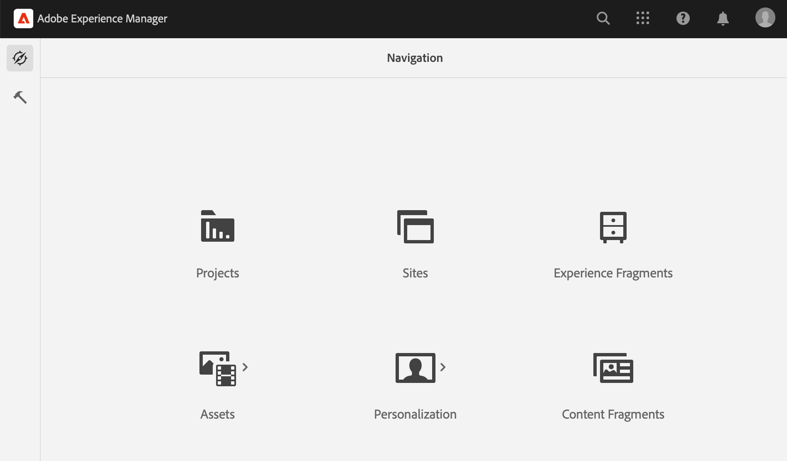

# Quick Start Guide to Authoring {#quick-guide-to-authoring}

Börja här om du vill ha en snabb guide på hög nivå som hjälper dig att komma igång med att skapa innehåll med **Webbplatser** konsol.

>[!TIP]
>
>Den här snabbstartsguiden fokuserar på utveckling av webbplatser, men de flesta koncept är i stort sett tillämpliga på andra konsoler.

## Allt börjar i webbplatskonsolen. {#sites-console}

Oavsett om du vill skapa nytt innehåll eller visa och hantera befintligt innehåll är den centrala översikten för dig **Webbplatser** konsol.

När du först loggar in på AEM visas den globala navigeringsskärmen. Tryck eller klicka bara **Webbplatser** för att öppna **Webbplatser** konsol.

Om du vill komma åt den globala navigeringen från någon annan plats i AEM trycker du på eller klickar på knappen **Adobe Experience Manager** länk längst upp till vänster på AEM, vilket öppnar en nedrullningsbar övertäckning av den globala navigeringen.

En gång i **Webbplatser** konsol är innehållet enkelt att navigera i och visas som standard i en kolumnvy.

## Vyer {#views}

Som standard är **Webbplatser** konsolen öppnas i **Kolumn** vy. Varje hierarkinivå visas som en kolumn, som passar bra för webbaserat hierarkiskt organiserat innehåll.

Tryck eller klicka på en post i en kolumn för att antingen markera den eller öppna nästa nivå i hierarkin. Ett markerat objekt markeras med en bock.

Det finns ytterligare två vyer:

* **Kortvy** - I den här vyn visas alla tävlingsbidrag som ett lätthanterligt kort, vilket gör att du enkelt kan komma åt ytterligare alternativ.
* **Listvy** - Detta utgör en nivå i en hierarki som en enda lista, vilket ger mer information om de enskilda objekten.

Använd vyväljaren längst upp till vänster på skärmen för att växla mellan vyer. Det här dokumentet använder standardkolumnvyn.

## Navigera i innehåll {#navigating}

**Kolumnvy** visar innehåll som en serie överlappande kolumner. Om du markerar ett objekt i den aktuella kolumnen visas antingen informationen i nästa kolumn till höger om det är ett dokument, eller så visas innehållet i nästa hierarkinivå om det är en mapp.

På så sätt kan du gå igenom innehållsstrukturen uppåt och nedåt.

Om du snabbt vill hoppa mellan olika nivåer kan du använda vägbeskrivningarna längst upp på sidan.

Du kan när som helst även använda sökikonen längst upp till höger på skärmen för att hitta visst innehåll.

Sökningen visas som en nedrullningsbar övertäckning över hela konsolen. Ange söktermerna för att hitta ditt innehåll.

## Skapa innehåll {#creating}

Om du vill skapa en ny sida går du till den plats där du vill att den ska vara i innehållshierarkin och trycker eller klickar på **Skapa** i verktygsfältet.

De tillgängliga alternativen är sammanhangsberoende. Om du är roten i innehållsstrukturen kan du skapa en helt ny plats. I annat fall kan du skapa nya sidor eller annat sidrelaterat innehåll.

Beroende på vad du väljer att skapa kommer rätt guide att hjälpa dig att skapa.

## Redigera innehåll {#editing}

Om du vill redigera en sida trycker eller klickar du för att markera sidan i **Webbplatser** konsol. Tryck eller klicka på knappen **Redigera** -ikon.

Då öppnas sidan i redigeraren.

Om du bara vill uppdatera egenskaperna för en sida, till exempel taggar eller namn, kan du trycka eller klicka på **Egenskaper** i verktygsfältet.

## Ordna innehåll {#organizing}

Om du vill flytta eller kopiera en sida markerar du sidan i konsolen och trycker sedan på eller klickar i verktygsfältet **Flytta** eller **Kopiera**. Då startas en guide som vägleder dig genom stegen för att flytta eller kopiera och som definierar namn och plats för den resulterande sidan.

## Publicera innehåll {#publishing}

När du är klar med ändringarna som du vill göra i innehållet med **Webbplatser** kan du publicera innehållet. Välj det innehåll du vill publicera och tryck eller klicka på **Snabbpublicering** i verktygsfältet.

Bekräfta publikationen med en annan tryckning eller klicka på **Publicera** i dialogrutan.

## Ytterligare resurser {#additional-resources}

Det här är bara en kort introduktion till möjligheterna att skapa webbplatsinnehåll och som sådant omfattar det inte alla ämnen eller alternativ.

Här finns fler resurser som går in på att fördjupa sig i alla funktioner i konsolen och som också handlar om allmän innehållsutveckling.

* [Grundläggande hantering](/help/sites-cloud/authoring/basic-handling.md)
* [Designbegrepp](/help/sites-cloud/authoring/author-publish.md)
* [Webbplatskonsol](/help/sites-cloud/authoring/sites-console/introduction.md)
* [Page Editor](/help/sites-cloud/authoring/page-editor/introduction.md)
* [Publicera sidor](/help/sites-cloud/authoring/sites-console/publishing-pages.md)
