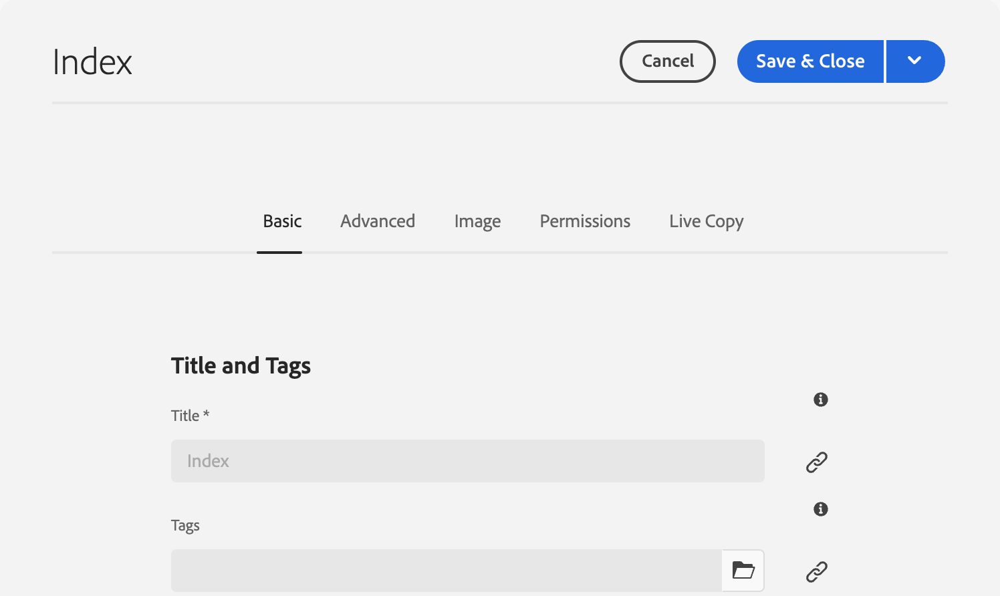
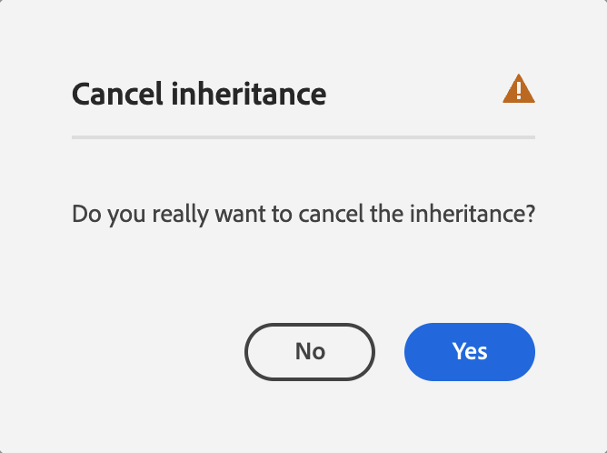

# Redigera sidegenskaper {#page-properties}

Lär dig hur du redigerar [egenskaperna för en sida](/help/sites-cloud/authoring/sites-console/page-properties.md) och ändrar sidans beteende och hur den hanteras.

>[!TIP]
>
>Mer information om de enskilda sidegenskaperna finns i dokumentet [Sidegenskaper.](/help/sites-cloud/authoring/sites-console/page-properties.md)

## Här kan du redigera sidegenskaper {#where}

Du kan redigera sidegenskaper från ett antal platser i AEM.

* [Från &#x200B;](#from-the-sites-console)
* [Från sidredigeraren](#from-the-page-editor)
* [Från den universella redigeraren](#from-the-universal-editor)

Med Sites Console kan du även [redigera egenskaperna för flera sidor samtidigt.](#editing-multiple-pages)

### Från platskonsolen {#from-the-sites-console}

När du bläddrar bland ditt innehåll i konsolen **Platser** kan du använda knappen **Egenskaper** i verktygsfältet för att redigera sidegenskaper:

1. Med konsolen [**Platser** kan du](/help/sites-cloud/authoring/sites-console/introduction.md) navigera till platsen för sidan som du vill visa och redigera egenskaper för.
1. Välj alternativet **Egenskaper** för den begärda sidan med något av följande alternativ:
   * [Snabbåtgärder](/help/sites-cloud/authoring/basic-handling.md#quick-actions)
   * [Markeringsläge](/help/sites-cloud/authoring/basic-handling.md#selecting-resources)
   * Sidegenskaperna visas med rätt flikar.
1. Visa eller redigera egenskaperna efter behov.
1. Använd sedan **Spara** för att spara uppdateringar följt av **Stäng** för att återgå till konsolen.

### Från sidredigeraren {#from-the-page-editor}

När du redigerar en sida med hjälp av sidredigeraren kan du använda **Sidinformation** för att definiera sidegenskaperna:

1. Öppna sidan som du vill redigera egenskaper för i [sidredigeraren](/help/sites-cloud/authoring/page-editor/introduction.md).
1. Välj ikonen **Sidinformation** för att öppna markeringsmenyn:
1. Välj **Öppna egenskaper** så öppnas en dialogruta där du kan redigera egenskaperna, sorterade efter lämplig flik. Följande knappar finns till höger om verktygsfältet:
   * **Avbryt**
   * **Spara och stäng**
1. Använd knappen **Spara och stäng** för att spara ändringarna.

## Från den universella redigeraren {#from-the-universal-editor}

När du redigerar en sida med den universella redigeraren kan du använda ikonen **Sidegenskaper** för att redigera egenskaperna:

1. Öppna sidan som du vill redigera egenskaper för i [Universal Editor](/help/sites-cloud/authoring/universal-editor/authoring.md#page-properties).
1. Välj ikonen **Sidegenskaper** i verktygsfältet.
1. Fönstret för sidegenskaper i AEM öppnas i en ny webbläsarflik på samma sätt som om du redigerade sidegenskaper från [sidredigeraren.](#from-the-page-editor) Följande knappar finns till höger om verktygsfältet:
   * **Avbryt**
   * **Spara och stäng**
1. Använd knappen **Spara och stäng** för att spara ändringarna.
1. Gå tillbaka till webbläsarfliken i Universal Editor.

## Redigera egenskaper för flera sidor {#editing-multiple-pages}

I [**webbplatskonsolen**](/help/sites-cloud/authoring/sites-console/introduction.md) kan du markera flera sidor och sedan använda **Visa egenskaper** för att visa och/eller redigera sidegenskaperna. Detta kallas massredigering av sidegenskaper.

Du kan välja flera sidor för massredigering på olika sätt, bland annat:

* När du bläddrar i konsolen **Platser**
* När du har använt **Sök** för att hitta en uppsättning sidor

När du har markerat sidorna och sedan klickat eller tryckt på alternativet **Egenskaper** visas bulkegenskaperna:

Du kan bara redigera sidor som:

* Dela samma resurstyp
* Är inte en del av en Live-kopia
   * Om någon av de markerade sidorna ingår i en Live-kopia visas ett meddelande när egenskaperna öppnas.

Massredigeringsfönstret är uppdelat i halva vertikalt:

* Den vänstra sidan är en lista över de sidor som du har valt för massredigering.

   * Du kan markera/avmarkera sidorna efter behov.
   * Som standard är alla markerade.

* Höger är en lista över [egenskaper som är tillgängliga för massredigering.](/help/implementing/developing/extending/bulk-editor.md)

   * På samma sätt som när du visar egenskaper för en enskild sida ordnas egenskaperna under flikar.
   * Egenskaper som är tillgängliga på alla markerade sidor och som uttryckligen har definierats som tillgängliga för massredigering visas.
   * Om du minskar sidmarkeringen till en sida visas alla egenskaper.
   * Endast egenskaper med ett gemensamt värde visas.
   * När fältet har flera värden (till exempel Taggar) visas värden bara när *all* är gemensamma. Om bara vissa är vanliga visas de bara när du redigerar.

* Fält som är vanliga, men har olika värden på de olika sidorna, anges med ett särskilt värde som texten `<Mixed Entries>`.

Du kan uppdatera värdena i fälten som är tillgängliga på de sidor du markerar. De nya värdena tillämpas på alla markerade sidor när du väljer **Klar**. När fältet har flera värden (till exempel Taggar) kan du antingen lägga till ett nytt värde eller ta bort ett gemensamt värde.

## Egenskapsarv {#inheritance}

Om sidan baseras på en plan eller på annat sätt ärver innehåll från en annan sida, återspeglas arv i fönstret **Sidegenskaper** för det enskilda fältet.

Ärvda egenskaper kan inte redigeras. Tryck eller klicka på ikonen **Avbryt arv** bredvid ett visst fält för att bryta dess arv.

Bekräfta annulleringen i **Avbryt arv** modal.

När arvet avbryts för ett fält kan det redigeras.

Om du vill återställa arvet trycker eller klickar du på ikonen **Återställ arv** bredvid fältet.

Bekräfta återgivningen i **återställ arv** modal.

Välj **Synkronisera sida efter återgång av arv** om du vill uppdatera fältet med de senaste värdena i planen. Om du inte gör det uppdateras värdena nästa gång LiveCopy synkroniseras.

>[!TIP]
>
>Mer information om arv finns i dokumentet [Multi Site Manager och Translation](/help/sites-cloud/administering/msm-and-translation.md)
