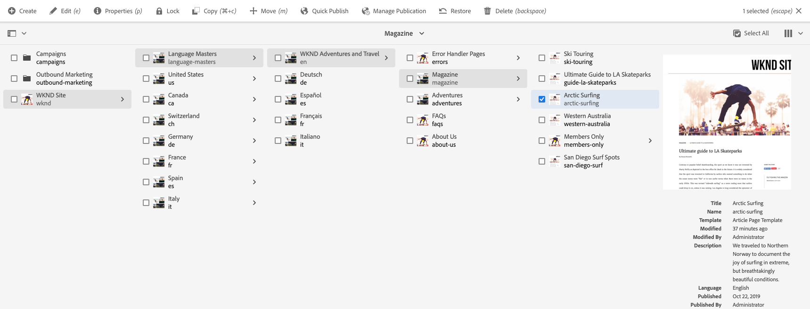
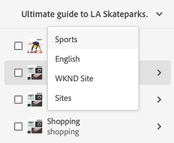

# Webbplatskonsolen {#sites-console}

Lär dig använda **Webbplatser** konsol för att hantera och ordna dina AEM sidor.

## Orientering {#orientation}

The **Webbplatser** konsolen gör att du kan visa sidhierarkin.

Här finns olika vyer och verktygsfält som du kan använda för att hantera och ordna sidorna.

* [Verktygsfältet för konsolen](#toolbar) finns alltid till för att hjälpa dig navigera.
* [Tre olika vyer](#views) gör att du enkelt kan hitta och markera sidan.
* [Verktygsfältet Åtgärder](#action-toolbar) visas när du har valt ett objekt som du vill vidta åtgärder för.
* [Sidpanelen](#side-panel) har flera alternativ för att visa detaljerad information på en markerad sida.

## Verktygsfältet Konsol {#console-toolbar}

Konsolens verktygsfält finns alltid på konsolen och hjälper dig att orientera dig i ditt innehåll och navigera i innehållet.

### Panelväljare {#side-panel-selector}

Med sidpanelsväljaren kan du visa ytterligare information om det markerade objektet i konsolen.

Vilka alternativ som visas beror på den aktuella konsolen. Till exempel i **Webbplatser** Du kan bara markera innehåll (standardvärdet), tidslinjen, referenser eller panelen på filtersidan.

Mer information om sidopanelen finns i dokumentet [Panelen Sida i platskonsolen.](/help/sites-cloud/authoring/sites-console/console-side-panel.md)

### Breadcrumbs {#breadcrumbs}

I mitten av spåret, och alltid med en beskrivning av det markerade objektet, kan du navigera på webbplatsens nivåer med hjälp av spåren.

Tryck eller klicka på den synliga texten för att visa en listruta med hierarkinivåerna för det markerade objektet. Tryck eller klicka på en post för att hoppa till den platsen.

### Markera alla {#select-all}

Tryck eller klicka på **Markera alla** markerar alla objekt i den aktuella vyn av konsolen.

När du har markerat alla objekt visas antalet markerade objekt längst upp till höger i verktygsfältet där **Markera alla** visas.

Du kan avmarkera alla objekt och avsluta markeringsläget genom att:

* Klicka eller peka på **X** bredvid antalet.
* Använda **escape** -tangenten.

### Skapa-knapp {#create-button}

The **Skapa** Med kan du lägga till nya sidor på webbplatsen samt skapa ytterligare webbplatsobjekt som Live-kopior eller Launches.

När du klickar på det här alternativet passar de alternativ som visas konsolen/kontexten. De vanligaste är:

* [Sida](/help/sites-cloud/authoring/sites-console/creating-pages.md)
* [Plats](/help/sites-cloud/administering/site-creation/create-site.md)
* [Live Copy](/help/sites-cloud/administering/msm/overview.md)
* [Starta](/help/sites-cloud/authoring/launches/overview.md)
* [Språkkopia](/help/sites-cloud/administering/translation/overview.md)
* [CSV-rapport](/help/sites-cloud/authoring/sites-console/csv-export.md)

Mer information om hur de fungerar finns i länkarna till dessa funktioner.

## Vyer och val av sidor {#views}

The **Webbplatser** konsolen har tre olika vyer av innehållshierarkin. Du kan visa, navigera i och välja (för ytterligare åtgärder) dina resurser med någon av de tillgängliga vyerna.

* [Kolumnvy](#column-view)
* [Kortvy](#card-view)
* [Listvy](#list-view)

The **Visa** ikonen längst till höger i verktygsfältet AEM visar den aktuella vyn som är markerad.

Om du trycker eller klickar på den kan du välja en annan vy.

Du kan växla mellan kolumnvy, kortvy och listvy. I listvyn visas även visningsinställningarna.

>[!NOTE]
>
>Alternativet **Visa inställningar** är bara tillgängligt i **listvyn**.

Visning, navigering och markering är lika begreppsmässigt för alla vyer, men har små variationer i hantering, beroende på vilken vy du använder.

>[!NOTE]
>
>Som standard visas inte de ursprungliga återgivningarna av resurser i användargränssnittet som miniatyrbilder i någon av vyerna i AEM Assets. Om du är administratör kan du använda övertäckningar för att konfigurera AEM Assets så att de ursprungliga återgivningarna visas som miniatyrbilder.

### Välja resurser {#selecting-resources}

Välja en specifik resurs beror på en kombination av vyn och enheten:

| Visa | Välj Touch | Välj skrivbord | Avmarkera Touch | Avmarkera skrivbord |
|---|---|---|---|---|
| Kolumn | Markera miniatyrbilden | Klicka på miniatyrbilden | Markera miniatyrbilden | Klicka på miniatyrbilden |
| Kort | Markera och håll ned kortet | Muspekaren använder sedan snabbåtgärden bock | Välj kort | Klicka på kortet |
| Lista | Markera miniatyrbilden | Klicka på miniatyrbilden | Markera miniatyrbilden | Klicka på miniatyrbilden |

#### Markera exempel {#selecting-example}

1. I kortvyn:

   

1. När du har valt en resurs täcks den översta rubriken av [funktionsmakron, verktygsfält](#actions-toolbar) som ger åtkomst till åtgärder som för närvarande gäller för den valda resursen.

1. Välj **X** längst upp till höger, eller använd **escape**.

### Kolumnvy {#column-view}

I kolumnvyn kan du visuellt navigera i ett innehållsträd genom en serie överlappande kolumner. I den här vyn kan du visualisera och gå igenom webbplatsens trädstruktur.

Om du väljer en resurs i kolumnen längst till vänster visas de underordnade resurserna i en kolumn till höger. Om du väljer en resurs i den högra kolumnen visas de underordnade resurserna i en annan kolumn till höger och så vidare.

* Du kan navigera uppåt och nedåt i trädet genom att trycka eller klicka på resursnamnet eller nedåt till höger om resursnamnet.

   * Resursnamnet och förvrängningen markeras när användaren knackar på eller klickar på den.
   * De underordnade resurserna för den resurs som användaren klickar på/trycker på visas i kolumnen till höger om den resurs som användaren klickar på/trycker på.
   * Om du väljer ett resursnamn som inte har några underordnade objekt visas informationen i den sista kolumnen.

* Om du trycker eller klickar på miniatyrbilden markeras resursen.

   * När du väljer det här alternativet läggs en bock över miniatyrbilden och resursnamnet markeras också.
   * Information om den valda resursen visas i den sista kolumnen.
   * Verktygsfältet för åtgärder blir tillgängligt.

* När en sida är markerad i kolumnvyn visas den markerade sidan i den sista kolumnen tillsammans med följande information:

   * Sidrubrik
   * Sidnamn (del av sidans URL)
   * Mall som sidan baseras på
   * Ändringsinformation
   * Sidspråk
   * Information om publikation och förhandsgranskning

### Kortvy {#card-view}

I kortvyn visas varje objekt på den aktuella nivån i hierarkin som ett stort kort.

* Korten tillhandahåller information som:

   * En visuell representation av sidinnehållet.
   * Sidans titel.
   * Viktiga datum (t.ex. senast redigerade och publicerade).
   * Om sidan är låst, dold eller ingår i en livecopy.
   * Anger om du måste agera på objektet som en del av ett arbetsflöde.

Kortvyn erbjuder också [snabbåtgärder](#quick-actions) för objekt som markering och vanliga åtgärder som redigering.

Du kan navigera nedåt i trädet genom att trycka på/klicka på kort (var noga med att inte trycka på snabbåtgärderna) eller uppåt igen genom att använda [vägbeskrivningar i sidhuvudet](#the-header).

### Listvy {#list-view}

Listvyn innehåller information för varje resurs på den aktuella nivån i en lista.

* Du kan navigera nedåt i trädet genom att trycka på/klicka på resursnamnet och sedan säkerhetskopiera genom att använda [vägbeskrivningar i sidhuvudet](#the-header).
* Om du enkelt vill markera alla objekt i listan använder du [**Markera alla** i verktygsfältet.](#select-all)

* Markera de kolumner som ska visas med **Visa inställningar** som finns under knappen Vyer. Följande kolumner är tillgängliga för visning:

   * **Namn** - Sidnamn, som kan vara användbart i en flerspråkig redigeringsmiljö eftersom det är en del av sidans URL och inte ändras oavsett språk
   * **Ändrad** - Senast ändrat den och senast ändrat av användaren
   * **Publicerad** - Publiceringsstatus
   * **Förhandsgranska** - Förhandsgranskningsstatus
   * **Mall** - Mall som sidan baseras på
   * **Åtgärd**
   * **Arbetsflöde** - Det arbetsflöde som för närvarande används på sidan. Mer information finns när du för musen över eller öppnar tidslinjen.
   * **Översatt**
   * **Sidvyer**
   * **Unika besökare**
   * **Tid på sidan**

Som standard är **Namn** -kolumnen visas, vilket utgör en del av sidans URL. I vissa fall kan författaren behöva komma åt sidor på ett annat språk och det kan vara bra att se sidans namn (som vanligtvis inte ändras) om författaren inte kan sidans språk.

* Ändra objektens ordning med hjälp av den prickade lodräta listen längst till höger om varje objekt i listan.

Markera det lodräta markeringsfältet och dra objektet till en ny plats i listan.

>[!NOTE]
>
>Att ändra ordningen fungerar bara i en ordnad mapp som har `jcr:primaryType` värde som `sling:OrderedFolder`.

## Verktygsfältet Åtgärder {#actions-toolbar}

När en resurs har valts kan du utföra olika åtgärder för det valda objektet. Dessa åtgärder visas i verktygsfältet Åtgärder.

Verktygsfältet Åtgärder visas bara när en resurs har valts i konsolen. Den åtgärd som är tillgänglig i verktygsfältet Åtgärder ändras så att den återspeglar de åtgärder du kan vidta för de valda objekten. De vanligaste åtgärderna är:

* [**Skapa**](#create-action) - Skapa nytt innehåll eller innehållsrelaterade åtgärder
* **Redigera** - Beroende på hur den valda sidan skapades kan **Redigera** öppnas rätt redigerare.
   * [Page Editor](/help/sites-cloud/authoring/page-editor/introduction.md) - För sidor som skapats med AEM sidredigeraren
   * [Universal Editor](/help/sites-cloud/authoring/universal-editor/authoring.md) - För sidor som skapats med den universella redigeraren
* [**Egenskaper**](/help/sites-cloud/authoring/sites-console/page-properties.md) - Öppnar fönstret för sidegenskaper
* [**Lås**](/help/sites-cloud/authoring/sites-console/managing-pages.md#locking-a-page) - Lås en sida för att förhindra att andra ändrar den
* [**Kopiera**](/help/sites-cloud/authoring/sites-console/managing-pages.md#copying-and-pasting-a-page) - Kopiera en sida
* [**Flytta**](/help/sites-cloud/authoring/sites-console/managing-pages.md#moving-or-renaming-a-page) - Flytta eller byta namn på en sida
* [**Snabbpublicering**](/help/sites-cloud/authoring/sites-console/publishing-pages.md#quick-publish) - Publicera en eller flera sidor direkt
* [**Hantera publikation**](/help/sites-cloud/authoring/sites-console/publishing-pages.md#manage-publication) - Schemalägg en eller flera sidor för publicering
* [**Återställ**](/help/sites-cloud/authoring/sites-console/page-versions.md#restore-version) - Återställa en version av en sida eller ett sidträd
* [**Ta bort**](/help/sites-cloud/authoring/sites-console/managing-pages.md#deleting-a-page) - Ta bort en eller flera sidor

På grund av utrymmesbegränsningar i vissa fönster kan verktygsfältet snabbt bli längre än det tillgängliga utrymmet. När detta inträffar visas ytterligare alternativ. Klicka eller peka på ellipsen (de tre punkterna eller **...**) öppnar en nedrullningsbar väljare med alla återstående åtgärder.

### Skapa åtgärd {#create-action}

Skapa-åtgärden har liknande alternativ som [**Skapa** verktygsfältsknapp](#create-button) för att skapa nya sidor och liknande objekt.

Dessutom kan man skapa sidrelaterade åtgärder.

* [**Arbetsflöde**](/help/sites-cloud/authoring/workflows/overview.md) - Tillämpa ett arbetsflöde på en sida
* [**Version**](/help/sites-cloud/authoring/sites-console/page-versions.md) - Skapa en sidversion

## Mallar

Du kan enkelt se vilken mall sidan baseras på när du markerar sidan i [**kolumnvyn**](/help/sites-cloud/authoring/basic-handling.md#column-view) eller [**listvyn**](/help/sites-cloud/authoring/basic-handling.md#list-view).
