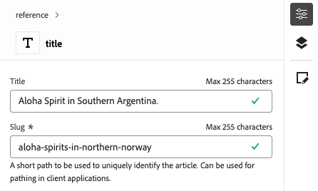

# Skapa innehåll med den universella redigeraren {#authoring}

Se hur enkelt och intuitivt det är för skribenter att skapa innehåll med den universella redigeraren.

## Introduktion {#introduction}

Med den universella redigeraren kan du redigera alla delar av innehållet i alla implementeringar så att du kan leverera enastående upplevelser, öka innehållets hastighet och skapa en toppmodern utvecklarupplevelse.

För att göra detta har den universella redigeraren ett intuitivt användargränssnitt som kräver minimal utbildning för att man ska kunna börja redigera material. I det här dokumentet beskrivs hur du skapar i Universell redigerare.

>[!NOTE]
>
>Det här dokumentet förutsätter att du redan känner till hur du kommer åt och navigerar i den universella redigeraren. Om du inte är det läser du dokumentet [Åtkomst till och navigering i den universella redigeraren.](/help/sites-cloud/authoring/universal-editor/navigation.md)

>[!TIP]
>
>En mer detaljerad introduktion till Universal Editor finns i dokumentet [Universal Editor Introduction.](/help/implementing/universal-editor/introduction.md)

## Redigera innehåll {#editing-content}

Det är enkelt och intuitivt att redigera innehåll. När du för musen över innehåll i redigeraren markeras redigerbart innehåll med en tunn blå kontur.

>[!TIP]
>
>Som standard markeras det för redigering när du trycker eller klickar på ett innehåll. Om du vill navigera i ditt innehåll genom att följa länkar växlar du till [förhandsgranskningsläget.](/help/sites-cloud/authoring/universal-editor/navigation.md#preview-mode)

Beroende på vilket innehåll du väljer kan du ha olika redigeringsalternativ på plats och du kan få ytterligare information och alternativ för innehållet i [egenskapsfältet.](/help/sites-cloud/authoring/universal-editor/navigation.md#properties-rail)

### Redigera oformaterad text {#edit-plain-text}

Du kan redigera texten på plats genom att dubbelklicka eller dubbeltrycka på komponenten.

Den tunna blå konturen ändras till en blå kontur som anger att den är markerad och en markör visas. Gör ändringarna och tryck sedan på Enter eller markera utanför textrutan för att spara ändringarna.

När du väljer att markera textkomponenten visas information om den i [egenskapsfältet.](/help/sites-cloud/authoring/universal-editor/navigation.md#properties-rail) Du kan även redigera texten i skenan.

Dessutom finns information om texten i egenskapsfältet. Ändringarna sparas automatiskt när fokus lämnar det redigerade fältet i egenskapsfältet.

### Redigera RTF {#edit-rich-text}

Du kan redigera texten på plats genom att dubbelklicka eller dubbeltrycka på komponenten.

Formateringsalternativen och informationen på texten finns på två ställen.

#### Snabbmenyn {#context-menu}

Snabbmenyn öppnas ovanför det formaterade textblocket och innehåller grundläggande formateringsalternativ. På grund av utrymmesbegränsningar kan vissa alternativ vara dolda bakom ellipsknappen.

Ändringarna sparas automatiskt när fokus lämnar det redigerade fältet.

#### The Properties Rail {#properties-rail}

[egenskapsfältet](/help/sites-cloud/authoring/universal-editor/navigation.md#properties-rail) visar ett objekt för den markerade texten. Tryck på posten för att öppna en dialogruta med en större arbetsyta för att redigera texten.

Tryck eller klicka på **Avbryt** eller **Klar** för att ignorera eller spara ändringarna.

### Redigera media {#edit-media}

Du kan visa information om den i [egenskapsfältet.](/help/sites-cloud/authoring/universal-editor/navigation.md#properties-rail)

1. Tryck eller klicka på förhandsvisningen av den markerade bilden i egenskapsfältet.
1. Fönstret [Resursväljaren](/help/assets/overview-asset-selector.md#using-asset-selector) öppnas så att du kan välja en resurs.
1. Välj för att välja en ny resurs.
1. Välj **Välj** om du vill gå tillbaka till egenskapsfältet där resursen ersattes.

Ändringarna sparas automatiskt i innehållet.

### Redigera innehållsfragment {#edit-content-fragment}

Om du väljer ett [innehållsfragment](/help/sites-cloud/administering/content-fragments/overview.md) kan du redigera informationen i fältet [egenskaper.](/help/sites-cloud/authoring/universal-editor/navigation.md#properties-rail)

De fält som definieras i innehållsmodellen för det valda innehållsfragmentet visas och kan redigeras i egenskapsfältet.

Om du markerar ett fält som är relaterat till ett innehållsfragment läses innehållsfragmentet in i komponentspåret och fältet rullas automatiskt till.

Ändringarna sparas automatiskt när fokus lämnar det redigerade fältet i egenskapsfältet.

Om du vill redigera ditt innehållsfragment i [redigeraren för innehållsfragment](/help/sites-cloud/administering/content-fragments/authoring.md) i stället trycker eller klickar du på knappen [**Öppna i CF-redigeraren** ](/help/sites-cloud/authoring/universal-editor/navigation.md#edit) i egenskapsfältet.

>[!TIP]
>
>Använd snabbtangenten `e` för att redigera det markerade innehållsfragmentet i redigeraren för innehållsfragment.

Beroende på arbetsflödets behov kan du behöva redigera innehållsfragmentet i den universella redigeraren eller direkt i redigeraren för innehållsfragment.

>[!NOTE]
>
>Den universella redigeraren [validerar fält för innehållsfragment baserat på deras modeller](/help/assets/content-fragments/content-fragments-models.md#validation), vilket gör att du kan tillämpa dataintegritetsregler som regex-mönster och unikhetsbegränsningar.
>
>Detta säkerställer att innehållet uppfyller specifika affärskrav innan det publiceras.

### Lägga till komponenter i behållare {#adding-components}

1. Markera en behållarkomponent i [innehållsträdet](/help/sites-cloud/authoring/universal-editor/navigation.md#content-tree-mode) eller i redigeraren.
1. Välj sedan ikonen Lägg till i egenskapsfältet.

   

Komponenten infogas i behållaren och kan redigeras i redigeraren.

>[!TIP]
>
>Använd snabbtangenten `a` för att lägga till en komponent i den valda behållaren.

### Ta bort komponenter från behållare {#deleting-components}

1. Markera en behållarkomponent i [innehållsträdet](/help/sites-cloud/authoring/universal-editor/navigation.md#content-tree-mode) eller i redigeraren.
1. Markera ikonen för avfasning för behållaren för att expandera dess innehåll i innehållsträdet.
1. Markera sedan en komponent i behållaren i innehållsträdet.
1. Markera borttagningsikonen i egenskapsfältet.

   

Den markerade komponenten har tagits bort.

>[!TIP]
>
>Använd snabbtangenten `Shift+Backspace` för att ta bort den markerade komponenten från dess behållare.

### Ändra ordning på komponenter i behållare {#reordering-components}

1. Om det inte redan är i [innehållsträdet, ](/help/sites-cloud/authoring/universal-editor/navigation.md#content-tree-mode) växlar du till det.
1. Markera en behållarkomponent i innehållsträdet eller i redigeraren.
1. Markera ikonen för avfasning för behållaren för att expandera dess innehåll i innehållsträdet.
1. Dra handtagsikonerna intill komponenterna i behållaren för att visa att du kan ordna om dem. Dra komponenterna för att ordna om dem i behållaren.

   

1. Den dragna komponenten blir grå i innehållsträdet medan insättningspunkten representeras av en blå linje. Släpp komponenten för att placera den på dess nya plats.

Komponenterna ordnas om i både innehållsträdet och i redigeraren

## Förhandsgranska innehåll {#previewing-content}

När du är klar med redigeringen av innehållet vill du ofta navigera i det och se hur det ser ut i innehållet på andra sidor. I [förhandsgranskningsläget](/help/sites-cloud/authoring/universal-editor/navigation.md#preview-mode) kan du klicka på länkar för att navigera i ditt innehåll som en läsare skulle kunna. Innehållet återges i redigeraren på samma sätt som det publiceras.

I förhandsgranskningsläget fungerar knapptryckning eller klickning på innehåll på samma sätt som för en läsare av innehållet. Om du vill markera innehållet som ska redigeras kan du växla från [förhandsgranskningsläget.](/help/sites-cloud/authoring/universal-editor/navigation.md#preview-mode)

## Ytterligare resurser {#additional-resources}

Läs det här dokumentet om du vill lära dig hur du publicerar innehåll med den universella redigeraren.

* [Publicera innehåll med den universella redigeraren](publishing.md) - Lär dig hur den universella redigeraren publicerar innehåll och hur dina appar kan hantera det publicerade innehållet.

Mer information om de tekniska detaljerna i Universal Editor finns i dessa utvecklardokument.

* [Introduktion till universell redigering](/help/implementing/universal-editor/introduction.md) - Lär dig hur den universella redigeraren kan redigera alla delar av innehåll i alla implementeringar så att du kan leverera enastående upplevelser, öka innehållets hastighet och skapa en toppmodern utvecklarupplevelse.
* [Komma igång med den universella redigeraren i AEM](/help/implementing/universal-editor/getting-started.md) - Lär dig hur du får tillgång till den universella redigeraren och hur du börjar använda den i ditt första AEM.
* [Universell redigeringsarkitektur](/help/implementing/universal-editor/architecture.md) - Lär dig mer om arkitekturen för den universella redigeraren och hur data flödar mellan dess tjänster och lager.
* [Attribut och typer](/help/implementing/universal-editor/attributes-types.md) - Lär dig mer om de dataattribut och datatyper som krävs för den universella redigeraren.
* [Autentisering av universell redigerare](/help/implementing/universal-editor/authentication.md) - Lär dig hur den universella redigeraren autentiseras.

## Redigera komponentarv {#inheritance}

Arv är den mekanism där innehåll kan länkas så att om du ändrar det ena ändras det andra automatiskt.

Med den universella redigeraren kan du avbryta arv av innehåll genom att helt enkelt uppdatera innehållet. Redigeraren inaktiverar automatiskt arv för alla ändringar som görs av författare på den sidan, vilket säkerställer att ändrat innehåll bevaras när uppdateringarna synkroniseras från planen.

Mer information om hur arv fungerar med den universella redigeraren finns i dokumentet [Innehållsarv i den universella redigeraren.](/help/sites-cloud/authoring/universal-editor/inheritance.md)
