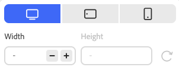

# Skapa innehåll med den universella redigeraren {#authoring}

Se hur enkelt och intuitivt det är för skribenter att skapa innehåll med den universella redigeraren.

## Introduktion {#introduction}

Med den universella redigeraren kan du redigera alla delar av innehållet i alla implementeringar så att du kan leverera enastående upplevelser, öka innehållets hastighet och skapa en toppmodern utvecklarupplevelse.

För att göra detta har den universella redigeraren ett intuitivt användargränssnitt som kräver minimal utbildning för att man ska kunna börja redigera material. I det här dokumentet beskrivs hur du skapar i Universell redigerare.

>[!TIP]
>
>En mer detaljerad introduktion till Universal Editor finns i dokumentet [Universal Editor Introduction.](/help/implementing/universal-editor/introduction.md)

## Förbered appen {#prepare-app}

Om du vill skapa innehåll för ett program med den universella redigeraren måste appen vara instrumenterad av en utvecklare för att stödja redigeraren.

>[!TIP]
>
>Se [Komma igång med den universella redigeraren i AEM](/help/implementing/universal-editor/getting-started.md) för ett exempel på hur du konfigurerar en AEM för att fungera med den universella redigeraren.

## Åtkomst till den universella redigeraren {#accessing}

När appen har instrumenterats för att fungera med den universella redigeraren kan den ha åtkomst både i AEM as a Cloud Service och direkt utan att ha tillgång till AEM.

### Åtkomst inom AEM as a Cloud Service {#accessing-aem}

1. Logga in på din AEM as a Cloud Service-redigeringsinstans.
1. Använd [**webbplatskonsolen**](/help/sites-cloud/authoring/sites-console/introduction.md) för att navigera till sidan som skapats för att användas med den universella redigeraren som du vill redigera.
1. Redigera sidan.
1. Den universella redigeraren öppnas och du kan redigera den valda sidan.

>[!NOTE]
>
>När du redigerar en sida i konsolen [**Platser** ](/help/sites-cloud/authoring/sites-console/introduction.md) öppnar konsolen den redigerare som passar sidans [mall:](/help/sites-cloud/authoring/sites-console/templates.md) antingen den universella redigeraren som beskrivs i det här dokumentet eller [sidredigeraren.](/help/sites-cloud/authoring/page-editor/introduction.md)

### Direkt åtkomst {#accessing-directly}

1. Logga in i den universella redigeraren. Du behöver en Adobe ID för att logga in och [har tillgång till den universella redigeraren.](/help/implementing/universal-editor/getting-started.md#request-access)

1. När du har loggat in anger du URL-adressen till sidan som du vill redigera i [platsfältet.](#location-bar) så att du kan börja redigera innehåll som [textinnehåll](#text-mode) eller [mediainnehåll.](#media-mode)

## Förstå användargränssnittet {#ui}

Gränssnittet är indelat i dessa huvudområden.

* [Rubriken Experience Cloud](#experience-cloud-header)
* [Verktygsfältet för den universella redigeraren](#universal-editor-toolbar)
* [Redigeraren](#editor)
* [Egenskapsfältet](#properties-rail)

### Sidhuvudet Experience Cloud {#experience-cloud-header}

Sidhuvudet Experience Cloud finns alltid längst upp på skärmen. Det är en ankarpunkt som talar om var du befinner dig i Experience Cloud och som hjälper dig att navigera till andra program i Experience Cloud.

#### Experience Manager {#experience-manager}

Klicka på länken Adobe Experience Cloud till vänster om rubriken för att navigera till roten i din Experience Manager-lösning för att komma åt verktyg som [Cloud Manager,](/help/onboarding/cloud-manager-introduction.md) [Cloud Acceleration Manager,](/help/journey-migration/cloud-acceleration-manager/introduction/overview-cam.md) och [Programvarudistribution.](https://experienceleague.adobe.com/docs/experience-cloud/software-distribution/home.html)

#### Organisation {#organization}

Här visas den organisation du är inloggad på. Välj om du vill byta till en annan organisation om din Adobe ID är kopplad till flera.

#### Lösningar {#solutions}

Om du trycker eller klickar på lösningens väljare kan du snabbt gå över till andra Experience Cloud-lösningar.

#### Hjälp {#help}

Hjälpikonen ger snabb åtkomst till utbildningsresurser och supportresurser.

#### Meddelanden {#notifications}

Den här ikonen är märkt med antalet för närvarande tilldelade ofullständiga [meddelanden.](/help/implementing/cloud-manager/notifications.md)

#### Användaregenskaper {#user-properties}

Välj den ikon som representerar användaren för att få åtkomst till dina användarinställningar. Om du inte har konfigurerat någon användarbild tilldelas ikonen slumpmässigt.

### Verktygsfältet för den universella redigeraren {#universal-editor-toolbar}

Verktygsfältet för den universella redigeraren visas alltid längst upp på skärmen precis under [Experience Cloud.](#experience-cloud-header) Du får snabb åtkomst för att navigera till en annan sida för att redigera och publicera den aktuella sidan.

#### Hemknappen {#home-button}

Hemknappen återgår till startsidan för Universal Editor

På startsidan anger du URL-adressen till den webbplats som du vill redigera med Universal Editor.

>[!NOTE]
>
>Alla sidor som du vill redigera med den universella redigeraren måste vara [instrumenterade för att stödja den universella redigeraren.](/help/implementing/universal-editor/getting-started.md)

#### Platsfält {#location-bar}

Platsfältet visar adressen till sidan som du redigerar. Välj det här alternativet om du vill ange adressen till en annan sida som ska redigeras.

>[!TIP]
>
>Använd snabbtangenten `L` för att öppna adressfältet.

>[!NOTE]
>
>Alla sidor som du vill redigera med den universella redigeraren måste vara [instrumenterade för att stödja den universella redigeraren.](/help/implementing/universal-editor/getting-started.md)

#### Inställningar för autentiseringshuvud {#authentication-settings}

Välj ikonen med inställningar för autentiseringshuvudet om du behöver [ange ett anpassat autentiseringshuvud för lokala utvecklingssyften.](/help/implementing/universal-editor/developer-overview.md#auth-header)

#### Emulatorinställningar {#emulator}

Välj emuleringsikonen för att definiera hur den universella redigeraren ska återge sidan.

Om du trycker eller klickar på emuleringsikonen visas alternativen.

Som standard öppnas redigeraren i skrivbordslayout där höjd och bredd definieras automatiskt av webbläsaren.

Du kan också välja att emulera en mobil enhet och i Universell redigerare:

* Definiera dess orientering
* Definiera bredd och höjd
* Ändra orientering

#### Förhandsgranskningsläge {#preview-mode}

I förhandsgranskningsläget återges sidan i redigeraren som den skulle se ut i din publicerade tjänst. Det gör att innehållsförfattaren kan navigera i innehållet genom att klicka på länkar och så vidare.

>[!TIP]
>
>Använd snabbtangenten `P` för att växla till och från förhandsvisningsläget.

#### Öppna programförhandsgranskning {#open-app-preview}

Välj ikonen för förhandsgranskning av öppna program om du vill öppna sidan som du redigerar på en egen webbläsarflik, utan redigeraren, för att förhandsgranska innehållet.

>[!TIP]
>
>Använd snabbtangenten `O` (bokstaven O) för att öppna appförhandsvisningen.

#### Publish {#publish}

Välj publiceringsknappen så att du kan publicera ändringarna i innehållet live för att användas av läsarna.

>[!TIP]
>
>Mer information om hur du publicerar med den universella redigeraren finns i dokumentet [Publicera innehåll med den universella redigeraren](publishing.md).

### Redigeraren {#editor}

Redigeraren tar upp större delen av fönstret och är där sidan som anges i [platsfältet](#location-bar) återges.

Om redigeraren är i [förhandsgranskningsläge](#preview-mode) kan innehållet navigeras och du kan följa länkar, men du kan inte redigera innehållet.

### Properties Rail {#properties-rail}

Egenskapsfältet visas alltid längs den högra sidan av redigeraren. Beroende på dess läge kan det visa information för en komponent som är markerad i innehållet eller hierarkin för sidinnehållet.

#### Egenskapsläge {#properties-mode}

I egenskapsläget visar rälen egenskaperna för den komponent som är markerad i redigeraren. Det här är standardläget för egenskapsfältet när en sida läses in.

Beroende på vilken typ av komponent du väljer kan information visas och ändras i egenskapsfältet.

Alla komponenter har inte information som kan visas och/eller redigeras.

>[!TIP]
>
>Använd snabbtangenten `D` för att växla till egenskapsläge.

#### Läge för innehållsträd {#content-tree-mode}

I innehållsträdsläge visar rälen sidinnehållets hierarki.

När du väljer ett objekt i innehållsträdet rullar redigeraren till det innehållet och markerar det.

>[!TIP]
>
>Använd snabbtangenten `F` för att växla till innehållsträdsläge.

##### Redigera {#edit}

När du redigerar visas alternativen för den markerade komponenten i egenskapsfältet, där du kan redigera den markerade komponenten. Om den markerade komponenten är ett innehållsfragment kan du även välja redigeringsknappen.

Om du trycker eller klickar på redigeringsknappen öppnas [redigeraren för innehållsfragment](/help/assets/content-fragments/content-fragments-managing.md#opening-the-fragment-editor) på en ny flik. Detta ger dig tillgång till den fulla kraften i Content Fragment Editor för att redigera det tillhörande innehållsfragmentet.

Beroende på arbetsflödets behov kan du behöva redigera innehållsfragmentet i den universella redigeraren eller direkt i redigeraren för innehållsfragment.

>[!TIP]
>
>Använd snabbtangenten `E` för att redigera en markerad komponent.

##### Lägg till {#add}

Om du väljer en behållarkomponent i innehållsträdet eller i redigeraren visas alternativet Lägg till i egenskapsfältet.

Om du trycker eller klickar på knappen Lägg till öppnas en listruta med komponenter som är tillgängliga för att [lägga till i den valda behållaren.](#adding-components)

>[!TIP]
>
>Använd snabbtangenten `A` för att lägga till en komponent i en markerad behållarkomponent.

##### Ta bort {#delete}

Om du markerar en komponent i en behållarkomponent antingen i innehållsträdet eller i redigeraren visas borttagningsalternativet på egenskapslisten.

Om du trycker på eller klickar på borttagningsknappen [tas komponenten bort.](#deleting-components)

>[!TIP]
>
>Använd snabbtangenten `Shift+Backspace` för att ta bort en markerad komponent från en behållare.

## Redigera innehåll {#editing-content}

Det är enkelt och intuitivt att redigera innehåll. När du för musen över innehåll i redigeraren markeras redigerbart innehåll med en blå ruta.

>[!TIP]
>
>Som standard markeras det för redigering när du trycker eller klickar på ett innehåll. Om du vill navigera i ditt innehåll genom att följa länkar växlar du till [förhandsgranskningsläget.](#preview-mode)

Beroende på vilket innehåll du väljer kan du ha olika redigeringsalternativ på plats och du kan få ytterligare information och alternativ för innehållet i [egenskapsfältet.](#properties-rail)

### Redigera oformaterad text {#edit-plain-text}

Du kan redigera texten på plats genom att dubbelklicka eller dubbeltrycka på komponenten.

Tryck på Enter eller välj utanför textrutan för att spara ändringarna.

När du väljer att markera textkomponenten visas informationen om den i egenskapsfältet. Du kan också redigera texten på rälsen.

Dessutom finns information om texten i egenskapsfältet. Ändringarna sparas automatiskt när fokus lämnar det redigerade fältet i egenskapsfältet.

### Redigera RTF {#edit-rich-text}

Du kan redigera texten på plats genom att dubbelklicka eller dubbeltrycka på komponenten.

Formateringsalternativen och informationen på texten finns på två ställen.

* **snabbmenyn** öppnas ovanför RTF-blocket och innehåller grundläggande formateringsalternativ i sitt sammanhang. På grund av utrymmesbegränsningar kan vissa alternativ vara dolda bakom ellipsknappen.
* På **egenskapsfältet** visas alla tillgängliga formateringsalternativ tillsammans med texten.

Ändringarna sparas automatiskt när fokus lämnar det redigerade fältet.

### Redigera media {#edit-media}

Du kan visa informationen i egenskapsfältet.

1. Tryck eller klicka på förhandsvisningen av den markerade bilden i egenskapsfältet.
1. Fönstret [Resursväljaren](/help/assets/asset-selector.md#using-asset-selector) öppnas så att du kan välja en resurs.
1. Välj för att välja en ny resurs.
1. Välj **Välj** om du vill gå tillbaka till egenskapsfältet där resursen ersattes.

Ändringarna sparas automatiskt i innehållet.

### Redigera innehållsfragment {#edit-content-fragment}

Om du väljer ett [innehållsfragment](/help/sites-cloud/administering/content-fragments/overview.md) kan du redigera informationen i egenskapsfältet.

De fält som definieras i innehållsmodellen för det valda innehållsfragmentet visas och kan redigeras i egenskapsfältet.

Om du markerar ett fält som är relaterat till ett innehållsfragment läses innehållsfragmentet in i komponentspåret och fältet rullas automatiskt till.

Ändringarna sparas automatiskt när fokus lämnar det redigerade fältet i egenskapsfältet.

Om du vill redigera ditt innehållsfragment i [redigeraren för innehållsfragment](/help/sites-cloud/administering/content-fragments/authoring.md) i stället klickar du på [redigeringsknappen](#edit) i fältet mode.

Beroende på arbetsflödets behov kan du behöva redigera innehållsfragmentet i den universella redigeraren eller direkt i redigeraren för innehållsfragment.

### Lägga till komponenter i behållare {#adding-components}

1. Markera en behållarkomponent i innehållsträdet eller i redigeraren.
1. Välj sedan ikonen Lägg till i egenskapsfältet.

   

Komponenten infogas i behållaren och kan redigeras i redigeraren.

>[!TIP]
>
>Använd snabbtangenten `A` för att lägga till en komponent i den valda behållaren.

### Ta bort komponenter från behållare {#deleting-components}

1. Markera en behållarkomponent i innehållsträdet eller i redigeraren.
1. Markera ikonen för avfasning för behållaren för att expandera dess innehåll i innehållsträdet.
1. Markera sedan en komponent i behållaren i innehållsträdet.
1. Markera borttagningsikonen i egenskapsfältet.

   

Den markerade komponenten har tagits bort.

>[!TIP]
>
>Använd snabbtangenten `Shift+Backspace` för att ta bort den markerade komponenten från dess behållare.

### Ändra ordning på komponenter i behållare {#reordering-components}

1. Markera en behållarkomponent i innehållsträdet eller i redigeraren.
1. Om det inte redan är i [innehållsträdet, ](#content-tree-mode) växlar du till det.
1. Markera ikonen för avfasning för behållaren för att expandera dess innehåll i innehållsträdet.
1. Dra handtagsikonerna intill komponenterna i behållaren för att visa att du kan ordna om dem. Dra komponenterna för att ordna om dem i behållaren.

   

1. Den dragna komponenten blir grå i komponentträdet, medan insättningspunkten representeras av en blå linje. Släpp komponenten för att placera den på dess nya plats.

Komponenterna ordnas om i både innehållsträdet och i redigeraren

## Förhandsgranska innehåll {#previewing-content}

När du är klar med redigeringen av innehållet vill du ofta navigera i det och se hur det ser ut i innehållet på andra sidor. I [förhandsgranskningsläget](#preview-mode) kan du klicka på länkar för att navigera i ditt innehåll som en läsare skulle kunna. Innehållet återges i redigeraren på samma sätt som det publiceras.

I förhandsgranskningsläget fungerar knapptryckning eller klickning på innehåll på samma sätt som för en läsare av innehållet. Om du vill markera innehållet som ska redigeras kan du växla från [förhandsgranskningsläget.](#preview-mode)

## Ytterligare resurser {#additional-resources}

Läs det här dokumentet om du vill lära dig hur du publicerar innehåll med den universella redigeraren.

* [Publicera innehåll med den universella redigeraren](publishing.md) - Lär dig hur den universella redigeraren publicerar innehåll och hur dina appar kan hantera det publicerade innehållet.

Mer information om de tekniska detaljerna i Universal Editor finns i dessa utvecklardokument.

* [Introduktion till universell redigering](/help/implementing/universal-editor/introduction.md) - Lär dig hur den universella redigeraren kan redigera alla delar av innehåll i alla implementeringar så att du kan leverera enastående upplevelser, öka innehållets hastighet och skapa en toppmodern utvecklarupplevelse.
* [Komma igång med den universella redigeraren i AEM](/help/implementing/universal-editor/getting-started.md) - Lär dig hur du får tillgång till den universella redigeraren och hur du börjar använda den i ditt första AEM.
* [Universell redigeringsarkitektur](/help/implementing/universal-editor/architecture.md) - Lär dig mer om arkitekturen för den universella redigeraren och hur data flödar mellan dess tjänster och lager.
* [Attribut och typer](/help/implementing/universal-editor/attributes-types.md) - Lär dig mer om de dataattribut och datatyper som krävs för den universella redigeraren.
* [Autentisering av universell redigerare](/help/implementing/universal-editor/authentication.md) - Lär dig hur den universella redigeraren autentiseras.

