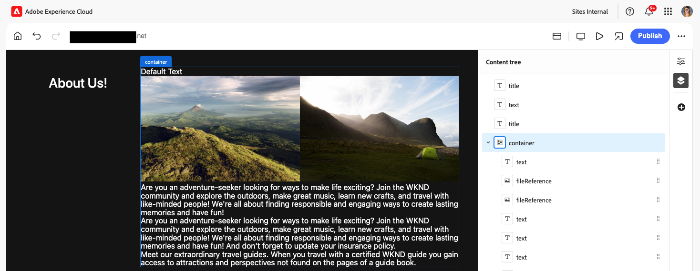

# Skapa innehåll med den universella redigeraren {#authoring}

Se hur enkelt och intuitivt det är för skribenter att skapa innehåll med den universella redigeraren.

## Introduktion {#introduction}

Med den universella redigeraren kan du redigera alla delar av innehållet i alla implementeringar, så att du kan leverera enastående upplevelser och öka innehållets hastighet.

För att göra detta har den universella redigeraren ett intuitivt användargränssnitt som kräver minimal utbildning för att man ska kunna börja redigera material. I det här dokumentet beskrivs hur du skapar i Universell redigerare.

>[!NOTE]
>
>Det här dokumentet förutsätter att du redan känner till hur du kommer åt och navigerar i den universella redigeraren. Om du inte är det läser du [Åtkomst till och navigering i den universella redigeraren](/help/sites-cloud/authoring/universal-editor/navigation.md).

>[!TIP]
>
>En mer detaljerad introduktion till den universella redigeraren finns i [Introduktion till den universella redigeraren](/help/implementing/universal-editor/introduction.md).

## Redigera innehåll {#editing-content}

Det är enkelt och intuitivt att redigera innehåll. När du för musen över innehåll i redigeraren markeras redigerbart innehåll med en tunn blå kontur.

>[!TIP]
>
>Som standard markeras det för redigering när du trycker eller klickar på ett innehåll. Om du vill navigera i ditt innehåll genom att följa länkar växlar du till [förhandsgranskningsläget](/help/sites-cloud/authoring/universal-editor/navigation.md#preview-mode).

Beroende på vilket innehåll du väljer kan du ha olika redigeringsalternativ på plats och du kan få ytterligare information och alternativ för innehållet på [egenskapspanelen](/help/sites-cloud/authoring/universal-editor/navigation.md#properties-rail).

### Redigera oformaterad text {#edit-plain-text}

Du kan redigera texten på plats genom att dubbelklicka eller dubbeltrycka på komponenten.

Den tunna blå konturen ändras till en blå kontur som anger att den är markerad och en markör visas. Gör ändringarna och tryck sedan på Enter eller markera utanför textrutan för att spara ändringarna.

När du markerar textkomponenten visas information om den på [egenskapspanelen](/help/sites-cloud/authoring/universal-editor/navigation.md#properties-rail). Du kan också redigera texten på panelen.

Information om texten finns också på egenskapspanelen. Ändringarna sparas automatiskt när fokus lämnar det redigerade fältet på egenskapspanelen.

### Redigera RTF {#edit-rich-text}

Du kan redigera texten på plats genom att dubbelklicka eller dubbeltrycka på komponenten.

Formateringsalternativen och informationen på texten finns på två ställen.

#### Snabbmenyn {#context-menu}

Snabbmenyn öppnas ovanför det formaterade textblocket och innehåller grundläggande formateringsalternativ. På grund av utrymmesbegränsningar kan vissa alternativ vara dolda bakom ellipsknappen.

Ändringarna sparas automatiskt när fokus lämnar det redigerade fältet.

#### Egenskapspanelen {#properties-rail}

[egenskapspanelen](/help/sites-cloud/authoring/universal-editor/navigation.md#properties-rail) visar ett objekt för den markerade texten. Tryck på posten för att öppna en dialogruta med en större arbetsyta för att redigera texten.

Tryck eller klicka på **Avbryt** eller **Klar** för att ignorera eller spara ändringarna.

#### RTF-formateringsalternativ {#formatting-options}

RTF-redigeraren i Universal Editor gör att författaren kan använda standardtextformatering. Som standard är följande alternativ tillgängliga.

* Stycke (h1, h2, h3 osv.)
* Fet
* Kursiv
* Understruken
* Upphöjd
* Nedsänkt
* Punktlista
* Numrerad lista
* Länk

RTE kan konfigureras för att dölja alternativ eller visa ytterligare alternativ beroende på författarens behov. Mer information finns i dokumentet [Configuring the RTE for the Universal Editor](/help/implementing/universal-editor/configure-rte.md).

### Redigera media {#edit-media}

Du kan visa information om den i [egenskapspanelen](/help/sites-cloud/authoring/universal-editor/navigation.md#properties-rail).

1. Tryck eller klicka på förhandsvisningen av den markerade bilden på egenskapspanelen.
1. Fönstret [Resursväljaren](/help/assets/overview-asset-selector.md#using-asset-selector) öppnas så att du kan välja en resurs.
1. Välj för att välja en ny resurs.
1. Välj **Välj** om du vill gå tillbaka till egenskapspanelen där resursen ersattes.

Ändringarna sparas automatiskt i innehållet.

### Redigera innehållsfragment {#edit-content-fragment}

Om du väljer ett [innehållsfragment](/help/sites-cloud/administering/content-fragments/overview.md) kan du redigera informationen på [egenskapspanelen](/help/sites-cloud/authoring/universal-editor/navigation.md#properties-rail).

De fält som definieras i innehållsmodellen för det valda innehållsfragmentet visas och kan redigeras på egenskapspanelen.

Om du markerar ett fält som är relaterat till ett innehållsfragment läses innehållsfragmentet in på komponentpanelen och fältet rullas automatiskt till.

Ändringarna sparas automatiskt när fokus lämnar det redigerade fältet på egenskapspanelen.

Om du vill redigera ditt innehållsfragment i [redigeraren för innehållsfragment](/help/sites-cloud/administering/content-fragments/authoring.md) i stället trycker eller klickar du på knappen [**Öppna i CF-redigeraren** ](/help/sites-cloud/authoring/universal-editor/navigation.md#edit) på egenskapspanelen.

>[!TIP]
>
>Använd snabbtangenten `e` för att redigera det markerade innehållsfragmentet i redigeraren för innehållsfragment.

Beroende på arbetsflödets behov kan du behöva redigera innehållsfragmentet i den universella redigeraren eller direkt i redigeraren för innehållsfragment.

>[!NOTE]
>
>Den universella redigeraren [validerar fält för innehållsfragment baserat på deras modeller](/help/assets/content-fragments/content-fragments-models.md#validation), vilket gör att du kan tillämpa dataintegritetsregler som regex-mönster och unikhetsbegränsningar.
>
>Detta säkerställer att innehållet uppfyller specifika affärskrav innan det publiceras.

### Lägga till komponenter i behållare {#adding-components}

1. Markera en behållarkomponent i [innehållsträdet](/help/sites-cloud/authoring/universal-editor/navigation.md#content-tree-mode) eller i redigeraren.

   

1. Välj sedan ikonen Lägg till på egenskapspanelen.

   

1. Om mer än en komponent tillåts för behållaren väljer du vilken du vill infoga i listrutan. Om bara en komponent tillåts infogas den automatiskt.

Komponenten infogas i behållaren och kan redigeras i redigeraren.

>[!TIP]
>
>Använd snabbtangenten `a` för att lägga till en komponent i den valda behållaren.

### Duplicera komponenter i behållare {#duplicating-components}

1. Markera en komponent i en behållare med [innehållsträdet](/help/sites-cloud/authoring/universal-editor/navigation.md#content-tree-mode) eller redigeraren.
1. Välj sedan ikonen **Duplicera** på egenskapspanelen.

   
1. Komponenten dupliceras och infogas under den markerade komponenten.

Komponenten infogas i behållaren och kan redigeras i redigeraren.

### Ta bort komponenter från behållare {#deleting-components}

1. Markera en behållarkomponent i [innehållsträdet](/help/sites-cloud/authoring/universal-editor/navigation.md#content-tree-mode) eller i redigeraren.
1. Markera ikonen för avfasning för behållaren för att expandera dess innehåll i innehållsträdet.
1. Markera sedan en komponent i behållaren i innehållsträdet.
1. Välj ikonen Ta bort på egenskapspanelen.

   

Den markerade komponenten har tagits bort.

>[!TIP]
>
>Använd snabbtangenten `Shift+Backspace` för att ta bort den markerade komponenten från dess behållare.

### Ändra ordning på komponenter {#reordering-components}

1. Om det inte redan är i [innehållsträdet](/help/sites-cloud/authoring/universal-editor/navigation.md#content-tree-mode) växlar du till det.
1. Markera en behållarkomponent i innehållsträdet eller i redigeraren.
1. Markera ikonen för avfasning för behållaren för att expandera dess innehåll i innehållsträdet.
1. Dra handtagsikonerna intill komponenterna i behållaren för att visa att du kan ordna om dem. Dra komponenterna för att ordna om dem i behållaren.

   

1. Den dragna komponenten är nedtonad i innehållsträdet, medan insättningspunkten representeras av en blå linje. Släpp komponenten för att placera den på dess nya plats.

Komponenterna ordnas om både i innehållsträdet och i redigeraren.

>[!NOTE]
>
>Komponenter kan bara flyttas mellan behållare om målbehållarna [komponentfiltret](/help/implementing/universal-editor/filtering.md) tillåter den valda komponenten.

### Ångra och Gör om {#undo-redo}

Välj Ångra eller Gör om för att ångra eller göra om den senaste redigeringen i redigeraren.

* Ångra och göra om kan göras för redigeringar som görs i sitt sammanhang, redigeringar som görs via panelen Egenskaper samt för att lägga till, duplicera, flytta och ta bort block.
* Ångra och gör om är begränsat till den aktuella webbläsarsessionen.

>[!TIP]
>
>Använd snabbtangenten `Command-Z` eller `Shift-Command-Z` för att ångra respektive göra om.

### Kopiera och klistra in {#copy-paste}

Du kan kopiera och klistra in komponenter som finns i [behållare.](/help/implementing/universal-editor/field-types.md#container) Detta är bara möjligt om målbehållaren inte har [filter konfigurerade](/help/implementing/universal-editor/filtering.md) eller har filter som tillåter att komponenten klistras in.

Kopiera och klistra in kan finnas på samma webbläsarflik eller mellan webbläsarflikar, förutsatt att flikarna redan är öppna. Du kan inte kopiera ett objekt och sedan öppna en ny webbläsarflik för att klistra in det.

1. Markera en komponent i redigeraren eller i innehållsträdet.
1. Ikonen **Kopiera** visas på egenskapspanelen i [.](/help/sites-cloud/authoring/universal-editor/navigation.md#properties-panel) Tryck eller klicka på den.
1. Ikonen **Klistra in** visas på egenskapspanelen.
1. Markera komponenten _efter_ som du vill klistra in den kopierade komponenten.
1. Tryck eller klicka på Klistra in.
1. Den kopierade komponenten klistras in _efter_ den markerade komponenten.

>[!TIP]
>
>Använd snabbtangenten `Command-C` eller `Command-V` för att kopiera respektive klistra in.

## Förhandsgranska innehåll {#previewing-content}

När du är klar med redigeringen av innehållet vill du ofta navigera i det och se hur det ser ut i innehållet på andra sidor. I [förhandsgranskningsläget](/help/sites-cloud/authoring/universal-editor/navigation.md#preview-mode) kan du klicka på länkar för att navigera i ditt innehåll som en läsare skulle kunna. Innehållet återges i redigeraren på samma sätt som det publiceras.

I förhandsgranskningsläget fungerar knapptryckning eller klickning på innehåll på samma sätt som för en läsare av innehållet. Om du vill markera innehållet som ska redigeras växlar du från [förhandsgranskningsläget](/help/sites-cloud/authoring/universal-editor/navigation.md#preview-mode).

## Redigera komponentarv {#inheritance}

Arv är den mekanism där innehåll kan länkas så att om du ändrar det ena ändras det andra automatiskt.

Med den universella redigeraren kan du avbryta arv av innehåll genom att helt enkelt uppdatera innehållet. Redigeraren inaktiverar automatiskt arv för alla ändringar som görs av författare på den sidan, vilket säkerställer att ändrat innehåll bevaras när uppdateringarna synkroniseras från planen.

Om **AEM Multi-Site-Management (MSM) Extension** är aktiverat för ditt program har du [ytterligare verktygsfältsalternativ](#inheritance-extension) som du kan använda för att visa och ändra arvsstatus för en enskild komponent i Universal Editor.

Mer information om hur arv fungerar med den universella redigeraren finns i [Innehållsarv i den universella redigeraren](/help/sites-cloud/authoring/universal-editor/inheritance.md).

## Valfria verktygsfältsfunktioner {#toolbar-options}

Ytterligare funktioner finns som tillägg till den universella redigeraren för att du ska kunna hantera sidor och innehåll ytterligare. [Dessa tillägg måste aktiveras av en administratör](/help/implementing/universal-editor/extending.md) i programmet innan de visas som innehållsförfattare i [verktygsfältet för den universella redigeraren.](/help/sites-cloud/authoring/universal-editor/navigation.md#universal-editor-toolbar)

### Arv {#inheritance-extension}

Tillägget **AEM Multi-Site-Management (MSM)** visar den aktuella arvsstatusen för den markerade komponenten och gör att du kan [bryta eller återinstallera arv.](/help/sites-cloud/authoring/universal-editor/inheritance.md)

Ikonen **Arv installerat** i verktygsfältet för universell redigering visar att arv fortfarande är aktivt för den valda komponenten.

Tryck eller klicka på ikonen för att bryta arv för den markerade komponenten. Arv bryts automatiskt om du redigerar komponenten.

Ikonen **Arv brutet** visar att arv har brutits för den valda komponenten.

Tryck eller klicka på ikonen för att återskapa arv för den markerade komponenten. Du måste läsa in sidan igen för att uppdatera innehållet för att kunna visa det ärvda innehållet.

Information om hur du aktiverar det här tillägget finns i [Extension Manager-dokumentationen.](https://developer.adobe.com/uix/docs/extension-manager/feature-highlights/#enablingdisabling-extensions)

>[!NOTE]
>
>Ikonerna **Inledda arv** och **Avbrutna arv** visas bara när en komponent har markerats och sidan baseras på en plan.

>[!NOTE]
>
>**AEM Multi-Site-Management (MSM)-tillägget** fungerar bara för sidor, inte för innehållsfragment.

### Åtkomst till sidegenskaper {#page-properties}

Med **AEM-tillägget Sidegenskaper** får du snabb åtkomst till [fönstret Sidegenskaper](/help/sites-cloud/authoring/sites-console/page-properties.md) för sidan som redigeras just nu.

Tryck eller klicka på ikonen **Sidegenskaper** i verktygsfältet för Universell redigerare för att öppna sidegenskaperna för sidan på en ny flik i webbläsaren.

Information om hur du aktiverar det här tillägget finns i [Extension Manager-dokumentationen.](https://developer.adobe.com/uix/docs/extension-manager/feature-highlights/#enablingdisabling-extensions)

>[!NOTE]
>
>**AEM-tillägget Sidegenskaper** fungerar bara för sidor, inte för innehållsfragment.

### Åtkomstplatskonsolen {#sites-console}

Med **AEM Site Admin Extension** får du snabb åtkomst till den sida som redigeras i [Sites Console i AEM](/help/sites-cloud/authoring/sites-console/introduction.md) så att du kan navigera i webbplatsträdet eller utföra åtgärder på sidnivå i konsolen.

Tryck eller klicka på ikonen för att öppna platskonsolen på en ny flik i webbläsaren, navigerad till sidan som är i redigeraren.

Information om hur du aktiverar det här tillägget finns i [Extension Manager-dokumentationen.](https://developer.adobe.com/uix/docs/extension-manager/feature-highlights/#enablingdisabling-extensions)

### Låsa och låsa upp sidor {#locking-pages}

**AEM Page Lock Extension** visar sidans aktuella låsstatus i redigeraren och du kan [låsa eller låsa upp sidan.](/help/sites-cloud/authoring/sites-console/managing-pages.md#locking-a-page)

Ikonen **Olåst** i verktygsfältet för universell redigering visar att sidan som för närvarande finns i redigeraren inte är låst.

Tryck eller klicka på ikonen för att låsa sidan.

Ikonen **Låst** i verktygsfältet för universell redigering visar att sidan som för närvarande finns i redigeraren är låst. Håll muspekaren över ikonen om du vill visa ett verktygstips som anger användaren som låste sidan.

Tryck eller klicka på ikonen för att låsa upp sidan om du är den användare som låste den.

Information om hur du aktiverar det här tillägget finns i [Extension Manager-dokumentationen.](https://developer.adobe.com/uix/docs/extension-manager/feature-highlights/#enablingdisabling-extensions)

>[!NOTE]
>
>**AEM Page Lock Extension** fungerar bara för sidor, inte för innehållsfragment.

### Arbetsflöden {#workflows}

Med **AEM Workflows Extension** kan du [starta ett arbetsflöde](/help/sites-cloud/authoring/workflows/overview.md) på den sida som är i redigeraren.

Tryck eller klicka på ikonen **Arbetsflöden** i verktygsfältet för Universell redigering för att öppna **Starta ett arbetsflöde** modal. I fönstret visas det möjliga innehåll som du kan använda ett arbetsflöde på.

1. Välj arbetsflödet som ska användas i listrutan **Arbetsflödesmodell**.
1. Ange en beskrivning av arbetsflödet i fältet **Namn**.
1. I listan **Innehåll som ska inkluderas i arbetsflödet** använder du kryssrutorna för att definiera vilket innehåll som ska inkluderas i arbetsflödet.
1. Tryck eller klicka på **Starta arbetsflöde** för att starta arbetsflödet eller på **Stäng** för att avbryta.

Information om hur du aktiverar det här tillägget finns i [Extension Manager-dokumentationen.](https://developer.adobe.com/uix/docs/extension-manager/feature-highlights/#enablingdisabling-extensions)

### Utvecklarinloggning {#developer-login}

**Dev-inloggningstillägget för AEM Universal Editor** är användbart för utvecklare som utvecklar lokalt, vilket gör det enkelt att autentisera lokalt i en AEM SDK för testning.

Tryck eller klicka på ikonen **Developer Logon** i verktygsfältet Universal Editor för att ange dina lokala inloggningsuppgifter för att logga in på din lokala AEM SDK.

Information om hur du aktiverar det här tillägget finns i [Extension Manager-dokumentationen.](https://developer.adobe.com/uix/docs/extension-manager/feature-highlights/#enablingdisabling-extensions)

## Valfria funktioner i egenskapspanelen {#properties-panel-options}

Ytterligare funktioner finns som tillägg till den universella redigeraren för att du ska kunna hantera sidinnehållet ytterligare. [Dessa tillägg måste aktiveras av en administratör](/help/implementing/universal-editor/extending.md) i programmet innan de visas som innehållsförfattare i [egenskapspanelen för den universella redigeraren.](/help/sites-cloud/authoring/universal-editor/navigation.md#properties-rail)

### Generera variationer {#generate-variations}

Med tillägget **Generera variationer** kan du använda generativ artificiell intelligens (AI) för att skapa variationer för ditt innehåll direkt på egenskapspanelen.

Tryck eller klicka på ikonen **Generera variationer** på egenskapspanelen för den universella redigeraren för att ta emot rekommendationer och skapa variationer. Mer information om hur du genererar variationer finns i dokumentet [Generate Variations - Integrated in AEM Editors](/help/generative-ai/generate-variations-integrated-editor.md).

Information om hur du aktiverar det här tillägget finns i [Extension Manager-dokumentationen.](https://developer.adobe.com/uix/docs/extension-manager/feature-highlights/#enablingdisabling-extensions)

## Ytterligare resurser {#additional-resources}

Läs det här dokumentet om du vill lära dig hur du publicerar innehåll med den universella redigeraren.

* [Publicera innehåll med den universella redigeraren](publishing.md) - Lär dig hur den universella redigeraren publicerar innehåll och hur dina appar kan hantera det publicerade innehållet.

Mer information om de tekniska detaljerna i Universal Editor finns i dessa utvecklardokument.

* [Introduktion till universell redigering](/help/implementing/universal-editor/introduction.md) - Lär dig hur den universella redigeraren kan redigera alla delar av innehåll i alla implementeringar så att du kan leverera enastående upplevelser och öka innehållets hastighet.
* [Komma igång med den universella redigeraren i AEM](/help/implementing/universal-editor/getting-started.md) - Lär dig hur du får tillgång till den universella redigeraren och hur du börjar använda den i ditt första AEM-program.
* [Universell redigeringsarkitektur](/help/implementing/universal-editor/architecture.md) - Lär dig mer om arkitekturen för den universella redigeraren och hur data flödar mellan dess tjänster och lager.
* [Attribut och typer](/help/implementing/universal-editor/attributes-types.md) - Lär dig mer om de dataattribut och datatyper som krävs för den universella redigeraren.
* [Autentisering av universell redigerare](/help/implementing/universal-editor/authentication.md) - Lär dig hur den universella redigeraren autentiseras.
