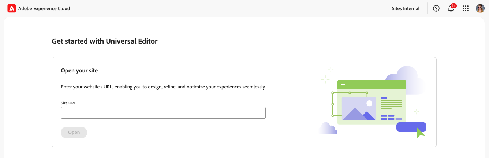
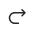
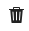

# Öppna och navigera i den universella redigeraren {#navigating}

Lär dig grunderna i hur du kommer åt och navigerar i den universella redigeraren.

## Introduktion {#introduction}

Med den universella redigeraren kan du redigera alla delar av innehållet i alla implementeringar så att du kan leverera enastående upplevelser, öka innehållets hastighet och skapa en toppmodern utvecklarupplevelse.

För att göra detta har den universella redigeraren ett intuitivt användargränssnitt som kräver minimal utbildning för att man ska kunna börja redigera material. I det här dokumentet beskrivs hur du navigerar i den universella redigeraren.

>[!TIP]
>
>* Mer information om hur du redigerar med den universella redigeraren finns i dokumentet [Skapa innehåll med den universella redigeraren](/help/sites-cloud/authoring/universal-editor/authoring.md).
>* En mer detaljerad introduktion till den universella redigeraren finns i [Introduktion till den universella redigeraren](/help/implementing/universal-editor/introduction.md).

## Förbered appen {#prepare-app}

Om du vill skapa innehåll för ett program med den universella redigeraren måste appen vara instrumenterad av en utvecklare för att stödja redigeraren.

>[!TIP]
>
>Se [Komma igång med den universella redigeraren i AEM](/help/implementing/universal-editor/getting-started.md) för ett exempel på hur du konfigurerar en AEM-app så att den fungerar med den universella redigeraren.

## Åtkomst till den universella redigeraren {#accessing}

När appen har fått ett verktyg som fungerar tillsammans med den universella redigeraren kan den ha åtkomst både inifrån AEM as a Cloud Service och direkt utan att kunna använda AEM.

### Åtkomst inom AEM as a Cloud Service {#accessing-aem}

1. Logga in på din AEM as a Cloud Service-redigeringsinstans.
1. Använd [**webbplatskonsolen**](/help/sites-cloud/authoring/sites-console/introduction.md) för att navigera till sidan som skapats för att användas med den universella redigeraren som du vill redigera.
1. Redigera sidan.
1. Den universella redigeraren öppnas och du kan redigera den valda sidan.

>[!NOTE]
>
>När du redigerar en sida i konsolen [**Platser**](/help/sites-cloud/authoring/sites-console/introduction.md) öppnar konsolen den redigerare som är lämplig för sidans [mall](/help/sites-cloud/authoring/page-editor/templates.md), antingen den universella redigeraren som beskrivs i det här dokumentet eller [sidredigeraren](/help/sites-cloud/authoring/page-editor/introduction.md).

### Direkt åtkomst {#accessing-directly}

1. Logga in i den universella redigeraren. Du behöver en Adobe ID för att logga in och [har tillgång till den universella redigeraren](/help/implementing/universal-editor/getting-started.md#request-access).

1. När du har loggat in anger du URL-adressen till sidan som du vill redigera i [platsfältet](#location-bar) så att du kan börja redigera innehåll som textinnehåll eller mediainnehåll.

## Förstå användargränssnittet {#ui}

Gränssnittet är indelat i dessa huvudområden.

* [Experience Platform övre navigeringsfält](#experience-cloud-header)
* [Verktygsfältet för den universella redigeraren](#universal-editor-toolbar)
* [Redigeraren](#editor)
* [Egenskapspanelen](#properties-rail)

>[!TIP]
>
>Den universella redigeraren erbjuder ett antal [anpassningsalternativ](/help/implementing/universal-editor/customizing.md) och [utökningspunkter](/help/implementing/universal-editor/extending.md) som kan ändra och lägga till i redigerarens funktioner. Av den anledningen kan du se andra alternativ än de som beskrivs här.

### Experience Platform övre navigeringsfält {#experience-cloud-header}

Experience Platform övre navigeringsfält finns alltid överst på skärmen. Det är en ankarpunkt som talar om var du befinner dig inom Experience Cloud och som hjälper dig att navigera till andra Experience Cloud-program.

Mer information om Experience Platform övre navigeringsfält finns i [Adobe Experience Platform användargränssnittsguide](https://experienceleague.adobe.com/sv/docs/experience-platform/landing/platform-ui/ui-guide#top-navigation-bar)

#### Konto {#user-properties}

Om du trycker eller klickar på kontoikonen öppnas en meny med dina användarinställningar.

För den universella redigeraren, under rubriken **Produktinställningar**, finns det ett alternativ för att växla mellan den aktuella produktionsversionen av den universella redigeraren och den kommande förhandsvisningsversionen.

### Verktygsfältet för den universella redigeraren {#universal-editor-toolbar}

Verktygsfältet för den universella redigeraren visas alltid längst upp på skärmen precis under [Experience Cloud-rubriken](#experience-cloud-header). Du får snabb åtkomst för att navigera till en annan sida för att redigera och publicera den aktuella sidan.

Beroende på hur programmet är konfigurerat kan det även innehålla [ytterligare funktioner som har aktiverats som tillägg av administratören.](#additional-toolbar-buttons)

#### Hemknappen {#home-button}

Hemknappen återgår till startsidan för Universal Editor

På startsidan anger du URL-adressen till den webbplats som du vill redigera med Universal Editor.

>[!NOTE]
>
>Alla sidor som du vill redigera med den universella redigeraren måste vara [instrumenterade för att stödja den universella redigeraren](/help/implementing/universal-editor/getting-started.md).

I avsnittet **Snabblänkar** får du tillgång till hjälpresurser och i avsnittet **Senaste** finns länkar till sidor som du nyligen öppnat med den universella redigeraren.

#### Platsfält {#location-bar}

Platsfältet visar adressen till sidan som du redigerar. Välj det här alternativet om du vill ange adressen till en annan sida som ska redigeras.

>[!TIP]
>
>Använd snabbtangenten `l` (bokstaven l) för att öppna adressfältet.

>[!NOTE]
>
>Alla sidor som du vill redigera med den universella redigeraren måste vara [instrumenterade för att stödja den universella redigeraren](/help/implementing/universal-editor/getting-started.md).

#### Ångra och Gör om {#undo-redo}

Välj Ångra eller Gör om för att ångra eller göra om den senaste redigeringen i redigeraren. Mer information finns i dokumentet [Skapa innehåll med den universella redigeraren](/help/sites-cloud/authoring/universal-editor/authoring.md#undo-redo).

>[!TIP]
>
>Använd snabbtangenten `Command-Z` eller `Shift-Command-Z` för att ångra respektive göra om.

#### Lokal utvecklarinloggning {#local-developer-login}

Välj den lokala utvecklarinloggningsikonen om du enkelt behöver autentisera till din lokala AEM SDK [vid lokal utveckling.](/help/implementing/universal-editor/local-dev.md)

#### Responsivt läge {#emulator}

Välj ikonen för svarsläge för att definiera hur sidan ska återges i den universella redigeraren.

Om du trycker eller klickar på ikonen för responsivt läge visas alternativen.

Som standard öppnas redigeraren i skrivbordslayout där höjd och bredd definieras automatiskt av webbläsaren.

Du kan också välja att emulera en mobil enhet och i Universell redigerare:

* Definiera dess orientering
* Definiera bredd och höjd
* Ändra orientering

#### Förhandsgranska {#preview-mode}

I förhandsgranskningsläget återges sidan i redigeraren som den skulle se ut i din publicerade tjänst. Det gör att innehållsförfattaren kan navigera i innehållet genom att klicka på länkar och så vidare.

>[!TIP]
>
>Använd snabbtangenten `p` för att växla till och från förhandsvisningsläget.

#### Öppna sida {#open-page}

Markera ikonen för att öppna sidan som du redigerar på en egen webbläsarflik, utan redigeraren, för att förhandsgranska innehållet.

>[!TIP]
>
>Använd snabbtangenten `o` (bokstaven o) för att öppna appförhandsvisningen.

>[!TIP]
>
>URL:en för förhandsgranskning för din app [kan anpassas](/help/implementing/universal-editor/customizing.md#custom-preview-urls).

>[!NOTE]
>
>Knappen [&#x200B; för öppen sida kan inaktiveras](/help/implementing/universal-editor/customizing.md#open-page) och kanske inte visas i redigeraren.

#### Publicera {#publish}

Välj publiceringsknappen så att du kan publicera ändringarna i innehållet live för att användas av läsarna eller i en förhandsvisningsmiljö för granskning.

>[!TIP]
>
>Mer information om hur du publicerar med den universella redigeraren finns i dokumentet [Publicera innehåll med den universella redigeraren](publishing.md).

>[!NOTE]
>
>Publiceringsknappen [&#x200B; kan inaktiveras](/help/implementing/universal-editor/customizing.md#disable-publish) och kanske inte visas i redigeraren.

#### Ellips {#ellipsis}

Dessutom kan du komma åt standardalternativen med ellipsknappen.

Du kan till exempel avpublicera en sida (d.v.s. invertera åtgärden för knappen [**Publicera**](#publish)) via ellipsknappen.

#### Ytterligare knappar {#additional-toolbar-buttons}

Universal Editor ger en anpassningsbar och utbyggbar redigeringsfunktion. Om du ser ytterligare knappar i verktygsfältet har den universella redigeraren utökats.

* Mer information om hur ett enskilt tillägg fungerar finns i [dokumentationen för Universal Editor.](/help/sites-cloud/authoring/universal-editor/authoring.md#toolbar-options)
* Mer information om tilläggsmöjligheter finns i [Utöka den universella redigeraren.](/help/implementing/universal-editor/extending.md)
* Mer information om hur du installerar ett enskilt tillägg finns i [Extension Manager-dokumentationen.](https://developer.adobe.com/uix/docs/extension-manager/extension-developed-by-adobe/)

### Redigeraren {#editor}

Redigeraren tar upp större delen av fönstret och är där sidan som anges i [platsfältet](#location-bar) återges.

Om redigeraren är i [förhandsgranskningsläget](#preview-mode) kan innehållet navigeras och du kan följa länkar, men du kan inte redigera innehållet.

### Egenskapspanelen {#properties-rail}

Egenskapspanelen finns alltid till höger om redigeraren. Beroende på dess läge kan det visa information för en komponent som är markerad i innehållet eller hierarkin för sidinnehållet.

Beroende på hur programmet är konfigurerat kan det även innehålla [ytterligare funktioner som har aktiverats som tillägg av administratören.](#additional-properties-panel-buttons)

#### Egenskapsläge {#properties-mode}

I egenskapsläget visar panelen egenskaperna för den komponent som är markerad i redigeraren. Det här är standardläget för egenskapspanelen när en sida läses in.

Beroende på vilken typ av komponent du väljer kan information visas och ändras på egenskapspanelen.

Alla komponenter har inte information som kan visas och/eller redigeras.

>[!TIP]
>
>Använd snabbtangenten `d` för att växla till egenskapsläge.

#### Läge för innehållsträd {#content-tree-mode}

I innehållsträdesläget visas sidinnehållets hierarki på panelen.

* När du väljer ett objekt i innehållsträdet rullar redigeraren till det innehållet och markerar det.
* När du dubbelklickar på ett objekt i innehållsträdet rullar redigeraren till det innehållet och markerar det, och öppnar även de associerade egenskaperna i [egenskapsläget.](#properties-mode)
* När du högerklickar på ett objekt i trädet öppnas en snabbmeny med lämpliga åtgärder för objektet.

>[!TIP]
>
>Använd snabbtangenten `f` för att växla till innehållsträdsläge.

##### Öppna i CF Editor {#edit}

När du redigerar visas alternativen för den markerade komponenten på egenskapspanelen, där du kan redigera den markerade komponenten. Om den markerade komponenten är ett innehållsfragment kan du även välja knappen **Öppna i CF-redigeraren** .

Om du trycker eller klickar på knappen **Öppna i CF-redigeraren** öppnas [redigeraren för innehållsfragment](/help/assets/content-fragments/content-fragments-managing.md#opening-the-fragment-editor) på en ny flik. Detta ger dig tillgång till den fulla kraften i Content Fragment-redigeraren för att redigera det tillhörande innehållsfragmentet.

Beroende på arbetsflödets behov kan du behöva redigera innehållsfragmentet i den universella redigeraren eller direkt i redigeraren för innehållsfragment.

>[!TIP]
>
>Använd snabbtangenten `e` för att öppna ett valt innehållsfragment i redigeraren för innehållsfragment.

##### Lägg till {#add}

Om du väljer en behållarkomponent i innehållsträdet eller i redigeraren visas alternativet Lägg till på egenskapspanelen.

Om du trycker eller klickar på knappen Lägg till öppnas en listruta med komponenter som är tillgängliga för att [lägga till i den markerade behållaren](/help/sites-cloud/authoring/universal-editor/authoring.md#adding-components).

>[!TIP]
>
>Använd snabbtangenten `a` för att lägga till en komponent i en markerad behållarkomponent.

##### Duplicera {#duplicate}

Om du markerar en komponent i en behållarkomponent antingen i innehållsträdet eller i redigeraren visas alternativet Duplicera på egenskapspanelen.

Om du trycker eller klickar på den duplicerade knappen [dupliceras den markerade komponenten](/help/sites-cloud/authoring/universal-editor/authoring.md#duplicating-components).

>[!TIP]
>
>Använd snabbtangenten `Command+d` för att ta bort en markerad komponent från en behållare.

##### Ta bort {#delete}

Om du markerar en komponent i en behållarkomponent antingen i innehållsträdet eller i redigeraren visas borttagningsalternativet på egenskapspanelen.

Om du trycker på eller klickar på borttagningsknappen [tas komponenten](/help/sites-cloud/authoring/universal-editor/authoring.md#deleting-components) bort.

>[!TIP]
>
>Använd snabbtangenten `Shift+Backspace` för att ta bort en markerad komponent från en behållare.

##### Kopiera och klistra in {#copy-paste}

Du kan kopiera och klistra in komponenter som finns i [behållare.](/help/implementing/universal-editor/field-types.md#container)

>[!TIP]
>
>Använd snabbtangenten `Command-C` eller `Command-V` för att kopiera respektive klistra in.

Mer information finns i dokumentet [Skapa innehåll med den universella redigeraren](/help/sites-cloud/authoring/universal-editor/authoring.md#copy-paste).

#### Ytterligare knappar {#additional-properties-panel-buttons}

Universal Editor ger en anpassningsbar och utbyggbar redigeringsfunktion. Om du ser ytterligare knappar på egenskapspanelen har den universella redigeraren utökats.

* Mer information om hur ett enskilt tillägg fungerar finns i [dokumentationen för Universal Editor.](/help/sites-cloud/authoring/universal-editor/authoring.md#properties-panel-options)
* Mer information om tilläggsmöjligheter finns i [Utöka den universella redigeraren.](/help/implementing/universal-editor/extending.md)
* Mer information om hur du installerar ett enskilt tillägg finns i [Extension Manager-dokumentationen.](https://developer.adobe.com/uix/docs/extension-manager/extension-developed-by-adobe/)

## Nästa steg {#next-steps}

Nu när du vet hur du kommer åt och navigerar i den universella redigeraren är du redo att [redigera innehåll med hjälp av den](/help/sites-cloud/authoring/universal-editor/authoring.md).
