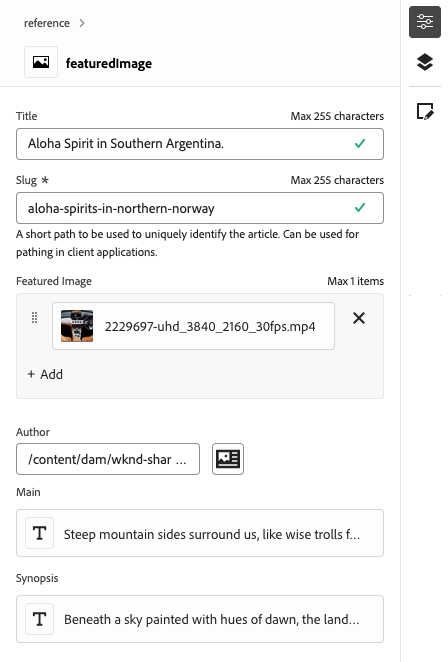

# Öppna och navigera i den universella redigeraren {#navigating}

Lär dig grunderna i hur du kommer åt och navigerar i den universella redigeraren.

## Introduktion {#introduction}

Med den universella redigeraren kan du redigera alla delar av innehållet i alla implementeringar så att du kan leverera enastående upplevelser, öka innehållets hastighet och skapa en toppmodern utvecklarupplevelse.

För att göra detta har den universella redigeraren ett intuitivt användargränssnitt som kräver minimal utbildning för att man ska kunna börja redigera material. I det här dokumentet beskrivs hur du navigerar i den universella redigeraren.

>[!TIP]
>
>* Mer information om hur du redigerar med den universella redigeraren finns i dokumentet [Skapa innehåll med den universella redigeraren.](/help/sites-cloud/authoring/universal-editor/authoring.md)
>* En mer detaljerad introduktion till Universal Editor finns i dokumentet [Universal Editor Introduction.](/help/implementing/universal-editor/introduction.md)

## Förbered appen {#prepare-app}

Om du vill skapa innehåll för ett program med den universella redigeraren måste appen vara instrumenterad av en utvecklare för att stödja redigeraren.

>[!TIP]
>
>Se [Komma igång med den universella redigeraren i AEM](/help/implementing/universal-editor/getting-started.md) för ett exempel på hur du konfigurerar en AEM för att fungera med den universella redigeraren.

## Åtkomst till den universella redigeraren {#accessing}

När appen har instrumenterats för att fungera med den universella redigeraren kan den ha åtkomst både i AEM as a Cloud Service och direkt utan att ha tillgång till AEM.

### Åtkomst inom AEM as a Cloud Service {#accessing-aem}

1. Logga in på din AEM as a Cloud Service-redigeringsinstans.
1. Använd [**webbplatskonsolen**](/help/sites-cloud/authoring/sites-console/introduction.md) för att navigera till sidan som skapats för att användas med den universella redigeraren som du vill redigera.
1. Redigera sidan.
1. Den universella redigeraren öppnas och du kan redigera den valda sidan.

>[!NOTE]
>
>När du redigerar en sida i konsolen [**Platser** ](/help/sites-cloud/authoring/sites-console/introduction.md) öppnar konsolen den redigerare som passar sidans [mall:](/help/sites-cloud/authoring/page-editor/templates.md) antingen den universella redigeraren som beskrivs i det här dokumentet eller [sidredigeraren.](/help/sites-cloud/authoring/page-editor/introduction.md)

### Direkt åtkomst {#accessing-directly}

1. Logga in i den universella redigeraren. Du behöver en Adobe ID för att logga in och [har tillgång till den universella redigeraren.](/help/implementing/universal-editor/getting-started.md#request-access)

1. När du har loggat in anger du URL-adressen till sidan som du vill redigera i [platsfältet.](#location-bar) så att du kan börja redigera innehåll som textinnehåll eller mediainnehåll.

## Förstå användargränssnittet {#ui}

Gränssnittet är indelat i dessa huvudområden.

* [Rubriken Experience Cloud](#experience-cloud-header)
* [Verktygsfältet för den universella redigeraren](#universal-editor-toolbar)
* [Redigeraren](#editor)
* [Egenskapsfältet](#properties-rail)

### Sidhuvudet Experience Cloud {#experience-cloud-header}

Sidhuvudet Experience Cloud finns alltid längst upp på skärmen. Det är en ankarpunkt som talar om var du befinner dig i Experience Cloud och som hjälper dig att navigera till andra program i Experience Cloud.

#### Experience Manager {#experience-manager}

Klicka på länken Adobe Experience Cloud till vänster om rubriken för att navigera till roten i din Experience Manager-lösning för att komma åt verktyg som [Cloud Manager,](/help/onboarding/cloud-manager-introduction.md) [Cloud Acceleration Manager,](/help/journey-migration/cloud-acceleration-manager/introduction/overview-cam.md) och [Programvarudistribution.](https://experienceleague.adobe.com/docs/experience-cloud/software-distribution/home.html)

#### Organisation {#organization}

Här visas den organisation du är inloggad på. Välj om du vill byta till en annan organisation om din Adobe ID är kopplad till flera.

#### Lösningar {#solutions}

Om du trycker eller klickar på lösningens väljare kan du snabbt gå över till andra Experience Cloud-lösningar.

#### Hjälp {#help}

Hjälpikonen ger snabb åtkomst till utbildningsresurser och supportresurser.

#### Meddelanden {#notifications}

Den här ikonen är märkt med antalet för närvarande tilldelade ofullständiga [meddelanden.](/help/implementing/cloud-manager/notifications.md)

#### Användaregenskaper {#user-properties}

Välj den ikon som representerar användaren för att få åtkomst till dina användarinställningar. Om du inte har konfigurerat någon användarbild tilldelas ikonen slumpmässigt.

### Verktygsfältet för den universella redigeraren {#universal-editor-toolbar}

Verktygsfältet för den universella redigeraren visas alltid längst upp på skärmen precis under [Experience Cloud.](#experience-cloud-header) Du får snabb åtkomst för att navigera till en annan sida för att redigera och publicera den aktuella sidan.

#### Hemknappen {#home-button}

Hemknappen återgår till startsidan för Universal Editor

På startsidan anger du URL-adressen till den webbplats som du vill redigera med Universal Editor.

>[!NOTE]
>
>Alla sidor som du vill redigera med den universella redigeraren måste vara [instrumenterade för att stödja den universella redigeraren.](/help/implementing/universal-editor/getting-started.md)

#### Platsfält {#location-bar}

Platsfältet visar adressen till sidan som du redigerar. Välj det här alternativet om du vill ange adressen till en annan sida som ska redigeras.

>[!TIP]
>
>Använd snabbtangenten `l` (bokstaven l) för att öppna adressfältet.

>[!NOTE]
>
>Alla sidor som du vill redigera med den universella redigeraren måste vara [instrumenterade för att stödja den universella redigeraren.](/help/implementing/universal-editor/getting-started.md)

#### Inställningar för autentiseringshuvud {#authentication-settings}

Välj ikonen med inställningar för autentiseringshuvudet om du behöver [ange ett anpassat autentiseringshuvud för lokala utvecklingssyften.](/help/implementing/universal-editor/developer-overview.md#auth-header)

#### Emulatorinställningar {#emulator}

Välj emuleringsikonen för att definiera hur den universella redigeraren ska återge sidan.

Om du trycker eller klickar på emuleringsikonen visas alternativen.

Som standard öppnas redigeraren i skrivbordslayout där höjd och bredd definieras automatiskt av webbläsaren.

Du kan också välja att emulera en mobil enhet och i Universell redigerare:

* Definiera dess orientering
* Definiera bredd och höjd
* Ändra orientering

#### Förhandsgranskningsläge {#preview-mode}

I förhandsgranskningsläget återges sidan i redigeraren som den skulle se ut i din publicerade tjänst. Det gör att innehållsförfattaren kan navigera i innehållet genom att klicka på länkar och så vidare.

>[!TIP]
>
>Använd snabbtangenten `p` för att växla till och från förhandsvisningsläget.

#### Öppna programförhandsgranskning {#open-app-preview}

Välj ikonen för förhandsgranskning av öppna program om du vill öppna sidan som du redigerar på en egen webbläsarflik, utan redigeraren, för att förhandsgranska innehållet.

>[!TIP]
>
>Använd snabbtangenten `o` (bokstaven o) för att öppna appförhandsvisningen.

>[!TIP]
>
>URL:en för förhandsgranskning för din app [kan anpassas.](/help/implementing/universal-editor/customizing.md#custom-preview-urls)

#### Publish {#publish}

Välj publiceringsknappen så att du kan publicera ändringarna i innehållet live för att användas av läsarna.

>[!TIP]
>
>Mer information om hur du publicerar med den universella redigeraren finns i dokumentet [Publicera innehåll med den universella redigeraren](publishing.md).

#### Ellips {#ellipsis}

Dessutom kan du komma åt standardalternativen med ellipsknappen.

Du kan till exempel avpublicera en sida (d.v.s. invertera åtgärden för knappen [**Publish**](#publish)) via ellipsknappen.

#### Ytterligare knappar {#additional-toolbar-buttons}

Universal Editor ger en anpassningsbar och utbyggbar redigeringsfunktion. Om du ser ytterligare knappar i verktygsfältet har den universella redigeraren utökats.

* Mer information om tilläggsmöjligheter finns i [Anpassa och utöka den universella redigeraren.](/help/implementing/universal-editor/customizing.md)
* Mer information om hur ett enskilt tillägg fungerar finns i [Extension Manager-dokumentationen.](https://developer.adobe.com/uix/docs/extension-manager/extension-developed-by-adobe/)

### Redigeraren {#editor}

Redigeraren tar upp större delen av fönstret och är där sidan som anges i [platsfältet](#location-bar) återges.

Om redigeraren är i [förhandsgranskningsläge](#preview-mode) kan innehållet navigeras och du kan följa länkar, men du kan inte redigera innehållet.

### Properties Rail {#properties-rail}

Egenskapsfältet visas alltid längs den högra sidan av redigeraren. Beroende på dess läge kan det visa information för en komponent som är markerad i innehållet eller hierarkin för sidinnehållet.

#### Egenskapsläge {#properties-mode}

I egenskapsläget visar rälen egenskaperna för den komponent som är markerad i redigeraren. Det här är standardläget för egenskapsfältet när en sida läses in.

Beroende på vilken typ av komponent du väljer kan information visas och ändras i egenskapsfältet.

Alla komponenter har inte information som kan visas och/eller redigeras.

>[!TIP]
>
>Använd snabbtangenten `d` för att växla till egenskapsläge.

#### Läge för innehållsträd {#content-tree-mode}

I innehållsträdsläge visar rälen sidinnehållets hierarki.

När du väljer ett objekt i innehållsträdet rullar redigeraren till det innehållet och markerar det.

>[!TIP]
>
>Använd snabbtangenten `f` för att växla till innehållsträdsläge.

##### Öppna i CF Editor {#edit}

När du redigerar visas alternativen för den markerade komponenten i egenskapsfältet, där du kan redigera den markerade komponenten. Om den markerade komponenten är ett innehållsfragment kan du även välja knappen **Öppna i CF-redigeraren** .

Om du trycker eller klickar på knappen **Öppna i CF-redigeraren** öppnas [redigeraren för innehållsfragment](/help/assets/content-fragments/content-fragments-managing.md#opening-the-fragment-editor) på en ny flik. Detta ger dig tillgång till den fulla kraften i Content Fragment-redigeraren för att redigera det tillhörande innehållsfragmentet.

Beroende på arbetsflödets behov kan du behöva redigera innehållsfragmentet i den universella redigeraren eller direkt i redigeraren för innehållsfragment.

>[!TIP]
>
>Använd snabbtangenten `e` för att öppna ett valt innehållsfragment i redigeraren för innehållsfragment.

##### Lägg till {#add}

Om du väljer en behållarkomponent i innehållsträdet eller i redigeraren visas alternativet Lägg till i egenskapsfältet.

Om du trycker eller klickar på knappen Lägg till öppnas en listruta med komponenter som är tillgängliga för att [lägga till i den valda behållaren.](/help/sites-cloud/authoring/universal-editor/authoring.md#adding-components)

>[!TIP]
>
>Använd snabbtangenten `a` för att lägga till en komponent i en markerad behållarkomponent.

##### Duplicera {#duplicate}

Om du markerar en komponent i en behållarkomponent antingen i innehållsträdet eller i redigeraren visas alternativet Duplicera i egenskapsfältet.

Om du trycker eller klickar på den duplicerade knappen [dupliceras den markerade komponenten.](/help/sites-cloud/authoring/universal-editor/authoring.md#duplicating-components)

##### Ta bort {#delete}

Om du markerar en komponent i en behållarkomponent antingen i innehållsträdet eller i redigeraren visas borttagningsalternativet på egenskapslisten.

Om du trycker på eller klickar på borttagningsknappen [tas komponenten bort.](/help/sites-cloud/authoring/universal-editor/authoring.md#deleting-components)

>[!TIP]
>
>Använd snabbtangenten `Shift+Backspace` för att ta bort en markerad komponent från en behållare.

#### Ytterligare knappar {#additional-properties-rail-buttons}

Universal Editor ger en anpassningsbar och utbyggbar redigeringsfunktion. Om du ser ytterligare knappar i egenskapsfältet har den universella redigeraren utökats.

* Mer information om tilläggsmöjligheter finns i [Anpassa och utöka den universella redigeraren.](/help/implementing/universal-editor/customizing.md)
* Mer information om hur ett enskilt tillägg fungerar finns i [Extension Manager-dokumentationen.](https://developer.adobe.com/uix/docs/extension-manager/extension-developed-by-adobe/)

## Nästa steg {#next-steps}

Nu när du vet hur du kommer åt och navigerar i den universella redigeraren kan du [redigera innehåll med den.](/help/sites-cloud/authoring/universal-editor/authoring.md)
