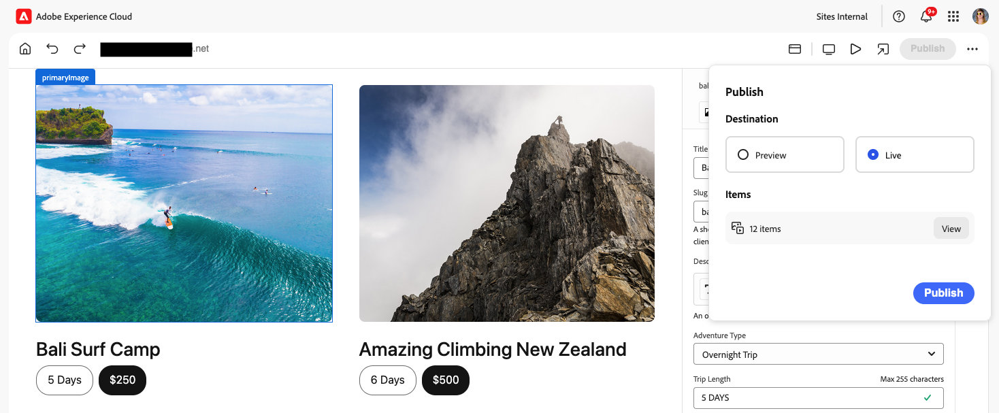

# Publicera innehåll med den universella redigeraren {#publishing}

Lär dig hur den universella redigeraren publicerar innehåll och hur dina appar kan hantera det publicerade innehållet.

>[!TIP]
>
>Den publiceringsprocess som beskrivs här är standardfunktionen i den universella redigeraren.
>
>Den universella redigeraren har också stöd för [tillägg och UI-utökningsmöjligheter](/help/implementing/universal-editor/extending.md) så att arbetsflöden kan stödja publiceringsprocessen, vilket kan ge olika publiceringsflöden.

## Publicera innehåll från den universella redigeraren {#publishing-content}

När du som innehållsförfattare är redo att publicera ditt innehåll behöver du bara trycka eller klicka på ikonen **Publicera** i den universella redigerarens verktygsfält.

1. Tryck eller klicka på ikonen **Publicera** i den universella redigerarens verktygsfält.[&#128279;](/help/sites-cloud/authoring/universal-editor/navigation.md#publish)
1. Om du har en [förhandsgranskningstjänst](/help/sites-cloud/authoring/sites-console/previewing-content.md) tillgänglig kan du välja var du vill publicera ditt innehåll, antingen till **Förhandsgranska** eller **Publicera**.
1. I avsnittet **Objekt** visas innehållet som ingår i publikationen, inklusive:
   * **Nya** objekt som ännu inte har publicerats.
   * **Ändrat** innehåll som har publicerats, men ändrats sedan den senaste publikationen.
   * **Publicerat** innehåll som har publicerats och inte ändrats sedan den publiceringen.

   Tryck eller klicka på kryssrutorna bredvid dessa objekt för att inkludera/exkludera dem från publiceringen efter behov. Tryck eller klicka på **Utöka** om du vill visa enskilda objekt som ingår i summorna för de tre kategorierna och kunna in/exkludera dem individuellt.

   

   Tryck eller klicka på bakåtpilen bredvid rubriken **Items** för att återgå till översikten.

1. Tryck eller klicka på **Publicera** för att publicera eller **Avbryt** för att avbryta.

## Avpublicera innehåll från den universella redigeraren {#unpublishing-content}

Att avpublicera innehåll fungerar på ungefär samma sätt som att publicera innehåll. När du som innehållsförfattare är redo att ta bort innehåll från publikationen trycker eller klickar du på ellipsikonen i den universella redigerarens verktygsfält och sedan **Avpublicera**.

Du har sedan samma alternativ för att avpublicera innehåll som du gjorde när du publicerade [innehåll.](#publishing-content) inkluderar avpublicering från en förhandsgranskningsinstans om sådan finns och vilka objekt som ska tas med i avpubliceringen.

## Publicera och avpublicera från Sites Console {#publishing-sites-console}

Du kan också publicera [ från webbplatskonsolen ](/help/sites-cloud/authoring/sites-console/publishing-pages.md) som kan vara användbar när du vill publicera flera sidor med innehåll eller schemalägga publicering eller avpublicering.

## Likheter med sidredigeraren {#similarities}

För användare av [AEM Page Editor](/help/sites-cloud/authoring/page-editor/introduction.md) fungerar processen att publicera innehåll med den universella redigeraren som du är van vid: vid publicering i AEM replikeras innehållet från författarnivån till publiceringsnivån.

## Skillnader {#differences}

Det som gör publicering med den universella redigeraren lite annorlunda är inte så mycket själva redigeraren, utan snarare den externa värdfunktionen för appen som den universella redigeraren gör möjlig.

När det finns en extern värd är det webappens sak att se till att innehåll läses in från författarnivån när appen öppnas av författare i redigeraren, och att det läses in från publiceringsnivån när besökarna öppnar appen.

## Identifiera nivån i appen {#detecting}

Du kan avgöra om författaren eller publiceringsnivån ska ha åtkomst genom att använda en enkel villkorssats i appen för att välja rätt författare eller publiceringsslutpunkt när du upptäcker att appen öppnas i redigeraren.

Ett annat alternativ är att distribuera appen till två olika miljöer som är konfigurerade på olika sätt, så att innehållet hämtas från författarnivån och en som hämtar det från publiceringsnivån. För att författare ska kunna öppna den publicerade URL:en i Universell redigerare kan ett litet skript skapas för att&quot;konvertera&quot; URL:en för publiceringssidan till motsvarande URL:er i författarmiljön (t.ex. genom att en `author`-underdomän försätts), så att författarna automatiskt omdirigeras.

## Sammanfattning {#summary}

Målet för den universella redigeraren är att inte införa något visst mönster, så att implementeringen bäst kan uppnå sina mål på ett helt fristående sätt samtidigt som allt förblir enkelt och rakt framåt för implementeringen.

Det finns heller inga krav på hur ett visst projekt ska gå till för att avgöra från vilken nivå innehållet ska levereras. Det ger snarare flera möjligheter och låter projektet avgöra vilken lösning som är bäst för sina egna behov.

## Ytterligare resurser {#additional-resources}

Läs det här dokumentet om du vill lära dig hur du skapar innehåll med den universella redigeraren.

* [Skapa innehåll med den universella redigeraren](authoring.md) - Lär dig hur enkelt och intuitivt det är för innehållsförfattare att skapa innehåll med den universella redigeraren.

Mer information om de tekniska detaljerna i Universal Editor finns i dessa utvecklardokument.

* [Introduktion till universell redigering](/help/implementing/universal-editor/introduction.md) - Lär dig hur den universella redigeraren kan redigera alla delar av innehåll i alla implementeringar så att du kan leverera enastående upplevelser, öka innehållets hastighet och skapa en toppmodern utvecklarupplevelse.
* [Komma igång med den universella redigeraren i AEM](/help/implementing/universal-editor/getting-started.md) - Lär dig hur du får tillgång till den universella redigeraren och hur du börjar använda den i ditt första AEM-program.
* [Universell redigeringsarkitektur](/help/implementing/universal-editor/architecture.md) - Lär dig mer om arkitekturen för den universella redigeraren och hur data flödar mellan dess tjänster och lager.
* [Attribut och typer](/help/implementing/universal-editor/attributes-types.md) - Lär dig mer om de dataattribut och datatyper som krävs för den universella redigeraren.
* [Autentisering av universell redigerare](/help/implementing/universal-editor/authentication.md) - Lär dig hur den universella redigeraren autentiseras.
