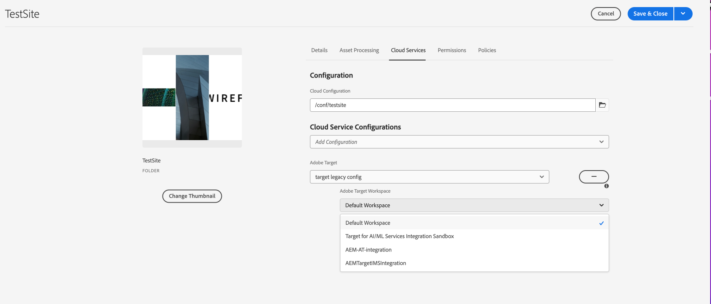
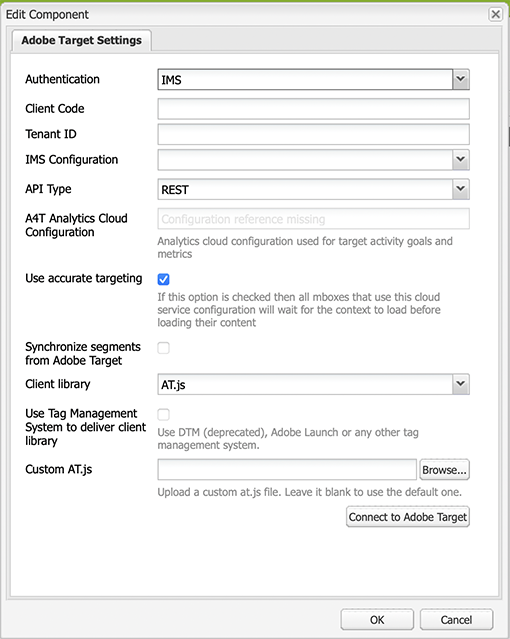

# Exportera innehållsfragment till Adobe Target {#exporting-content-fragments-to-adobe-target}

>[!CAUTION]
>
>* AEM innehållsfragment exporteras till standardarbetsytan i Adobe Target.
>* AEM måste integreras med Adobe Target enligt instruktionerna i [Integrera med Adobe Target](/help/sites-cloud/integrating/integrating-adobe-target.md).

Du kan exportera [Innehållsfragment](/help/sites-cloud/authoring/fundamentals/content-fragments.md)som har skapats i Adobe Experience Manager as a Cloud Service (AEM) till Adobe Target (Target). De kan sedan användas som erbjudanden i Target-aktiviteter för att testa och personalisera upplevelser i stor skala.

Det finns ett alternativ för att exportera ett innehållsfragment till Adobe Target:

* JSON: Stöd för leverans av headless-innehåll

<!-- * GraphQL query ??? -->

Om du vill förbereda instansen för att exportera AEM innehållsfragment till Adobe Target måste du:

* [Integrera med Adobe Target](/help/sites-cloud/integrating/integrating-adobe-target.md)
* [Lägg till molnkonfigurationen](#add-the-cloud-configuration)
* [Lägg till den äldre konfigurationen](#add-the-legacy-configuration)

Efter det kan du

* [Exportera ett innehållsfragment till Adobe Target](#exporting-a-content-fragment-to-adobe-target)
* [Använda dina innehållsfragment i Adobe Target](#using-your-content-fragments-in-adobe-target)
* Och [Ta bort ett innehållsfragment som redan har exporterats till Adobe Target](#deleting-a-content-fragment-already-exported-to-adobe-target)

Innehållsfragment kan exporteras till standardarbetsytan i Adobe Target eller till användardefinierade arbetsytor för Adobe Target.

>[!NOTE]
>
>Adobe Target arbetsytor finns inte i själva Adobe Target. De definieras och hanteras i Adobe IMS (Identity Management System) och väljs sedan ut för användning i olika lösningar med Adobe Developer Console.

>[!NOTE]
>
>Adobe Target arbetsytor kan användas för att tillåta medlemmar i en organisation (grupp) att endast skapa och hantera erbjudanden och aktiviteter för den här organisationen, utan att ge åtkomst till andra användare. Till exempel landsspecifika organisationer inom ett globalt område.

## Förutsättningar {#prerequisites}

Följande åtgärd krävs:

1. Du måste [integrera AEM med Adobe Target](/help/sites-cloud/integrating/integrating-adobe-target.md).

<!-- link rewriter - targets in content-fragments-customizing do not exist yet

1. Content Fragments are exported from the AEM author instance, so you need to [Configure the AEM Link Externalizer](/help/implementing/developing/extending/content-fragments-customizing.md#configuring-the-aem-link-externalizer) on the author instance to ensure that any references within the Content Fragment are externalized for web delivery.

   >[!NOTE]
   >
   >For link rewriting not covered by the default, the [Content Fragment Link Rewriter Provider](/help/implementing/developing/extending/content-fragments-customizing.md#the-content-fragment-link-rewriter-provider-html) is available. With this, customized rules can be developed for your instance.
-->

## Lägg till molnkonfigurationen {#add-the-cloud-configuration}

Innan du exporterar ett fragment måste du lägga till **Molnkonfiguration** for **Adobe Target** till fragmentet eller mappen. Detta gör även att du kan:

* ange de formatalternativ som ska användas för exporten
* välj en målarbetsyta som mål
* välj en externaliseringsdomän för att skriva om referenser i innehållsfragmentet (valfritt)

De obligatoriska alternativen kan väljas i **Sidegenskaper** av den mapp eller det fragment som krävs, eller både och. Specifikationen ärvs efter behov.

1. Navigera till **Resurser** konsol.

1. Öppna **Sidegenskaper** för rätt mapp eller fragment.

   >[!NOTE]
   >
   >Om du lägger till molnkonfigurationen i den överordnade mappen för innehållsfragment ärvs konfigurationen av alla underordnade.
   >
   >Om du lägger till molnkonfigurationen i själva innehållsfragmentet ärvs konfigurationen av alla variationer.

1. Välj **Cloud Service** -fliken.

1. Under **Konfiguration av Cloud Service**, markera **Adobe Target** i listrutan.

   <!-- is this note appropriate? -->

   >[!NOTE]
   >
   >JSON-formatet för ett Content Fragment-erbjudande kan anpassas. Om du vill göra det definierar du en komponent för kundinnehållsfragment och kommenterar sedan hur egenskaperna ska exporteras i komponentens Sling Model.
   >
   >Se kärnkomponenten: [Kärnkomponenter - innehållsfragment](https://experienceleague.adobe.com/docs/experience-manager-core-components/using/wcm-components/content-fragment-component.html)

1. Under **Adobe Target** välj:

   * lämplig konfiguration
   * det obligatoriska formatalternativet
   * en Adobe Target-arbetsyta
   * om det behövs - externaliseringsdomänen

   >[!CAUTION]
   >
   >Externeringsdomänen är valfri.
   >
   > En AEM externaliserare konfigureras när du vill att det exporterade innehållet ska peka mot en viss *publicera* domän. Mer information finns i [Konfigurera AEM Link Externalizer](/help/implementing/developing/extending/content-fragments-customizing.md#configuring-the-aem-link-externalizer).
   >
   > Observera också att Externalizer-domäner bara är relevanta för innehållet i det innehållsfragment som skickas till Target, och inte för metadata som Visa erbjudandeinnehåll.

   För en mapp:

   <!-- need a new screenshot -->

   

1. **Spara och stäng**.

## Lägg till den äldre konfigurationen {#add-the-legacy-configuration}

<!-- This is effectively the Manually Integrating with Adobe Target {#manually-integrating-with-adobe-target} section from 6.5 -->

>[!IMPORTANT]
>
>Att lägga till en ny äldre konfiguration är ett specialscenario som bara stöds för export av innehållsfragment.

Efter [lägga till molnkonfigurationen](#add-the-cloud-configuration) för att kunna använda Launch by Adobe måste du, för att kunna integrera AEM med Adobe Target, även manuellt integrera med Adobe Target med en äldre konfiguration.

### Skapa en målmolnkonfiguration {#creating-a-target-cloud-configuration}

Om du vill att AEM ska kunna interagera med Adobe Target skapar du en Target-molnkonfiguration. Om du vill skapa konfigurationen anger du Adobe Target klientkod och inloggningsuppgifter.

Du skapar bara målmolnkonfigurationen en gång eftersom du kan associera konfigurationen med flera AEM kampanjer. Om du har flera Adobe Target-klientkoder skapar du en konfiguration för varje klientkod.

Du kan konfigurera molnkonfigurationen så att segment från Adobe Target synkroniseras. Om du aktiverar synkronisering importeras segment från Target i bakgrunden så snart molnkonfigurationen har sparats.

Använd följande procedur för att skapa en Target-molnkonfiguration i AEM:

1. Navigera till **Äldre Cloud Service** via **AEM** > **verktyg** > **Cloud Service** > **Äldre Cloud Service**.
Till exempel: ([http://localhost:4502/libs/cq/core/content/tools/cloudservices.html](http://localhost:4502/libs/cq/core/content/tools/cloudservices.html))

   The **Adobe Experience Cloud** översiktssidan öppnas.

1. I **Adobe Target** avsnitt, klicka **Konfigurera nu**.
1. I **Skapa konfiguration** dialog:

   1. Ge konfigurationen en **Titel**.
   1. Välj **Adobe Target Configuration** mall.
   1. Klicka **Skapa**.

Nu kan du välja den nya konfigurationen för redigering.

1. Dialogrutan Redigera öppnas.

   

   <!-- Can this still occur?

   >[!NOTE]
   >
   >When configuring A4T with AEM, you may see a Configuration reference missing entry. To be able to select the analytics framework, do the following:
   >
   >1. Navigate to **Tools** &gt; **General** &gt; **CRXDE Lite**.
   >1. Navigate to **/libs/cq/analytics/components/testandtargetpage/dialog/items/tabs/items/tab1_general/items/a4tAnalyticsConfig**
   >1. Set the property **disable** to **false**.
   >1. Tap or click **Save All**.

   -->

1. I **Adobe Target-inställningar** anger du värden för dessa egenskaper.

   * **Autentisering**: det här är standardvärdet för IMS (användarens inloggningsuppgifter är inaktuella)

   * **Klientkod**: Målkontots klientkod

   * **Klient-ID**: innehavar-ID

   * **IMS-konfiguration**: välj önskad konfiguration i listrutan

   * **API-typ**: standardvärdet är REST (XML är föråldrat)

   * **A4T Analytics Cloud-konfiguration**: Välj den Analytics-molnkonfiguration som används för mål och mått för aktivitet. Du behöver detta om du använder Adobe Analytics som rapportkälla när du skapar innehåll för målgruppsanpassning.

     <!-- Is this needed?
     If you do not see your cloud configuration, see note in [Configuring A4T Analytics Cloud Configuration](#configuring-a-t-analytics-cloud-configuration).
     -->

   * **Använd korrekt målinriktning:** Som standard är den här kryssrutan markerad. Om du väljer det här alternativet väntar molntjänstkonfigurationen på att kontexten ska läsas in innan innehållet läses in. Se följande.

   * **Synkronisera segment från Adobe Target:** Välj det här alternativet om du vill hämta segment som har definierats i Target för att använda dem i AEM. Du måste välja det här alternativet när API-typegenskapen är REST, eftersom infogade segment inte stöds och du alltid måste använda segment från Target. (Observera att den AEM termen segment motsvarar målgruppen.)

   * **Klientbibliotek:** this default to AT.js (mbox.js is deprecated)

     >[!NOTE]
     >
     >Målbiblioteksfilen, [AT.JS](https://experienceleague.adobe.com/docs/target-dev/developer/client-side/at-js-implementation/at-js/how-atjs-works.html), är ett nytt implementeringsbibliotek för Adobe Target som är utformat för både vanliga webbimplementeringar och ensidiga program.
     >
     >mbox.js har tagits bort och kommer att tas bort i ett senare skede.
     >
     >Adobe rekommenderar att du använder AT.js i stället för mbox.js som klientbibliotek.
     >
     >AT.js har flera förbättringar jämfört med mbox.js-biblioteket:
     >
     >* Förbättrade sidladdningstider för webbimplementeringar
     >* Förbättrad säkerhet
     >* Bättre implementeringsalternativ för ensidiga program
     >* AT.js innehåller komponenterna som ingick i target.js, så det finns inte längre något anrop till target.js
     >
     >Du kan välja AT.js eller mbox.js i **Klientbibliotek** listruta.

   * **Använd Tag Management System för att leverera klientbibliotek** - Välj det här alternativet om du vill använda klientbiblioteket från Adobe Launch eller något annat tagghanteringssystem (eller DTM, som är inaktuellt).

   * **Anpassad AT.js**: Bläddra för att överföra din anpassade AT.js. Lämna tomt om du vill använda standardbiblioteket.

     >[!NOTE]
     >
     >Som standard aktiveras korrekt målgruppsanpassning när du väljer att använda konfigurationsguiden för Adobe Target.
     >
     >Korrekt målinriktning innebär att molntjänstkonfigurationen väntar på att kontexten ska läsas in innan innehållet läses in. Därför kan en korrekt målinriktning, vad gäller prestanda, skapa en fördröjning på några millisekunder innan innehållet läses in.
     >
     >Korrekt målinriktning är alltid aktiverat på författarinstansen. På publiceringsinstansen kan du dock välja att inaktivera korrekt målanpassning globalt genom att avmarkera kryssrutan bredvid Korrekt målanpassning i molntjänstkonfigurationen (**http://localhost:4502/etc/cloudservices.html**). Du kan även aktivera och inaktivera exakt målinriktning för enskilda komponenter, oavsett vilken inställning du har i molntjänstkonfigurationen.
     >
     >Om du har ***redan*** har skapat riktade komponenter och du ändrar den här inställningen påverkar inte ändringarna dessa komponenter. Du måste göra ändringar i den komponenten direkt.

1. Klicka **Anslut till Adobe Target** för att initiera anslutningen med Target. Om anslutningen lyckas visas meddelandet **Anslutningen lyckades** visas. Klicka **OK** i meddelandet och sedan **OK** i dialogrutan.

### Lägga till ett målramverk {#adding-a-target-framework}

<!-- Is this section needed? -->

När du har konfigurerat molnkonfigurationen för Target lägger du till ett Target-ramverk. Ramverket identifierar de standardparametrar som skickas till Adobe Target från de tillgängliga [ContextHub](/help/implementing/developing/personalization/configuring-contexthub.md) -komponenter. Target använder parametrarna för att fastställa vilka segment som gäller för den aktuella kontexten.

Du kan skapa flera ramverk för en enda Target-konfiguration. Flera ramverk är användbara när du behöver skicka en annan uppsättning parametrar till Target för olika delar av webbplatsen. Skapa ett ramverk för varje uppsättning parametrar som du måste skicka. Associera varje avsnitt på webbplatsen med rätt ramverk. Observera t*att en webbsida bara kan använda ett ramverk åt gången.

1. Klicka på knappen **+** (plustecken) bredvid Tillgängliga konfigurationer.

1. I dialogrutan Skapa ramverk anger du **Titel** väljer du **Adobe Target Framework** och klicka **Skapa**.

   <!--  -->

   Ramverkssidan öppnas. Sidekick tillhandahåller komponenter som representerar information från [ContextHub](/help/implementing/developing/personalization/configuring-contexthub.md) som du kan mappa.

   <!--  -->

1. Dra den klientkontextkomponent som representerar de data som du vill använda för mappning till släppmålet. Du kan också dra i **ContextHub Store** till ramverket.

   >[!NOTE]
   >
   >Vid mappning skickas parametrar till en mbox via enkla strängar. Du kan inte mappa arrayer från ContextHub.

   Använd till exempel **Profildata** om webbplatsbesökarna för att styra er Target-kampanj drar du **Profildata** till sidan. De profildatavariabler som är tillgängliga för mappning till Target-parametrar visas.

   <!--  -->

1. Markera variablerna som du vill göra synliga för Adobe Target-systemet genom att markera **Dela** -kryssrutan i rätt kolumner.

   <!--  -->

   >[!NOTE]
   >
   >Synkronisering av parametrar är bara ett sätt - från AEM till Adobe Target.

Ditt ramverk har skapats. Om du vill kopiera ramverket till publiceringsinstansen använder du **Aktivera ramverk** från sidosparken.

<!--
### Associating Activities With the Target Cloud Configuration  {#associating-activities-with-the-target-cloud-configuration}

Associate your [AEM activities](/help/sites-cloud/authoring/personalization/activities.md) with your Target cloud configuration so that you can mirror the activities in [Adobe Target](https://experienceleague.adobe.com/docs/target/using/experiences/offers/manage-content.html).

>[!NOTE]
>
>What types of activities are available is determined by the following:
>
>* If the **xt_only** option is enabled on the Adobe Target tenant (clientcode) used on the AEM side to connect to Adobe Target, then you can create **only** XT activities in AEM.
>
>* If the **xt_only** options is **not** enabled on the Adobe Target tenant (clientcode), then you can create **both** XT and A/B activities in AEM.
>
>**Additional note:** **xt_only** options is a setting applied on a certain Target tenant (clientcode) and can only be modified directly in Adobe Target. You cannot enable or disable this option in AEM.
-->

<!--
### Associating the Target Framework With Your Site {#associating-the-target-framework-with-your-site}

After you create a Target framework in AEM, associate your web pages with the framework. The targeted components on the pages send the framework-defined data to Adobe Target for tracking. (See [Content Targeting](/help/sites-cloud/authoring/personalization/targeted-content.md).)

When you associate a page with the framework, the child pages inherit the association.

1. In the **Sites** console, navigate to the site that you want to configure.
1. Using either [quick actions](/help/sites-cloud/authoring/getting-started/basic-handling.md#quick-actions) or [selection mode](/help/sites-cloud/authoring/getting-started/basic-handling.md#selecting-resources), select **View Properties.**
1. Select the **Cloud Services** tab.
1. Tap/click **Edit**.
1. Tap/click **Add Configuration** under **Cloud Service Configurations** and select **Adobe Target**.

  

1. Select the framework you want under **Configuration Reference**.

   >[!NOTE]
   >
   >Make sure that you select the specific **framework** that you created and not the Target cloud configuration under which it was created.

1. Tap/click **Done**.
1. Activate the root page of the website to replicate it to the publish server. (See [How To Publish Pages](/help/sites-cloud/authoring/fundamentals/publishing-pages.md).)

   >[!NOTE]
   >
   >If the framework you attached to the page was not activated yet, a wizard opens which lets you publish it as well.
-->

## Exportera ett innehållsfragment till Adobe Target {#exporting-a-content-fragment-to-adobe-target}

>[!CAUTION]
>
>För medieresurser, till exempel bilder, exporteras bara en referens till Target. Resursen lagras i AEM Assets och levereras från den AEM publiceringsinstansen.
>
>På grund av detta måste innehållsfragmentet, med alla relaterade resurser, publiceras innan det exporteras till Target.

Så här exporterar du ett innehållsfragment från AEM till mål (efter att du har angett molnkonfigurationen):

1. Navigera till ditt innehållsfragment i **Resurser** konsol.
1. Markera det innehållsfragment som du vill exportera till mål.

1. Tryck/klicka **Exportera till Adobe Target**.

   

   <!-- this note does not seem to be accurate for CFs -->

   <!--
   
   >[!NOTE]
   >
   >If the Content Fragment has already been exported, select **Update in Adobe Target**.
   
   -->

1. Tryck/klicka **Exportera utan publicering** eller **Publicera** efter behov.

   >[!NOTE]
   >
   >Vilka åtgärder som visas beror på fragmentets status och relaterade resurser.
   >
   >Om allt redan har publicerats och inget har ändrats sedan dess, överförs det här steget.

   >[!NOTE]
   >
   >Markera **Publicera** publicerar innehållsfragmentet omedelbart och skickar det till Target.

1. Tryck/klicka **OK** i bekräftelsedialogrutan.

   Ditt innehållsfragment bör nu vara i Target.

   >[!NOTE]
   >
   >[Olika detaljer](/help/sites-cloud/authoring/fundamentals/content-fragments.md#details-of-your-content-fragment) av exporten visas i **Listvy** av konsolen och **Egenskaper**.

   >[!NOTE]
   >
   >När du visar ett innehållsfragment i Adobe Target visas *senast ändrad* datum som visas är det datum då fragmentet senast ändrades i AEM, inte det datum då fragmentet senast exporterades till Adobe Target.

>[!NOTE]
>
>Du kan också exportera från sidredigeraren med jämförbara kommandon i [Sidinformation](/help/sites-cloud/authoring/fundamentals/environment-tools.md#page-information) -menyn.

## Använda dina innehållsfragment i Adobe Target {#using-your-content-fragments-in-adobe-target}

När du har utfört de föregående åtgärderna visas innehållsfragmentet på sidan Erbjudanden i Mål. Se [specifik Target-dokumentation](https://experienceleague.adobe.com/docs/target/using/integrate/aem/fragments/content-fragments-aem.html) om du vill veta mer om vad du kan uppnå där.

>[!NOTE]
>
>När du visar ett innehållsfragment i Adobe Target visas *senast ändrad* datum som visas är det datum då fragmentet senast ändrades i AEM, inte det datum då fragmentet senast exporterades till Adobe Target.

## Ta bort ett innehållsfragment som redan har exporterats till Adobe Target {#deleting-a-content-fragment-already-exported-to-adobe-target}

Precis som vid export kan du även ta bort ett innehållsfragment från Adobe Target i det övre verktygsfältet i **Resurser** konsol när fragmentet har valts:

Om du tar bort ett innehållsfragment som redan har exporterats till Target kan det orsaka problem om fragmentet redan används i ett erbjudande i Target. Om du tar bort fragmentet blir erbjudandet oanvändbart eftersom fragmentinnehållet levereras av AEM.

<!-- if the information about deleting-if-used correct, or is it not allowed at all? -->

För att undvika sådana situationer:

* Om innehållsfragmentet inte används i en aktivitet kan AEM ta bort fragmentet utan ett varningsmeddelande.
* Om innehållsfragmentet används av en aktivitet i Target visas ett felmeddelande som informerar AEM om eventuella konsekvenser som en borttagning av fragmentet kan ha för aktiviteten.

  Felmeddelandet i AEM förhindrar inte användaren från att (tvinga) ta bort innehållsfragmentet. Om innehållsfragmentet tas bort:

   * Målerbjudandet med AEM innehållsfragment kan visa oönskat beteende

      * Erbjudandet kommer troligtvis fortfarande att återges eftersom innehållsfragmentet skickades till Target
      * Eventuella referenser i innehållsavsnittet kanske inte fungerar korrekt om refererade resurser också tas bort i AEM.

   * Det går förstås inte att göra ytterligare ändringar i innehållsfragmentet eftersom innehållsfragmentet inte längre finns i AEM.

## Ytterligare resurser {#further-resources}

Mer information finns i följande:

<!--
* [Creating a Target Cloud Configuration](/help/sites-cloud/integrating/integrating-adobe-target.md#create-configuration)
-->

* [Kärnkomponenter - innehållsfragment](https://experienceleague.adobe.com/docs/experience-manager-core-components/using/wcm-components/content-fragment-component.html)

* [Utveckling av Adobe Target](https://developers.adobetarget.com/)

* [Adobe Target - Använda AEM innehållsfragment i Target-aktiviteter för att underlätta optimering eller personalisering](https://experienceleague.adobe.com/docs/target/using/integrate/aem/fragments/content-fragments-aem.html)

* [Adobe Target - AEM Experience Fragments och Content Fragments - översikt](https://experienceleague.adobe.com/docs/target/using/integrate/aem/fragments/aem-experience-and-content-fragments.html)
