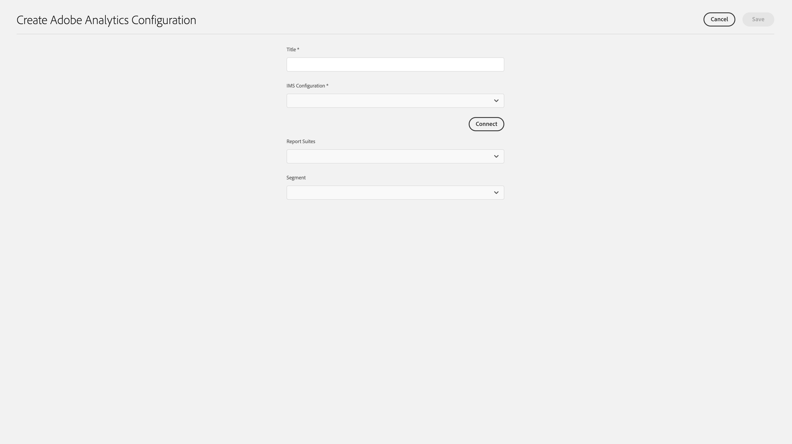

# Integrera med Adobe Analytics{#integrating-with-adobe-analytics}

Genom att integrera Adobe Analytics och AEM as a Cloud Service kan du spåra webbsidans aktivitet. Integreringen kräver:

* med Touch-gränssnittet för att skapa en Analytics-konfiguration på AEM as a Cloud Service. Observera att IMS-autentisering krävs för att integrera Adobe Analytics med AEM as a Cloud Service.
* lägga till och konfigurera Adobe Analytics som ett tillägg i [Adobe Launch](#analytics-launch). Mer information om Adobe Launch finns på [den här sidan](https://experienceleague.adobe.com/docs/experience-platform/tags/get-started/quick-start.html).

Jämfört med tidigare versioner av AEM finns ramverksstöd inte i Analytics Configuration i AEM as a Cloud Service. I stället görs det nu via Adobe Launch, som är det defacto-verktyg för att skapa en AEM webbplats med analysfunktioner (JS-bibliotek). I Adobe Launch skapas en egenskap där Adobe Analytics-tillägget kan konfigureras och regler skapas för att skicka data till Adobe Analytics. Adobe Launch har ersatt uppgiften med analys från sitecatalyst.

>[!NOTE]
>
>Adobe Experience Manager as a Cloud Service-kunder som inte har något befintligt Analytics-konto kan begära åtkomst till Analytics Foundation Pack för Experience Cloud. Detta Foundation Pack ger volymbegränsad användning av Analytics.

## Skapa Adobe Analytics-konfigurationen {#analytics-configuration}

1. Navigera till **verktyg** → **Cloud Services**.
2. Välj **Adobe Analytics**.
   
3. Välj **Skapa** -knappen.
4. Fyll i informationen (se nedan) och klicka på **Anslut**.

### Konfigurationsparametrar {#configuration-parameters}

Fälten i konfigurationsfönstret är följande:

| Egenskap | Beskrivning |
|---|---|
| Titel | Konfigurationsnamnet |
| IMS-konfiguration | Välj IMS-konfigurationen (se kapitlet nedan) |
| Segment | Möjlighet att använda ett analyssegment som definieras i den aktuella rapporteringssviten. Analysrapporterna filtreras baserat på segmentet. Se [den här sidan](https://experienceleague.adobe.com/docs/analytics/components/segmentation/seg-overview.html) om du vill ha mer information. |
| Rapportsviter | En databas där du skickar data och hämtar rapporter. En rapportsvit definierar den fullständiga, oberoende rapporteringen på en vald webbplats, en uppsättning webbplatser eller en delmängd av webbplatssidor. Du kan visa rapporter som hämtats från en enda rapportserie och kan redigera det här fältet i en konfiguration när som helst enligt dina önskemål. |

### Adobe Analytics med IMS-autentisering {#configuration-parameters-ims}

En IMS-konfiguration krävs för att Adobe Analytics ska kunna integreras korrekt med AEM as a Cloud Service. Den här konfigurationen måste skapas. Se den här [page](/help/sites-cloud/integrating/integration-adobe-analytics-ims.md) om du vill lära dig hur du skapar IMS-konfigurationen för Analytics.

### Lägga till en konfiguration till en plats {#add-configuration}

Om du vill använda en Touch UI-konfiguration på en webbplats går du till: **Webbplatser** → **Välj en webbplatssida** → **Egenskaper** → **Avancerat** → **Konfiguration** → välj konfigurationspersonen.

## Integrera Adobe Analytics på AEM sajter med Adobe Launch {#analytics-launch}

Adobe Analytics kan läggas till som ett tillägg i startegenskapen. Regler kan definieras för mappning och postanrop till Adobe Analytics:

* Titta [den här videon](https://experienceleague.adobe.com/docs/analytics-learn/tutorials/implementation/via-adobe-launch/basic-configuration-of-the-analytics-launch-extension.html) om du vill lära dig hur du konfigurerar Analytics-tillägget i Launch för en grundläggande webbplats.

* Se [den här sidan](https://experienceleague.adobe.com/docs/core-services-learn/implementing-in-websites-with-launch/implement-solutions/analytics.html) om du vill ha mer information om hur du skapar regler och skickar data till Adobe Analytics.

>[!NOTE]
>
>IMS-konfigurationen (tekniska konton) för Launch är förkonfigurerad i AEM as a Cloud Service. Du behöver inte skapa den här konfigurationen.

>[!NOTE]
>
>Befintliga (äldre) ramverk fungerar fortfarande, men de kan inte konfigureras i Touch-gränssnittet. Du bör återskapa variabelmappningskonfigurationerna i Launch.
