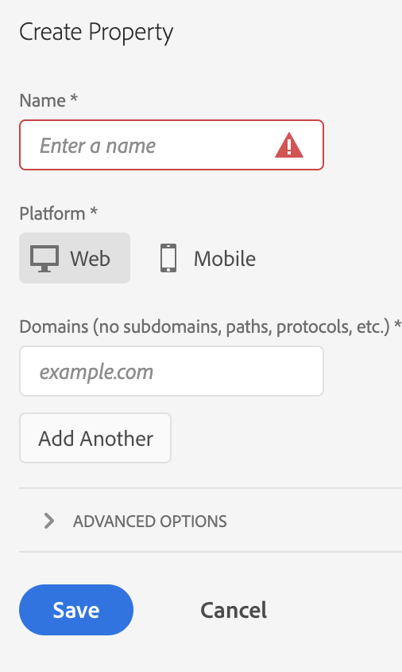
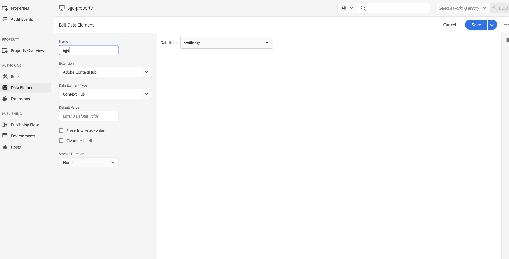

# Integrera med Adobe Target{#integrating-with-adobe-target}

Som en del av Adobe Marketing Cloud kan Adobe Target öka innehållets relevans genom målinriktning och mätning i alla kanaler. För att integrera Adobe Target och AEM som en Cloud Service krävs följande:

* med Touch-gränssnittet för att skapa en målkonfiguration i AEM som en Cloud Service (IMS-konfiguration krävs).
* lägga till och konfigurera Adobe Target som ett tillägg i [Adobe Launch](https://docs.adobe.com/content/help/en/launch/using/intro/get-started/quick-start.html).

Adobe Launch krävs för att hantera egenskaper på klientsidan för både Analytics och Target på AEM (JS-bibliotek/taggar). Integreringen med Launch behövs dock för&quot;upplevelseanpassning&quot;. För Experience Fragments export till Target behöver du bara Adobe Target Configuration och IMS.

>[!NOTE]
>
>Adobe Experience Manager som Cloud Service-kunder som inte har något befintligt Target-konto kan begära åtkomst till Target Foundation Pack för Experience Cloud. Foundation Pack ger begränsad volymanvändning av Target.

## Skapar Adobe Target-konfigurationen {#create-configuration}

1. Navigera till **Verktyg** → **Cloud Services**.
   
2. Välj **Adobe Target**.
3. Välj knappen **Skapa**.
   
4. Fyll i informationen (se nedan) och välj **Anslut**.
   

### IMS-konfiguration

En IMS-konfiguration för både Launch och Target krävs för att Target ska kunna integreras korrekt med AEM och Launch. IMS-konfigurationen för Launch är förkonfigurerad i AEM som en Cloud Service, men IMS-konfigurationen för mål måste skapas (efter att Target har etablerats). I [den här videon](https://helpx.adobe.com/experience-manager/kt/sites/using/aem-sites-target-standard-technical-video-understand.html) och [den här sidan](https://docs.adobe.com/content/help/en/experience-manager-65/administering/integration/integration-ims-adobe-io.html) får du lära dig hur du skapar mål-IMS-konfigurationen.

### Redigera målkonfigurationen {#edit-target-configuration}

Så här redigerar du målkonfigurationen:

1. Välj en befintlig konfiguration och klicka på **Egenskaper**.
2. Redigera egenskaperna.
3. Välj **Återanslut till Adobe Target**.
4. Välj **Spara och stäng**.

### Lägga till en konfiguration för en plats {#add-configuration}

Om du vill använda en Touch UI-konfiguration på en webbplats går du till: **Platser** →**Välj en webbplatssida** → **Egenskaper** → **Avancerat** → **Konfiguration** → Välj konfigurationtenant.

## Integrera Adobe Target på AEM sajter med Adobe Launch {#integrate-target-launch}

AEM erbjuder en färdig integrering med Experience Platform Launch. Genom att lägga till Adobe Target-tillägget i Experience Platform Launch kan du använda funktionerna i Adobe Target på AEM webbsidor. Målbibliotek återges bara med Launch.

>[!NOTE]
>
>Befintliga (äldre) ramverk fungerar fortfarande, men de kan inte konfigureras i Touch-gränssnittet. Du bör återskapa variabelmappningskonfigurationerna i Launch.

Som en allmän översikt är integrationsstegen:

1. Skapa en startegenskap
2. Lägg till nödvändiga tillägg
3. Skapa ett dataelement (för att hämta hubbparametrar)
4. Skapa en sidregel
5. Bygg och publicera

### Skapar en startegenskap {#create-property}

En egenskap är en behållare som fylls med tillägg, regler och dataelement.

1. Välj knappen **Ny egenskap**.
2. Ange ett namn för egenskapen.
3. Som domän anger du den IP/värddator som du vill läsa in startbiblioteket för.
4. Välj knappen **Spara**.
   

### Lägga till de nödvändiga tilläggen {#add-extension}

**** Tillägg är den behållare som hanterar huvudbiblioteksinställningarna. Adobe Target-tillägget stöder implementeringar på klientsidan genom att använda Target JavaScript SDK för den moderna webben, at.js. Du måste lägga till både **Adobe Target** och **Adobe ContextHub**.

1. Välj alternativet Tilläggskatalog och sök efter mål i filtret.
2. Välj **Adobe Target** at.js och klicka på alternativet Installera.
   
3. Välj knappen **Konfigurera**. Observera konfigurationsfönstret med Target-kontots autentiseringsuppgifter importerade och at.js-versionen för det här tillägget.
4. Välj **Spara** om du vill lägga till måltillägget i egenskapen Launch. Du bör kunna se måltillägget i listan **Installerade tillägg**.
   
5. Upprepa stegen ovan om du vill söka efter tillägget **Adobe ContextHub** och installera det (detta krävs för integrering med ContextHub-parametrar, baserat på vilken målanpassning som ska göras).

### Skapar ett dataelement {#data-element}

**Dataelement är** platshållare som du kan mappa kontextnavparametrar till.

1. Välj **Dataelement**.
2. Välj **Lägg till dataelement**.
3. Ange namnet på dataelementet och mappa det till en kontextnavparameter.
4. välj **Spara**.
   

### Skapa en sidregel {#page-rule}

I **Regel** definierar och ordnar vi en sekvens med åtgärder som ska utföras på webbplatsen för att uppnå målgruppsanpassning.

1. Lägg till en uppsättning åtgärder som visas i skärmbilden.
   
2. I Lägg till parametrar i alla Mboxes lägger du till dataelementet som konfigurerats tidigare (se dataelementet ovan) i den parameter som ska skickas i mbox-anropet.
   

### Skapa och publicera {#build-publish}

Mer information om hur du skapar och publicerar finns på den här [sidan](https://docs.adobe.com/content/help/en/experience-manager-learn/aem-target-tutorial/aem-target-implementation/using-launch-adobe-io.html).

## Förändringar i innehållsstrukturen mellan klassiska användargränssnittskonfigurationer och användargränssnittskonfigurationer {#changes-content-structure}

| **Ändra** | **Konfiguration av klassiskt användargränssnitt** | **Konfiguration av pekskärmsgränssnitt** | **Konsekvenser** |
|---|---|---|---|
| Sökväg till målkonfigurationen. | /etc/cloudservices/testandtarget/ | /conf/tenant/settings/cloudservices/target | Tidigare fanns det flera konfigurationer under /etc/cloudservices/the standtarget, men nu finns en enda konfiguration under en klientorganisation. |

>[!NOTE]
>
>Äldre konfigurationer stöds fortfarande för befintliga kunder (utan möjlighet att redigera eller skapa nya). Äldre konfigurationer kommer att ingå i innehållspaket som överförs av kunden med hjälp av VSTS.
