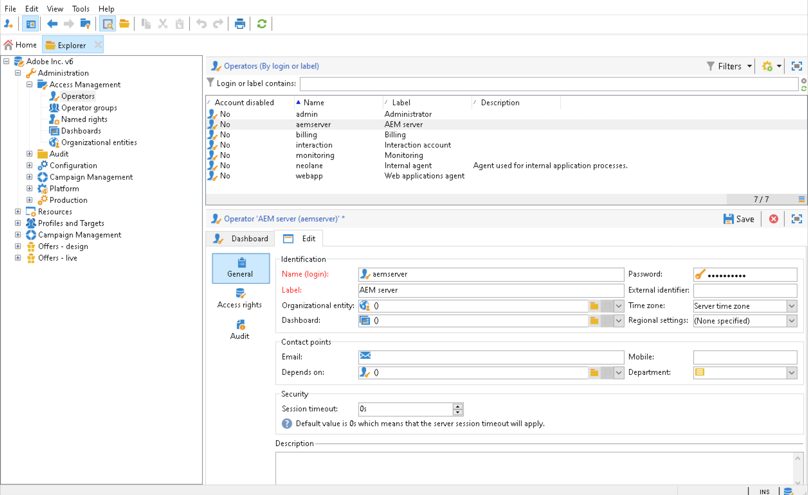

# Integrera med Adobe Campaign Classic {#integrating-campaign-classic}

Genom att integrera med Adobe Campaign kan ni hantera e-postleveranser, innehåll och formulär direkt i AEM as a Cloud Service. Konfigurationssteg i både Adobe Campaign Classic och AEM as a Cloud Service krävs för att möjliggöra dubbelriktad kommunikation mellan lösningar.

Observera att AEM as a Cloud Service och Adobe Campaign Classic också kan användas oberoende av varandra. Marknadsförare kan till exempel skapa kampanjer och använda målinriktning i Adobe Campaign, medan innehållsskapare kan arbeta med designen i AEM as a Cloud Service.

## Arbetsflöde för integrering {#integration-workflow}

I följande kapitel beskrivs hur du integrerar lösningarna. Detta kräver konfigurationssteg både i Adobe Campaign Classic och AEM as a Cloud Service. På så sätt får du lära dig att:

* [Skapa Operator User](#create-operator)
* [Konfigurera AEM as a Cloud Service för integreringen](#aem-configuration)
* [Konfigurera Campaign Remote User](#configure-user)
* [Konfigurera Adobe Campaign Classic externa konto](#acc-setup)

### Förutsättningar {#prerequisites}

**Adobe Campaign Classic**

För att kunna utföra integreringen behöver du en fungerande Adobe Campaign Classic-instans, inklusive en databas. Om du vill ha mer information om hur du konfigurerar och konfigurerar Adobe Campaign Classic kan du läsa [Adobe Campaign Classic-dokumentation](https://experienceleague.adobe.com/docs/campaign-classic/using/campaign-classic-home.html) särskilt i installations- och konfigureringshandboken. Tänk på att du även måste ha administratörsrollen för att kunna utföra åtgärderna nedan.

**AEM as a Cloud Service**

Du behöver [AEM as a Cloud Service](https://experienceleague.adobe.com/docs/experience-manager-cloud-service/content/overview/introduction.html) lösning.

### Skapa Operator-användaren i Adobe Campaign Classic {#create-operator}

Öppna Adobe Campaign Classic klientkonsol på Start-menyn och logga in. Startsidan bör visas.

1. Klicka **Utforskaren** för att öppna Utforskaren.
   
1. Navigera i trädvyn till vänster till **Administration->Åtkomshantering->Operatorer**.
1. Dubbelklicka på `aemserver` i listan Operatorer till höger.
1. Växla till **Redigera** -fliken. Ange lösenordet för servern.
   
1. Klicka på **Åtkomsträttigheter** och klicka på **Redigera åtkomstparametrarna** under skyddsinställningarna.
1. Under Kryptering väljer du Offentligt nätverk som auktoriserad anslutningszon. Klicka **OK**.
   
1. Klicka **Spara**.
1. Logga ut.
1. Gå till installationsplatsen för Adobe Campaign Classic v7, till exempel `C:\Program Files\Adobe\Adobe Campaign Classic v7\conf` och öppna `serverConf.xml` som administratör.
   * Sök efter **säkerhetszon**.
   * Ange följande parametrar `allowHTTP="true"` `sessionTokenOnly="true"` `allowUserPassword="true"`.
   * Spara filen.
1. Se till att säkerhetszonen inte skrivs över av respektive inställning i `config-<server name>.xml` fil (C:\Program Files\Adobe\Adobe Campaign Classic v7\conf\config_acc-test.xml).
   * Om konfigurationsfilen innehåller en separat säkerhetsinställning ändrar du `allowUserPassword` attributet är true.
1. Om du vill ändra Adobe Campaign Classic-serverporten ersätter du 8080 med önskad port (till exempel: 80).

>[!NOTE]
>
>Som standard finns ingen säkerhetszon konfigurerad för operatorn. Om du vill ansluta till Adobe Campaign med AEM as a Cloud Service måste du välja en (se stegen ovan). Vi rekommenderar starkt att du skapar en säkerhetszon som är dedikerad till AEM för att undvika säkerhetsproblem.

### Konfigurera AEM som en molntjänst {#aem-configuration}

1. Logga in i molnhanteraren och starta den AEM as a Cloud Service författarinstansen.
1. Gå till **Verktyg→Cloud Service→Äldre Cloud Service**.
   
1. Bläddra ned till Adobe Campaign och klicka på **Konfigurera nu** länk.
   * Ange en titel.
   * Ange ett namn.
   * Klicka **Skapa**.
1. På skärmen Redigera komponent
   * Ange användarnamn, se [Skapa Operator User](#create-operator).
   * Ange lösenordet.
   * Ange slutpunkten för Adobe Campaign Classic server-API (till exempel `http://3.22625.51:80`).
   * Klicka **Anslut till Adobe Campaign**.
   * Klicka **OK**.

   >[!NOTE]
   >
   >Kontrollera att din Adobe Campaign-server är tillgänglig på Internet eftersom AEM as a Cloud Service inte kan nå privata nätverk.
1. Kontrollera publiceringsinstansen i konfigurationen för Länkutjämnaren.
Du kan visa den här konfigurationen genom att kontrollera statusdumpen för OSGi-tjänsterna i [utvecklarkonsol](https://experienceleague.adobe.com/docs/experience-manager-learn/cloud-service/debugging/debugging-aem-as-a-cloud-service/developer-console.html#osgi-services).
Om det inte är korrekt ändrar du i motsvarande instans-Git-databas och distribuerar sedan konfigurationen med [cloud manager](https://experienceleague.adobe.com/docs/experience-manager-cloud-service/content/implementing/using-cloud-manager/deploy-code.html).

```
Service 3310 - [com.day.cq.commons.Externalizer] (pid: com.day.cq.commons.impl.ExternalizerImpl)",
"  from Bundle 420 - Day Communique 5 Commons Library (com.day.cq.cq-commons), version 5.12.16",
"    component.id: 2149",
"    component.name: com.day.cq.commons.impl.ExternalizerImpl",
"    externalizer.contextpath: ",
"    externalizer.domains: [local https://author-p17558-e33255-cmstg.adobeaemcloud.com, author https://author-p17558-e33255-cmstg.adobeaemcloud.com,
     publish https://publish-p17558-e33255-cmstg.adobeaemcloud.com]",
"    externalizer.encodedpath: false",
"    externalizer.host: ",
"    feature-origins: [com.day.cq:cq-quickstart:slingosgifeature:cq-platform-model_quickstart_author:6.6.0-V23085]",
"    service.bundleid: 420",
"    service.description: Creates absolute URLs",
"    service.scope: bundle",
"    service.vendor: Adobe Systems Incorporated",
```

>[!NOTE]
>
>Publiceringsinstansen måste också kunna nås från Adobe Campaign-servern.

### Konfigurera Adobe Campaign fjärranvändare {#configure-user}

Du måste ange ett lösenord för kampanjens fjärranvändare. Det är nödvändigt för att ansluta Adobe Campaign Classic till AEM som en molntjänst.

1. Gå till **AEM→Verktyg→Säkerhet→Användare**.
   
1. Sök efter `campaign-remote` och klicka på den.
1. Klicka på Ändra lösenord
   * Ange det nya lösenordet två gånger.
   * Ange ditt AEM lösenord.
   * Klicka **Spara**.

### Konfigurera Adobe Campaign Classic externa konto {#acc-setup}

Du måste också konfigurera ett externt konto för att kunna ansluta Adobe Campaign Classic till den AEM as a Cloud Service instansen.

1. Logga in på Adobe Campaign Classic-servern med hjälp av klientkonsolen.
1. Gå till Utforskaren.
1. I trädvyn till vänster går du till **Administration→Plattform→Externa konton**.
1. Klicka på AEM i listvyn högst upp till höger.
1. I AEM instanskonfiguration
   * Ange t.ex. AEM as a Cloud Service författarens IP/FQN `https://author-p17558-e33255-cmstg.adobeaemcloud.com`.
   * Ange användare och konto.
   * Ange lösenordet för den kampanjfjärranvändare som du angav i den AEM as a Cloud Service instansen (se proceduren ovan).
   * Välj **Aktiverad** kryssrutan.
   * Klicka **Spara**.

   >[!NOTE]
   >
   >IP/FQN för AEM Author-servern måste kunna nås från Adobe Campaign Classic-serverinstansen. Lägg inte till omvänt snedstreck i IP/FQN för AEM Author-servern.

Efter att ha konfigurerat både Adobe Campaign Classic och AEM as a Cloud Service är integreringen nu klar. Dessutom kan du lära dig att skapa ett Adobe Experience Manager Newsletter genom att läsa [den här sidan](/help/sites-cloud/integrating/creating-newsletter.md).
