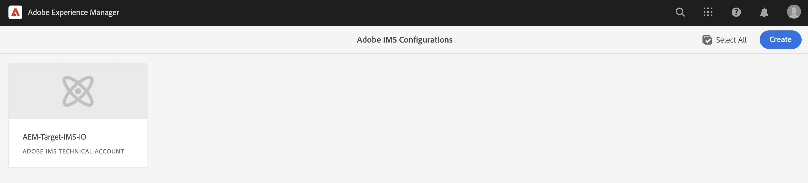

# IMS-konfiguration som ska användas vid integrering med Adobe Target{#ims-configuration-for-integration-with-adobe-target}

Integreringen av AEM med Adobe Target via Target Standard API kräver att Adobe IMS (Identity Management System) konfigureras. Konfigurationen genomförs med Adobe Developer Console.

>[!NOTE]
>
>Stöd för Adobe Target Standard API är nytt i AEMaaCS. Målstandard-API:t använder IMS-autentisering.
>
>API-valet styrs av den autentiseringsmetod som används för AEM/Target-integrering.

## Förutsättningar {#prerequisites}

Innan du börjar med den här proceduren:

* [Stöd för Adobe](https://helpx.adobe.com/se/contact/enterprise-support.ec.html) måste tillhandahålla ditt konto för:

   * Adobe Console
   * Adobe Developer Console
   * Adobe Target och
   * Adobe IMS (Identity Management System)

* Din organisations systemadministratör bör använda Admin Console för att lägga till de utvecklare som behövs i organisationen till de relevanta produktprofilerna.

   * Detta ger specifika utvecklare behörighet att aktivera integreringar med Adobe Developer Console.
   * Mer information finns i [Hantera utvecklare](https://helpx.adobe.com/enterprise/admin-guide.html/enterprise/using/manage-developers.ug.html).

## Konfigurera en IMS-konfiguration - Generera en offentlig nyckel {#configuring-an-ims-configuration-generating-a-public-key}

Det första steget i konfigurationen är att skapa en IMS-konfiguration i AEM och generera den offentliga nyckeln.

1. Öppna AEM **verktyg** -menyn.
1. I **Säkerhet** avsnittsmarkera **Adobe IMS-konfigurationer**.
1. Välj **Skapa** för att öppna **Adobe IMS Technical Account Configuration**.
1. Använda listrutan under **Molnkonfiguration**, markera **Adobe Target**.
1. Aktivera **Skapa nytt certifikat** och ange ett nytt alias.
1. Bekräfta med **Skapa certifikat**.

   

1. Välj **Ladda ned** (eller **Hämta offentlig nyckel**) för att hämta filen till den lokala hårddisken, så att den är klar att användas när [konfigurera IMS för Adobe Target-integrering med AEM](#configuring-ims-adobe-target-integration-with-aem).

   >[!CAUTION]
   >
   >Låt konfigurationen vara öppen, den behövs igen när [Slutför IMS-konfigurationen i AEM](#completing-the-ims-configuration-in-aem).

   

## Konfigurera IMS för Adobe Target-integrering med AEM {#configuring-ims-adobe-target-integration-with-aem}

Adobe Developer Console Project (integration) med Adobe Target som AEM ska använda och tilldela sedan de behörigheter som krävs.

### Skapa projektet {#creating-the-project}

Öppna Adobe Developer Console och skapa ett projekt med Adobe Target som AEM ska använda:

>[!CAUTION]
>
>För närvarande stöder vi endast Adobe Developer Console **Tjänstkonto (JWT)** autentiseringsuppgiftstyp.
>
>Använd inte **OAuth Server-till-server** autentiseringsuppgiftstyp, som kommer att stödjas i framtiden.

1. Öppna Adobe Developer Console for Projects:

   [https://developer.adobe.com/console/projects](https://developer.adobe.com/console/projects)

1. Alla projekt du har visas. Välj **Skapa nytt projekt** - platsen och användningen beror på:

   * Om du inte har något projekt än, **Skapa nytt projekt** är centrerad, nederst.
     
   * Om du redan har befintliga projekt visas dessa och **Skapa nytt projekt** är överst till höger.
     

1. Välj **Lägg till i projekt** följt av **API**:

   

1. Välj **Adobe Target** sedan **Nästa**:

   >[!NOTE]
   >
   >Om du prenumererar på Adobe Target, men inte ser det i listan, bör du kontrollera [Förutsättningar](#prerequisites).

   

1. **Överför din offentliga nyckel** och när det är klart fortsätter du med **Nästa**:

   

1. Granska inloggningsuppgifterna och fortsätt med **Nästa**:

   

1. Välj önskade produktprofiler och fortsätt med **Spara konfigurerat API**:

   >[!NOTE]
   >
   >Vilka produktprofiler som visas beror på om du har:
   >
   >* Adobe Target Standard - endast **Standardarbetsyta** är tillgänglig
   >* Adobe Target Premium - alla tillgängliga arbetsytor visas i listan enligt nedan

   

1. Skapandet bekräftas.

<!--
1. The creation is confirmed, you can now **Continue to integration details**; these are needed for [Completing the IMS Configuration in AEM](#completing-the-ims-configuration-in-aem).

   
-->

<!-- could not verify - only saw Adobe Target Classic -->

### Tilldela behörigheter till integreringen {#assigning-privileges-to-the-integration}

Du måste nu tilldela nödvändig behörighet till integreringen:

1. Öppna Adobe **Admin Console**:

   * [https://adminconsole.adobe.com](https://adminconsole.adobe.com/)

1. Navigera till **Produkter** (övre verktygsfältet) och sedan välja **ADOBE TARGET - &lt;*din-tenant-id*>** (från vänster panel).
1. Välj **Produktprofiler** och sedan den arbetsyta du behöver i den lista som visas. Exempel: Standardarbetsyta.
1. Välj **API-autentiseringsuppgifter** och sedan den integreringskonfiguration som krävs.
1. Välj **Redigerare** som **Produktroll**; i stället för **Observer**.

## Information lagrad för Adobe Developer Console Integration Project {#details-stored-for-the-ims-integration-project}

På Adobe Developer Console Projects-konsolen kan du se en lista över alla dina integreringsprojekt:

* [https://developer.adobe.com/console/projects](https://developer.adobe.com/console/projects)

Välj **Visa** (till höger om en viss projektpost) om du vill visa mer information om konfigurationen. Bland dessa finns:

* Projektöversikt
* Insikter
* Referenser
   * Tjänstkonto (JWT)
      * Information om autentiseringsuppgifter
      * Generera JWT
* APIS
   * Exempel: Adobe Target

Vissa av dessa måste integreras i AEM baserat på IMS.

## Slutför IMS-konfigurationen i AEM {#completing-the-ims-configuration-in-aem}

Om du går tillbaka till AEM kan du slutföra IMS-konfigurationen genom att lägga till obligatoriska värden från IMS-integreringen för Target:

1. Återgå till [IMS-konfiguration öppnas i AEM](#configuring-an-ims-configuration-generating-a-public-key).
1. Välj **Nästa**.

1. Här kan du använda [information från projektkonfigurationen i Adobe Developer Console](#details-stored-for-the-ims-integration-project):

   * **Titel**: Din text.
   * **Auktoriseringsserver**: Kopiera/klistra in detta från `aud` rad i **Nyttolast** avsnitt nedan, till exempel `https://ims-na1.adobelogin.com` i exemplet nedan
   * **API-nyckel**: Kopiera detta från projektet [Ökning](#details-stored-for-the-ims-integration-project) section
   * **Klienthemlighet**: Generera detta i projektet [Ökning](#details-stored-for-the-ims-integration-project) och kopiera
   * **Nyttolast**: Kopiera detta från [Generera JWT](#details-stored-for-the-ims-integration-project) section

   

1. Bekräfta med **Skapa**.

1. Din Adobe Target-konfiguration visas i AEM.

   

## Bekräfta IMS-konfigurationen {#confirming-the-ims-configuration}

Så här bekräftar du att konfigurationen fungerar som förväntat:

1. Öppna:

   * `https://localhost<port>/libs/cq/adobeims-configuration/content/configurations.html`

   Till exempel:

   * `https://localhost:4502/libs/cq/adobeims-configuration/content/configurations.html`

1. Välj din konfiguration.
1. Välj **Kontrollera hälsa** i verktygsfältet, följt av **Kontrollera**.

   

1. Om det lyckas visas ett bekräftelsemeddelande.

## Slutför integrationen med Adobe Target {#complete-the-integration-with-adobe-target}

Nu kan du använda den här IMS-konfigurationen för att slutföra [integrering med Adobe Target](/help/sites-cloud/integrating/integrating-adobe-target.md).

<!--

## Configuring the Adobe Target Cloud Service {#configuring-the-adobe-target-cloud-service}

The configuration can now be referenced for a Cloud Service to use the Target Standard API:

1. Open the **Tools** menu. Then, within the **Cloud Services** section, select **Legacy Cloud Services**.
1. Scroll down to **Adobe Target** and select **Configure now**.

   The **Create Configuration** dialog opens.

1. Enter a **Title** and, if you want, a **Name** (if left blank it is generated from the title).

   You can also select the required template (if more than one is available).

1. Confirm with **Create**.

   The **Edit Component** dialog opens.

1. Enter the details in the **Adobe Target Settings** tab:

    * **Authentication**: IMS

    * **Client Code**: See the [Tenant ID and Client Code](#tenant-client) section.

    * **Tenant ID**: the Adobe IMS Tenant ID. See also the [Tenant ID and Client Code](#tenant-client) section.

      >[!NOTE]
      >
      >For IMS this value needs to be taken from Target itself. You can log into Target and extract the Tenant ID from the URL.
      >
      >For example, if the URL is:
      >
      >`https://experience.adobe.com/#/@yourtenantid/target/activities`
      >
      >Then you would use `yourtenantid`.

    * **IMS Configuration**: select the name of the IMS Configuration

    * **API Type**: REST

    * **A4T Analytics Cloud Configuration**: Select the Analytics cloud configuration that is used for target activity goals and metrics. You need this if you are using Adobe Analytics as the reporting source when targeting content.   

      <!--
      If you do not see your cloud configuration, see note in [Configuring A4T Analytics Cloud Configuration](/help/sites-administering/target-configuring.md#configuring-a-t-analytics-cloud-configuration).
      -- >

    * **Use accurate targeting**: By default this check box is selected. If selected, the cloud service configuration will wait for the context to load before loading content. See note that follows.

    * **Synchronize segments from Adobe Target**: Select this option to download segments that are defined in Target to use them in AEM. You must select this option when the API Type property is REST, because inline segments are not supported and you always need to use segments from Target. (Note that the AEM term of 'segment' is equivalent to the Target 'audience'.)

    * **Client library**: Select whether you want the AT.js client library, or mbox.js (deprecated).

    * **Use Tag Management System to deliver client library**: Use DTM (deprecated), Adobe Launch or any other tag management system.

    * **Custom AT.js**: Leave blank if you checked the Tag Management box or to use the default AT.js. Alternatively upload your custom AT.js. Only appears if you have selected AT.js.

   <!--
   >[!NOTE]
   >
   >[Configuration of a Cloud Service to use the Target Classic API](/help/sites-administering/target-configuring.md#manually-integrating-with-adobe-target) has been deprecated (uses the Adobe Recommendations Settings tab).
   -- >

1. Click **Connect to Adobe Target** to initialize the connection with Adobe Target.

   If the connection is successful, the message **Connection successful** is displayed.

1. Select **OK** on the message, followed by **OK** on the dialog to confirm the configuration.

1. You can now proceed to [Adding a Target Framework](/help/sites-administering/target-configuring.md#adding-a-target-framework) to configure ContextHub or ClientContext parameters that are sent to Target. Note this may not be required for exporting AEM Experience Fragments to Target.

### Tenant ID and Client Code {#tenant-client}

With [Adobe Experience Manager as a Cloud Service](/help/release-notes/release-notes-cloud/release-notes-current.md), the Client Code field had been added to the Target configuration window.

When configuring the Tenant ID and Client Code fields, be aware of that for most customers, the **Tenant ID** and the **Client Code** are the same. This means that both fields contain the same information and are identical. Make sure you enter the Tenant ID in both fields.

>[!NOTE]
>
>For legacy purposes, you can also enter different values in the Tenant ID and the Client Code fields.

In both cases, be aware that:

* By default, the Client Code (if added first) will also be automatically copied into the Tenant ID field.
* You have the option to change the default Tenant ID set.
* Accordingly, the backend calls to Target are based on the **Tenant ID** and the client side calls to Target are based on the **Client Code**.

As stated previously, the default case is the most common for AEM as a Cloud Service. Either way, make sure **both** fields contain the correct information depending on your requirements.

>[!NOTE]
>
> If you want to change an existing Target Configuration:
>
> 1. Re-enter the Tenant ID.
> 2. Re-connect to Target.
> 3. Save the configuration.
-->
