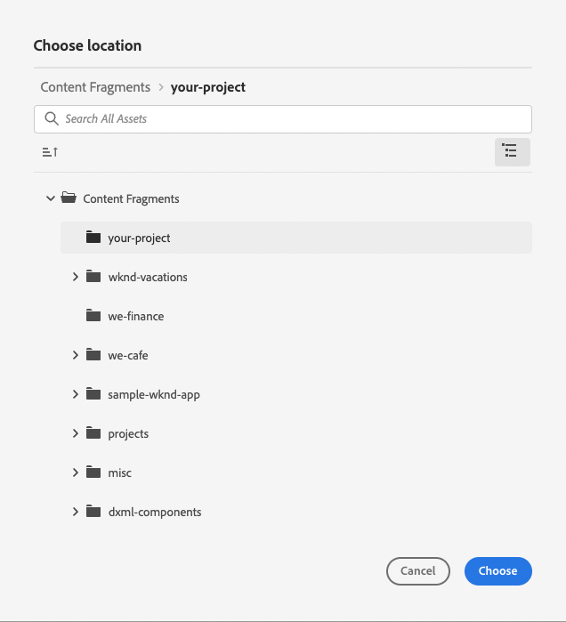
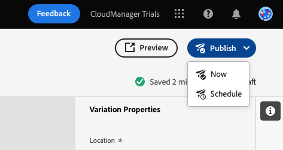

# Skapa rubrikfritt innehåll {#create-content}

Lär dig använda genom att följa produktutbildningsmodulen [de innehållsfragmentsmodeller du skapat tidigare](content-structure.md) för att skapa innehåll som kan användas för att skapa sidor, eller som bas för rubrikfritt innehåll. Det här dokumentet är ett komplement till den interaktiva rundturen, som omfattar samma steg och länkar till ytterligare resurser där så är lämpligt.

>[!CONTEXTUALHELP]
>id="aemcloud_sites_trial_admin_content_fragments_create_content"
>title="Skapa nytt innehåll"
>abstract="Med hjälp av modellerna som du skapade i modul 1 får du lära dig hur du skapar innehåll som kan användas för att skapa sidor, eller som bas för rubrikfritt innehåll."

>[!CONTEXTUALHELP]
>id="aemcloud_sites_trial_admin_content_fragments_create_content_guide"
>title="Starta konsolen för innehållsfragment"
>abstract="I AEM headless CMS är&quot;innehållsfragment&quot; alla innehållsdelar som passar i den fördefinierade strukturen, en&quot;innehållsfragmentmodell&quot;. I den här genomgången får du lära dig hur du skapar innehåll för innehållsfragmentmodellen.  Klicka nedan för att starta funktionen på en ny flik och följ det här utbildningsdokumentet för att skapa ditt första innehållsfragment."
>additional-url="https://video.tv.adobe.com/v/328618" text="Platshållare för inledande video"
>additional-url="https://experienceleague.adobe.com/docs/experience-manager-cloud-service/assets/home_c1.png" text="Videominiatyr: Lägga till innehåll - det vinnande receptet"

## Innehållsfragment {#introduction}

I AEM as a Cloud Service är innehållsfragment delar av headless-innehåll baserat på strukturen som definieras av en Content Fragment-modell. Du kan skapa ett eget innehållsfragment genom att starta i konsolen Innehållsfragment. Konsolen för innehållsfragment kan ses som ditt bibliotek med headless-innehåll. Du använder konsolen för att skapa nya innehållsfragment och hantera befintliga fragment. Konsolen börjar tom, så vi skapar ett nytt fragment!

Om du själv vill navigera till konsolen för innehållsfragment utanför vägledningen i appen visas den med ikonen Adobe längst upp till vänster på sidan. Då öppnas den globala navigeringen för AEM. Här väljer du **Navigering** och sedan **Innehållsfragment**.

>[!TIP]
>
>Om du vill veta mer om navigering i AEM kan du läsa [Avsnittet Ytterligare resurser](#additional-resources) för mer information om AEM grundläggande hantering.

## Skapa ett innehållsfragment {#create-fragment}

Content Fragments representerar ditt headless-innehåll. Men de kan bara skapas baserat på en fördefinierad innehållsstruktur. Modellen för innehållsfragment som du skapade tidigare fungerar som den strukturen.

1. Tryck eller klicka på **Skapa** knappen längst upp till höger på konsolen för att öppna **Nytt innehållsfragment** för att börja skapa ett nytt innehållsfragment.

   

1. Om du följer anvisningarna i appen **Plats** fylls i automatiskt.

   1. Om du inte följer vägledningen använder du sökvägsläsaren för att välja projektmappen.

   1. I **Nytt innehållsfragment** trycker du på eller klickar på **Välj plats** (ikonen som ser ut som en mapp) i **Plats** fält.

      
   * Du kan också markera sökvägen i den vänstra navigeringspanelen i konsolen för innehållsfragment innan du klickar på **Skapa**.

1. I **Modell för innehållsfragment** väljer du den modell för innehållsfragment som du skapade tidigare i listrutan.

1. Lägg till en **Titel** för innehållsfragmentet.

1. Tryck eller klicka **Skapa och öppna**.

## Innehållsfragmentsredigerare {#edit-fragment}

När du har sparat det nya innehållsfragmentet öppnas innehållsfragmentsredigeraren, där du kan ange fragmentets faktiska innehåll.

1. Redigeraren visar fälten som du definierade i den valda modellen. Här kan du redigera dem för att slutföra ditt innehållsfragment. Förloppet sparas automatiskt.

   

1. Om det finns många fält i innehållsfragmentets modell kan du snabbt hoppa till valfritt fält med **Variabler** till vänster om redigeraren. Fält med fel markeras här.

1. För att innehållsfragmentet ska vara tillgängligt för konsumtion av externt program måste du publicera det. Tryck eller klicka på **Publicera** längst upp till höger i redigeraren.

1. Välj **Nu** i listrutan. Du kan också schemalägga publiceringen vid ett senare tillfälle.

   

   >[!TIP]
   >
   >Om du vill veta mer om publicering i AEM kan du läsa [Avsnittet Ytterligare resurser](#additional-resources) för mer information om publicering.

1. AEM utför automatiskt en referenskontroll för att se till att alla nödvändiga resurser publiceras för ditt innehållsfragment. I det här fallet måste du även publicera modellen som du skapade. Tryck eller klicka **Publicera**.

   

1. Publiceringen bekräftas i en banderoll.

   

## Du har lärt dig att skapa ett innehållsfragment! {#conclusion}

I den här modulen lärde du dig att skapa ett innehållsfragment baserat på den modell du gjorde tidigare. Så här skapar en innehållsförfattare strukturerat rubrikfritt innehåll.

Nu när ditt innehåll har skapats och publicerats kan du extrahera det via Graph QL via AEM API:er. Du kommer att lära dig mer om detta i modulen [Extrahera innehåll via GraphQL API.](extract-content.md)

Du kan gå tillbaka till startskärmen för testversionen genom att klicka på **Lösningar** knappen längst upp till höger i navigeringsfältet och markera **Experience Manager**.

## Ytterligare resurser {#additional-resources}

Mer information om innehållsfragment och AEM finns i den här extra dokumentationen.

* [Grundläggande hantering](/help/sites-cloud/authoring/getting-started/basic-handling.md) - Dokumentation om hur du navigerar och använder AEM för nya användare
* [Hantera innehållsfragment - Publicera och referera](/help/assets/content-fragments/content-fragments-managing.md#publishing-and-referencing-a-fragment) - Information om hur du publicerar innehåll i AEM
* [Innehållsfragment](/help/assets/content-fragments/content-fragments.md) - Översikt över innehållsfragment och länkar till fullständig dokumentation om innehållsfragment
* [Hantera innehållsfragment](/help/assets/content-fragments/content-fragments-managing.md) - Skapa och hantera innehållsfragment
