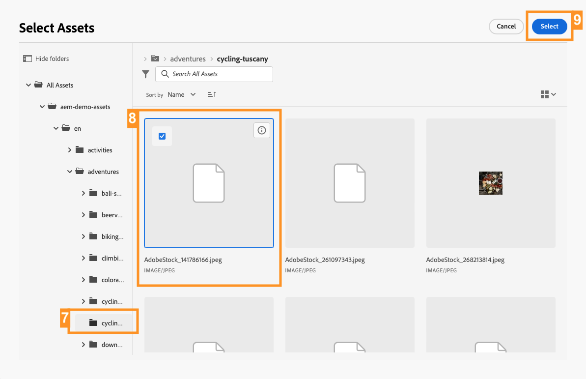

# Skapa rubrikfritt innehåll {#create-content}

>[!CONTEXTUALHELP]
>id="aemcloud_sites_trial_admin_content_fragments_create_content"
>title="Skapa headless-innehåll"
>abstract="Med hjälp av den modell du skapade i den tidigare modulen får du lära dig hur du skapar innehåll som kan användas för att skapa sidor, eller som bas för rubrikfritt innehåll."

>[!CONTEXTUALHELP]
>id="aemcloud_sites_trial_admin_content_fragments_create_content_guide"
>title="Starta konsolen för innehållsfragment"
>abstract="Att skapa enhetligt, högkvalitativt innehåll som fungerar smidigt i alla era appar och webbplatser leder till enastående kundupplevelser. Med den här modulen får du hjälp att skapa ditt första innehåll utan rubrik med hjälp av konsolen för innehållsfragment.<br><br>Starta den här modulen på en ny flik genom att klicka på knappen nedan och följ sedan den här guiden."

>[!CONTEXTUALHELP]
>id="aemcloud_sites_trial_admin_content_fragments_create_content_guide_footer"
>title="Snyggt jobb! I den här modulen lärde du dig att skapa rubrikfritt innehåll som ett innehållsfragment baserat på den tidigare modellen. Ni förstår nu hur innehållsteam kan skapa och hantera innehåll för appar och webbplatser oberoende av utvecklingscyklerna."
>abstract=""

## Skapa ett innehållsfragment {#create-fragment}

Content Fragments representerar ditt headless-innehåll och är baserade på fördefinierade strukturer, som kallas Content Fragment-modeller. Du har redan skapat en modell i en tidigare modul.

I den här modulen skapar du ett innehållsfragment baserat på den modellen med konsolen Innehållsfragment. Tänk på Content Fragment-konsolen som ditt bibliotek med headless-innehåll. Använd det för att skapa nya innehållsfragment och hantera befintliga fragment.

Konsolen för innehållsfragment används för att skapa och redigera headless-innehåll i olika distributionskanaler och oberoende av sammanhang, vilket kan vara den mest effektiva metoden i många fall. I en senare modul kommer vi att utforska redigering av headless-innehåll på plats och i sitt sammanhang.

1. Välj **Skapa** längst upp till höger på konsolen.

1. The **Nytt innehållsfragment** öppnas där du kan börja skapa ett innehållsfragment. **Plats** fylls automatiskt i där det nya innehållet sparas.

1. I **Modell för innehållsfragment** väljer du **Adventure** Modell för innehållsfragment som du skapade tidigare.

1. Lägg till `Tuscany` som en beskrivande **Titel** för innehållsfragmentet. Detta är för att identifiera ditt fragment i konsolen.

1. Välj **Skapa och öppna**.


>[!TIP]
>
>Beroende på inställningarna för webbläsaren kan den nya fliken i webbläsaren vara inaktiverad av en blockerare för popup-fönster. Om ditt nya fragment inte öppnas efter att du klickat **Skapa och öppna** kontrollerar du webbläsarens inställningar.

## Lägg till innehåll i ditt innehållsfragment {#add-content}

När du har sparat och öppnat ditt nya innehållsfragment öppnas redigeraren för innehållsfragment på en ny flik. Här kan du lägga till innehållet i det nya fragmentet.

1. Innehållsfragmentsredigeraren visar de fält som du har definierat i den valda modellen. Här kan du lägga till innehåll i varje fält för att slutföra innehållsfragmentet. Förloppet sparas automatiskt.

1. Ange en **Titel** för ditt fragment genom att ange `Tuscan Adventure`.

1. Ange en **Beskrivning** för ditt fragment genom att klistra in i följande text.

   ```text
   Visiting Tuscany on a bicycle is about experiencing the old world charm of Italy on your own terms. Your efforts on the climbs of Italy's rolling hills during this tour are rewarded with sunny Mediterranean landscapes and unmatched Italian hospitality. Tuscany's natural wonders have always been a well of inspiration for arts and culture. Find out why as you explore the Italian countryside and coastline on bicycle.
   ```

1. Ange en **Pris** för ditt fragment genom att ange `$700`.

1. Ange en **Bild** som representerar resan genom att trycka eller klicka **Lägg till resurs** i **Bild** fält.

1. I popup-fönstret för resurser väljer du **Bläddra bland resurser** för att välja från en befintlig resurs i resursbiblioteket.

   

1. The **Välj resurs** öppnas. Navigera med trädnavigatorn i den vänstra panelen till **Alla resurser** > **aem-demo-assets** > **en** > **äventyr** > **cykling-tuscany**.

1. Innehållet i **cykling-tuscany** visas till höger. Markera bilden `ADOBESTOCK_141786166.JPEG`.

1. Välj **Välj**.

   

1. Den valda bilden visas i innehållsfragmentet. Redigeraren sparar ändringarna automatiskt.

1. När du är klar med att lägga till innehåll väljer du **Publicera** längst upp till höger i redigeraren. Detta gör att ditt innehållsfragment blir tillgängligt för konsumtion i externa appar. Välj sedan **Nu** i listrutan. Du kan också schemalägga det för publicering vid ett senare tillfälle.

   

1. The **Publicera innehållsfragment** visas. AEM utför automatiskt en referenskontroll för att se till att alla nödvändiga resurser publiceras för ditt innehållsfragment. I det här fallet måste du även publicera modellen som du skapade. Välj **Publicera**.

   

1. Publiceringen bekräftas i en banderoll.

Ditt innehåll publiceras och kan levereras till din app eller webbplats som ett innehållsfragment.
