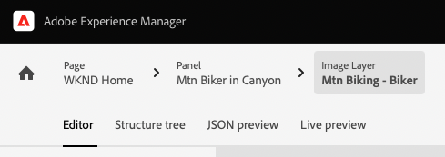
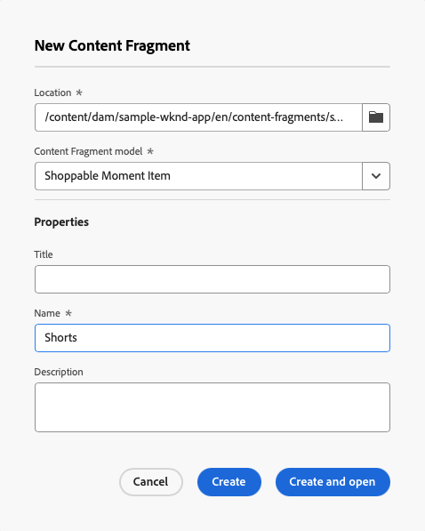

# Anpassa innehåll i en exempelapp {#customize-app}

AEM testversioner för headless levereras med en enkel React-app som visar headless-innehåll. I den här modulen får du lära dig hur du förhandsgranskar appen och ändrar dess innehåll genom att byta ut en bild och skapa en köpbar stund för den.

Själva programmet baseras på strukturen för innehållsfragment. Med hjälp av redigeraren för innehållsfragment i AEM kan du ändra appinnehåll. För att du ska få en bättre förståelse för hur du gör på det här sättet går du igenom processen med hjälp av den här modulen med AEM. Det här dokumentet är ett komplement till den interaktiva rundturen, som omfattar samma steg och länkar till ytterligare resurser där så är lämpligt.

>[!CONTEXTUALHELP]
>id="aemcloud_sites_trial_admin_content_fragments_react_app"
>title="Anpassa innehåll i en exempelapp för React"
>abstract="Vi har skapat en modern React-app som du kan använda för att lära dig hur du anpassar innehåll med hjälp av den headless-funktionsuppsättningen."

>[!CONTEXTUALHELP]
>id="aemcloud_sites_trial_admin_content_fragments_react_app_guide"
>title="Starta redigeraren för innehållsfragment"
>abstract="AEM testversioner för headless levereras med en enkel React-app som visar headless-innehåll. Appen baseras på strukturen för innehållsfragment. Med hjälp av redigeraren för innehållsfragment i AEM kan du ändra appens innehåll.  Starta funktionen på en ny flik genom att klicka nedan och följ sedan den här guiden."
>additional-url="https://video.tv.adobe.com/v/328618" text="Platshållare för inledande video"

## Innehållsfragmentsredigerare {#fragment-editor}

Du börjar i Content Fragment-redigeraren för exempelprogrammet.

Om du vill navigera till innehållsfragmentsredigeraren själv utanför vägledningen i appen visas den med ikonen Adobe längst upp till vänster på sidan. Då öppnas den globala navigeringen för AEM. Här väljer du **Navigering** och sedan **Innehållsfragment**.

Då öppnas konsolen för innehållsfragment. Därifrån använder du innehållsträdet i den vänstra panelen för att navigera till platsen för programinnehållet. I det här fallet **Innehållsfragment** -> **Exempel på WKND-app** -> **Engelska** -> **Innehållsfragment** -> **sidor**.

Tryck eller klicka på **WKND - startsida** sidfragment som visas i konsolen till höger om innehållsträdet för att starta redigeraren för programinnehållet.

>[!TIP]
>
>Om du vill veta mer om navigering i AEM kan du läsa [Avsnittet Ytterligare resurser](#additional-resources) för mer information om AEM grundläggande hantering.

## Förhandsgranska appen {#preview}

Innan du börjar ändra programmet bör du först bekanta dig med det genom att förhandsvisa dess aktuella läge. Tryck eller klicka på **Förhandsgranska** längst upp till höger på redigeringsskärmen.

Demonstrationsappen öppnas på en ny flik.

Själva appen är en enkel e-handelsapp för det påhittade WKND-livsstilen utomhus som implementerats i React. Klicka runt för att navigera i exempelinnehållet.

Gå tillbaka till fliken i redigeraren för innehållsfragment för att fortsätta.

## Redigera text i appen {#edit-app}

Som tidigare nämnts består själva programmet av innehållsfragment. Dessa fragment länkas tillsammans i en struktur för att skapa programmet.

Innehållsfragmentsredigeraren visar programmets grundläggande layout som en sida. Den här sidan är ett innehållsfragment, som i sin tur är en samling med andra fragment. The **Paneler** representerar olika sidor i programmet, som var och en är sin egen innehållsfragment. Genom att ändra dessa fragment kan du ändra innehållet i appen.

1. Tryck eller klicka **Mtn Biker i Canyon** i **Paneler** -avsnitt.

   

1. Redigeraren öppnar rubrikpanelen för bergsbudgivaren. Varje panel består av lager som representerar olika innehåll på en sida i programmet.

   

1. Markera textlagret **Mtn Biker i Canyon Text Layer**. Då öppnas detaljerna för lagret i redigeraren. Lagret består av flera innehållsfragment.

   

1. Välj **Mtn Biker in Canyon Title** textobjekt. Då öppnas Content Fragment-redigeraren, där innehållet i det här fragmentet visas och du kan ändra det.

   

1. Ändra texten från `Your next great adventure is calling` till `Choose your own adventure`. Ändringen sparas automatiskt av redigeraren.

1. Klicka på Förhandsgranska för att se ändringarna. Demonstrationsappen öppnas på en ny flik.

   

Gå tillbaka till fliken i redigeraren för innehållsfragment för att fortsätta modulen.

## Ändra programmets huvudbild {#change-image}

Nu när du har ändrat text i appen kan du prova att ändra programmets huvudbild. Först måste du hitta innehållet.

Bröderna högst upp till vänster i redigeraren visar var du befinner dig i innehållshierarkin.

1. Tryck eller klicka **Mtn Biker i Canyon** i vägbeskrivningarna för att återgå till den sidan.

   

1. Återgå till panelen med appens olika lager. Lagren representerar inte bara textinnehåll. De representerar allt innehåll i appen. Du kan därför växla bilder med hjälp av redigeraren för innehållsfragment.

   

1. Välj **Mtn Biking - Biker** bildlager. Då öppnas Content Fragment-redigeraren, där innehållet i det här fragmentet visas och du kan ändra det.

   

1. Tryck eller klicka på **X** om du vill ta bort den större bilden. Bilden försvinner och redigeraren visar ett fel eftersom bilden krävs för den här modellen för innehållsfragment.

   

1. Tryck eller klicka **Lägg till resurs** och hitta den gula bikerbilden i **sample-wknd-app** > **en** > **bildfiler**. Använd trädvyn till vänster om **Välj resurser** för att navigera i innehållshierarkin.

   

1. Filter för texten `yellow`. Använd **Sök i alla resurser** fält högst upp på **Välj resurser** fönster för att söka efter bilden. Ange söktexten och tryck på Retur för att söka.

   

1. Tryck eller klicka för att välja `biker-yellow.png` bild, tryck eller klicka **Välj**.

   

1. Bilden på den här färgväljaren har ersatts med den valda bilden. Redigeraren sparar ändringarna automatiskt.

   

## Skapa ett köpbart tillfälle {#create-moment}

Nu när du har uppdaterat bilden av budgivaren kan du lägga till en shoppingstund för köparens gula shorts.

1. Börja med att gå tillbaka till innehållsfragmentsredigeraren för sidfragmentet. Bröderna högst upp till vänster i redigeraren visar var du befinner dig i innehållshierarkin. Tryck eller klicka **WKND - startsida** i vägbeskrivningarna för att återgå till den sidan.

   

1. Välj **Mtn Biker på WKND Gul** -panelen.

   

1. Nu kan du se de lager som utgör bilden av den stora budgivaren. Lägg till en shoppingupplevelse i budgivarens gula shorts genom att välja **Mtn Biking - köpbar** lager.

   

1. För att kunna skapa en shoppingupplevelse måste du skapa en ny innehållsfragment som representerar den stunden. Tryck eller klicka på **+ Skapa nytt fragment** för att lägga till köpbart ögonblick för spelarens kortfilmer.

   

1. Eftersom innehållsfragment representerar strukturerade rubrikfria data måste du, när du skapar ett innehållsfragment, först välja en modell som de ska baseras på. Välj **Moment som kan köpas** modell från **Modell för innehållsfragment** nedrullningsbar meny.

   

1. Ge Content Fragment som kommer att representera den här nya shoppingsbara stunden ett namn. Skriv till exempel `Shorts` till **Namn** fält.

   

1. Tryck eller klicka **Skapa och öppna**.

1. Redigeraren öppnas för ditt nya innehållsfragment.
   * Ge shoppingstunden ett namn i **Text** fält som `Yellow shorts`.
   * Ange ett X och Y, plats där det köpbara ögonblicket ska överlappas.
      * **X**: `-18`
      * **Y**: `-28`
   * Ändringar i avsnittet sparas automatiskt av redigeraren

   

1. Tryck eller klicka **Förhandsgranska** för att testa placeringen och göra justeringar efter behov.

   

## Du har lärt dig att anpassa en React-exempelapp! {#conclusion}

I den här modulen lärde du dig att anpassa en exempelapp för React. Först lärde du dig att redigera befintlig text. Sedan byttes en bild ut mot en annan instans av den bilden. Äntligen såg du hur ett objekt för en köpvänlig stund skapas och positioneras.

Se till att du checkar ut [Avsnittet Ytterligare resurser](#additional-resources) om du vill ha mer information om hur du använder AEM och dess innehållsfragment.

Om du vill veta hur innehållsfragment och headless-innehåll skapas för konsumtion av anpassade appar kan du börja med att granska modulen [Skapa innehållsstrukturen för din app.](content-structure.md)

Du kan gå tillbaka till startskärmen för testversionen genom att klicka på **Lösningar** knappen längst upp till höger i navigeringsfältet och markera **Experience Manager**.

## Ytterligare resurser {#additional-resources}

Mer information om innehållsfragment och AEM finns i den här extra dokumentationen.

* [Modeller för innehållsfragment](/help/assets/content-fragments/content-fragments-models.md) - Fullständig dokumentation om Content Fragment-modeller
* [Innehållsfragment](/help/assets/content-fragments/content-fragments.md) - Översikt över innehållsfragment och länkar till fullständig dokumentation om innehållsfragment
* [Grundläggande hantering](/help/sites-cloud/authoring/getting-started/basic-handling.md) - Dokumentation om hur du navigerar och använder AEM för nya användare
