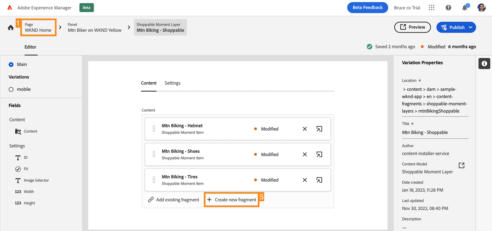

# Anpassa innehåll i en exempelapp {#customize-app}

>[!CONTEXTUALHELP]
>id="aemcloud_sites_trial_admin_content_fragments_react_app"
>title="Anpassa innehåll i en exempelapp för React"
>abstract="Din AEM headless-testversion är integrerad med en React-app som du kan anpassa."

>[!CONTEXTUALHELP]
>id="aemcloud_sites_trial_admin_content_fragments_react_app_guide"
>title="Starta redigeraren för innehållsfragment"
>abstract="Nu ska vi utforska hur headless content authoring fungerar. Din AEM headless-testversion är integrerad med en React-app så att du kan se hur enkelt det är för alla att hantera innehåll utan utvecklingstid.  Starta den här modulen på en ny flik genom att klicka nedan och följ sedan den här guiden."

>[!CONTEXTUALHELP]
>id="aemcloud_sites_trial_admin_content_fragments_react_app_guide_footer"
>title="I den här modulen lärde du dig att anpassa en exempelapp för React.  time to market: Accelerated! Utvecklingscykler: Minskade!  Nu förstår du hur enkelt det är att hantera headless-innehåll för webbplatser och appar som drivs av AEM headless-funktioner."
>abstract=""

## Förhandsgranska appen {#preview}

Du börjar i Content Fragment-redigeraren med exempelappen som medföljer AEM Headless-testversion redan inläst. Exempelappen drivs av innehållsfragment som levereras via GraphQL. Använd Content Fragment-redigeraren för att bekanta dig med redigeraren genom att förhandsgranska exempelappen.

1. Välj knappen **Förhandsgranska** längst upp till höger på redigeringsskärmen.

1. Demonstrationsappen öppnas på en ny flik. Appen är till för WKND:s påhittade livsstilsmärke. Bläddra nedåt på sidan för att navigera i exempelinnehållet.

1. Gå tillbaka till webbläsarfliken i Content Fragment-redigeraren för att fortsätta.

## Redigera en rubrik i appen {#edit-app}

Innehållsfragmentsredigeraren visar programmets grundläggande layout som ett sidinnehållsfragment. **Panelerna** representerar olika sidor i programmet, som alla är sina egna innehållsfragment. Genom att ändra dessa fragment kan du ändra innehållet i appen.

1. Välj **Mtn Biker i Canyon** i avsnittet **Paneler**.

   

1. Redigeraren öppnar programmets rubrikpanel för bergsbudgivaren. Varje panel består av lager som representerar olika bilder och text som utgör upplevelsen.

1. Markera textlagret **Mtn Biker i Canyon Text Layer** för att öppna detaljerna i lagret i redigeraren. Lagret består av flera innehållsfragment som styr texten som visas på den här panelen i programmet.

1. Markera textobjektet **Mtn Biker i cellanimeringsrubrik**. Då öppnas Content Fragment-redigeraren som visar innehållet i det här fragmentet och där du kan ändra det.

1. Ändra texten från `Your next great adventure is calling` till `Choose your own adventure`. Ändringen sparas automatiskt av redigeraren.

1. Välj **Förhandsgranska** längst upp till höger i fönstret för att se ändringarna. Förhandsgranskningen av demoappen öppnas på en ny flik.

   

Så enkelt är det att uppdatera innehåll i en React-app när den är integrerad i AEM headless CMS.

## Växla en bild i appen {#change-image}

Nu när du har ändrat en rubrik i appen kan du prova att ändra en bild.

1. Gå tillbaka till fliken för webbläsaren i redigeraren för innehållsfragment från förhandsgranskningen.

1. Du måste gå tillbaka till rätt plats i Content Fragment Editor. Bröderna högst upp till vänster i redigeraren visar var du befinner dig i innehållshierarkin. Välj **Mtn Biker i Canyon** i de vägbeskrivningar som du vill gå tillbaka till.

   

1. Markera bildlagret **Mtn Biking - Biker**. Då öppnas Content Fragment Editor

1. Markera **X** som du vill ta bort bitarsbilden. Bilden försvinner och redigeraren visar ett fel eftersom bilden krävs för den här modellen för innehållsfragment.

   

1. Välj **Lägg till resurs** och sedan **Bläddra i Assets** på snabbmenyn.

1. Dialogrutan **Välj resurs** öppnas och sökvägen **sample-wknd-app** > **en** > **image-files** väljs automatiskt åt dig.

1. Markera bilden `biker-yellow.png` och välj sedan **Markera**.

1. Bilden på den här färgväljaren ersätts med den valda bilden. Redigeraren sparar ändringarna automatiskt.

1. Välj **Förhandsgranska** längst upp till höger i fönstret för att se ändringarna. Förhandsgranskningen av demoappen öppnas på en ny flik. Klicka på Uppdatera i webbläsaren så ser du din nya bikerbild med gula kortkommandon i appen.

Det är så enkelt att uppdatera bilder och resurser i apparna med AEM headless CMS.

## Lägg till en referens till ett nytt innehållsfragment i appen {#create-moment}

Nu när du har uppdaterat bilden av budgivaren ska vi gå igenom hur man lägger till nytt innehåll i en app genom att skapa och referera till ett nytt innehållsfragment. Du kommer att lägga till ett produktsamtal som hanteras av innehållsfragmentet&quot;köpbart ögonblick&quot; på den andra panelen i programmet.

1. Gå tillbaka till fliken Webbläsare i redigeraren för innehållsfragment på fliken Förhandsgranska.

1. Du måste gå tillbaka till rätt plats i Content Fragment Editor. Bröderna högst upp till vänster i redigeraren visar var du befinner dig i innehållshierarkin. Välj **WKND Home** i vägbeskrivningarna om du vill gå tillbaka till den sidan.

1. Välj **Mtn Biker på panelen WKND Gul**.

1. Markera lagret **Mtn Biking - Shoppable**.

1. Om du vill ringa upp den här panelen skapar du en Content Fragment som kan köpas. Välj knappen **+ Skapa nytt fragment** .

   

1. Du måste först välja en modell som det nya innehållsfragmentet ska baseras på. Välj modellen **objekt för köpbart stund** i listrutan **Modell för innehållsfragment**.

1. Ge Content Fragment ett namn. Ange till exempel `Shorts` i fältet **Namn**.

1. Välj **Skapa och öppna**.

   

1. Redigeraren öppnas för ditt nya innehållsfragment.

1. Ge shoppingstunden ett namn i fältet **Text**, till exempel `Yellow shorts`.

1. Ange värden för **X** och **Y**. Här ska denna utlysning läggas över panelen. Ändringar i avsnittet sparas automatiskt av redigeraren

   * **X**: `-5`
   * **Y**: `-10`

1. Välj **Förhandsgranska** längst upp till höger i fönstret för att se ändringarna. Förhandsgranskningen av demoappen öppnas på en ny flik. Klicka på Uppdatera i webbläsaren för att testa placeringen och göra de justeringar som behövs i redigeraren.

   

Nu förstår du hur du kan skapa nytt innehåll och referera till det som ett innehållsfragment i appen utan några utvecklingscykler.
