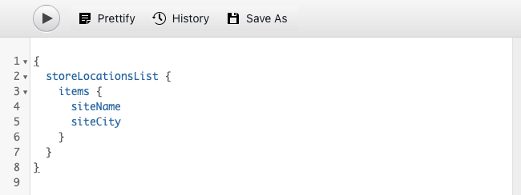

# Extrahera innehåll via GraphQL API {#extract-content}

Hittills i AEM för headless har du [har skapat egna Content Fragment-modeller](content-structure.md) har också skapat ett eget headless-innehåll [Innehållsfragment.](create-content.md) Nu kan du lära dig att använda innehållsfragment och GraphQL API som ett headless-system för innehållshantering för att leverera ditt innehåll.

GraphQL har ett frågebaserat API som tillåter externa klientprogram att fråga AEM efter endast det innehåll de behöver med ett enda API-anrop.

Först får du lära dig att köra två olika typer av frågor: **list** och **byPath** frågor. Sedan får du lära dig hur du hämtar innehåll från det innehållsfragment som du skapade tidigare. Det här dokumentet är ett komplement till den interaktiva rundturen, som omfattar samma steg och länkar till ytterligare resurser där så är lämpligt.

>[!TIP]
>
>Mer information om GraphQL API finns i [Avsnittet Ytterligare resurser](#additional-resources) i slutet av den här modulen för GraphQL API-guiden.

>[!CONTEXTUALHELP]
>id="aemcloud_sites_trial_admin_content_fragments_graphql"
>title="Extrahera innehåll med GraphQL API"
>abstract="I den här modulen får du lära dig hur du kan använda innehållsfragment och GraphQL API som rubriklöst innehållshanteringssystem."

>[!CONTEXTUALHELP]
>id="aemcloud_sites_trial_admin_content_fragments_graphql_guide"
>title="Starta GraphQL Explorer"
>abstract="GraphQL tillhandahåller ett frågebaserat API som tillåter externa klientprogram att fråga AEM efter endast det innehåll som behövs, med hjälp av ett enda API-anrop. Följ den här vägledningen när du vill lära dig hur du kör två olika typer av frågor och sedan hämtar innehåll från innehållsfragmentet som du skapade i en tidigare modul.<br><br>Starta funktionen på en ny flik genom att klicka nedan."
>additional-url="https://video.tv.adobe.com/v/328618" text="Platshållare för inledande video"

## GraphQL Explorer {#graphql-explorer}

Du startar i GraphQL Explorer. Här kan du skapa och köra frågor mot ditt headless-innehåll.


Om du vill navigera till GraphQL Utforskaren själv utanför vägledningen i appen visas den med ikonen Adobe längst upp till vänster på sidan. Då öppnas den globala navigeringen för AEM. Här väljer du **verktyg** och sedan **Allmänt** -> **GraphQL Query Editor**.

>[!TIP]
>
>Om du vill veta mer om navigering i AEM kan du läsa [Avsnittet Ytterligare resurser](#additional-resources) för mer information om AEM grundläggande hantering.

AEM testversioner innehåller en färdig slutpunkt med innehåll som du kan extrahera innehåll från i testsyfte.


Välj **AEM demoresurser** slutpunkt från **Slutpunkt** nedrullningsbar meny längst upp till höger i redigeraren, om den inte redan är det.

## Kopiera och köra en listfråga {#list-query}

Börja med en enkel listfråga för att kunna orientera dig AEM hur as a Cloud Service GraphQL API:er fungerar. Det här frågeexemplet returnerar en lista med allt innehåll som använder en viss Content Fragment-modell. Lagersidor och kategorisidor använder vanligtvis det här frågeformatet.

1. Kopiera följande kodfragment.

   ```text
   {
       adventureList {
         items {
            _path
            adventureTitle
            adventurePrice
            adventureTripLength
            adventurePrimaryImage {
              ... on ImageRef {
               _path
               mimeType
               width
               height
             }
           }
         }
      }
    }
   ```

1. Ersätt sedan det befintliga innehållet i frågeredigeraren genom att klistra in den kopierade koden.

   

1. När du har klistrat in klickar du på **Spela upp** längst upp till vänster i frågeredigeraren för att köra frågan.

1. När frågan har körts visas resultatet i den högra panelen bredvid frågeredigeraren. Om frågan är felaktig visas ett fel på den högra panelen.

   

Du har just validerat en listfråga för en fullständig lista över alla innehållsfragment. Den här processen bidrar till att säkerställa att svaret blir vad din app förväntar sig, med resultat som visar hur dina appar och webbplatser kommer att hämta innehåll som skapas i AEM.

De olika kanaler och plattformar där innehållet ska visas kan nu använda den här frågan eller liknande för att hämta ditt headless-innehåll.

## Kopiera och köra en byPath-fråga {#bypath-query}

Genom att köra en byPath-fråga kan du hämta resurser för ett visst innehållsfragment. Produktinformationssidor och sidor som fokuserar på en viss uppsättning innehåll kräver vanligtvis den här typen av fråga.

1. Kopiera följande kodfragment.

   ```text
    {
     adventureByPath(
       _path: "/content/dam/aem-demo-assets/en/adventures/bali-surf-camp/bali-surf-camp"
     ) {
       item {
         _path
         adventureTitle
         adventureDescription {
           json
         }
         adventurePrimaryImage {
           ... on ImageRef {
             _path
             width
             height
           }
         }
       }
     }
   }
   ```

1. Ersätt sedan det befintliga innehållet i frågeredigeraren genom att klistra in den kopierade koden.

   

1. När du har klistrat in klickar du på **Spela upp** längst upp till vänster i frågeredigeraren för att köra frågan.

1. När frågan har körts visas resultatet i den högra panelen bredvid frågeredigeraren. Om frågan är felaktig visas ett fel på den högra panelen.

1. När frågan har körts visas resultatet i den högra panelen bredvid frågeredigeraren. Om frågan är felaktig visas ett fel på den högra panelen.

   

Du har just validerat en listfråga för en fullständig lista över alla innehållsfragment. Den här processen bidrar till att säkerställa att svaret blir vad din app förväntar sig, med resultat som visar hur dina appar och webbplatser kommer att hämta innehåll som skapas i AEM.

De olika kanaler och plattformar där innehållet ska visas kan nu använda den här frågan eller liknande för att hämta ditt headless-innehåll.

## Kör frågor på ditt eget innehåll {#own-queries}

Nu när du har kört de två primära typerna av frågor är du redo att konfigurera och köra frågor för innehåll som du själv har skapat.

1. Om du vill köra frågor mot dina egna innehållsfragment ändrar du slutpunkten från **AEM demoresurser** mapp till **Ditt projekt** mapp.

   

1. Börja med att markera och ta bort allt befintligt innehåll i frågeredigeraren. Skriv sedan inledande hakparentes `{` och tryck på Ctrl+Blanksteg eller Alt+Blanksteg om du vill visa en lista över de modeller som definierats i modellen för innehållsfragment automatiskt. Välj den modell som du skapade och som slutar i `List` från listan.

   

1. Definiera de objekt som frågan ska innehålla för innehållsfragmentmodellen som du valde. Igen, skriv den öppna klammerparentesen `{`och trycker sedan på Ctrl+Blanksteg eller Alt+Blanksteg för att visa en lista som fylls i automatiskt. Välj `items` från listan.

   

1. Definiera fälten som frågan ska innehålla för innehållsfragmentmodellen som du valde. Igen, skriv den öppna klammerparentesen `{`Tryck sedan på Ctrl+Blanksteg eller Alt+Blanksteg för att få en lista över tillgängliga fält i modellen för innehållsfragment automatiskt. Välj fält som du vill använda från modellen i listan.

   

1. Avgränsa flera fält med kommatecken (`,`) eller blanksteg och tryck på Ctrl+Blanksteg eller Alt+Blanksteg igen för att markera ytterligare fält.

1. När du arbetar kan du trycka eller klicka på **Förtifiera** för att automatiskt formatera koden så att den blir lättare att läsa.

   

1. När du är klar trycker du på eller klickar på **Spela upp** längst upp till vänster i redigeraren för att köra frågan.

   

Så här kan ert innehåll levereras till digitala upplevelser i flera kanaler. Se [Avsnittet Ytterligare resurser](#additional-resources) om du vill ha fler exempelfrågor och se hur mycket mer du kan göra med GraphQL API.

## Du har lärt dig att fråga innehåll! {#conclusion}

Bra jobbat! Du har lärt dig mer om de två grundläggande typerna av frågor och hur du ställer frågor till ditt eget innehåll. Se till att du checkar ut [Avsnittet Ytterligare resurser](#additional-resources) om du vill ha fler exempelfrågor och lära dig mer om GraphQL API.

Om du vill veta hur extraherat innehåll sedan används i en anpassad React-app ska du kontrollera modulen [Anpassa innehåll i en exempelapp.](customize-app.md)

Du kan gå tillbaka till startskärmen för testversionen genom att klicka på **Lösningar** knappen längst upp till höger i navigeringsfältet och markera **Experience Manager**.


## Ytterligare resurser {#additional-resources}

Mer information om innehållsfragment och AEM finns i den här extra dokumentationen.

* [GraphQL API-guide](https://experienceleague.adobe.com/docs/experience-manager-learn/getting-started-with-aem-headless/graphql/multi-step/explore-graphql-api.html)
* [Grundläggande hantering](/help/sites-cloud/authoring/getting-started/basic-handling.md) - Dokumentation om hur du navigerar och använder AEM för nya användare
* [Att lära sig använda GraphQL med AEM - exempelinnehåll och frågor](https://experienceleague.adobe.com/docs/experience-manager-cloud-service/content/headless/graphql-api/sample-queries.html)
