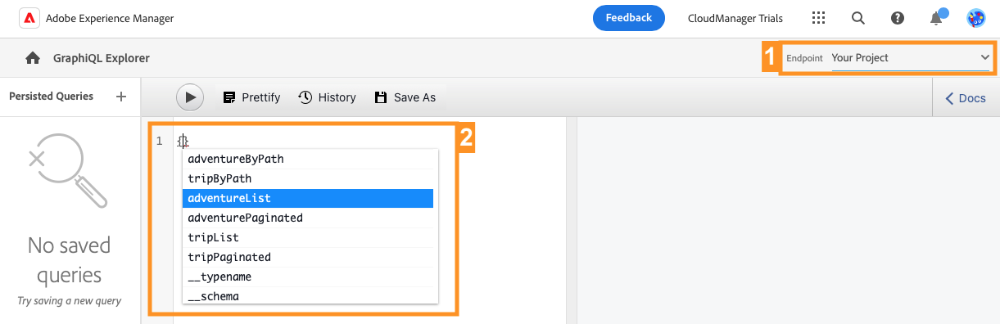

# Extrahera innehåll via GraphQL API {#extract-content}

>[!CONTEXTUALHELP]
>id="aemcloud_sites_trial_admin_content_fragments_graphql"
>title="Extrahera innehåll med GraphQL API"
>abstract="I den här modulen får du lära dig hur du kan använda innehållsfragment och GraphQL API som ett headless-system för innehållshantering."

>[!CONTEXTUALHELP]
>id="aemcloud_sites_trial_admin_content_fragments_graphql_guide"
>title="Starta GraphQL Explorer"
>abstract="GraphQL tillhandahåller ett frågebaserat API som tillåter externa klientprogram att fråga AEM efter endast det innehåll som behövs, med hjälp av ett enda API-anrop. Följ den här modulen för att lära dig hur du kör två olika typer av frågor. Lär dig sedan hur du hämtar innehållet från det innehållsfragment som du skapade i föregående modul.<br><br>Starta den här modulen på en ny flik genom att klicka nedan."

>[!CONTEXTUALHELP]
>id="aemcloud_sites_trial_admin_content_fragments_graphql_guide_footer"
>title="Snyggt jobbat! Du har lärt dig mer om de två grundläggande typerna av frågor och hur du ställer frågor till ditt eget innehåll. Du förstår nu hur du använder AEM GraphQL API för att skapa effektiva frågor som levererar innehåll i ett format som du förväntar dig av appen."
>abstract=""

## Fråga efter en lista med exempelinnehåll {#list-query}

Du börjar med GraphQL Explorer på en ny flik. Här kan du skapa och validera frågor mot ditt headless-innehåll innan du använder dem för att styra innehållet i din app eller på din webbplats.

1. Din AEM headless-testversion innehåller en förinläst slutpunkt med innehållsfragment som du kan extrahera innehåll från för testning. Se till att **AEM demoresurser** slutpunkten är markerad i **Slutpunkt** nedrullningsbar meny längst upp till höger i redigeraren.

1. Kopiera följande kodfragment för en listfråga för den förinlästa **AEM demoresurser** slutpunkt. En listfråga returnerar en lista med allt innehåll som använder en viss modell för innehållsfragment. Lagersidor och kategorisidor använder vanligtvis det här frågeformatet.

   ```text
   {
    adventureList {
     items {
       _path
       title
       price
       tripLength
       primaryImage {
         ... on ImageRef {
           _path
           mimeType
           width
           height
         }
       }
     }
    }
   }
   ```

1. Ersätt det befintliga innehållet i frågeredigeraren genom att klistra in den kopierade koden.

1. När du har klistrat in klickar du på **Spela upp** längst upp till vänster i frågeredigeraren för att köra frågan.

1. Resultatet visas i den högra panelen bredvid frågeredigeraren. Om frågan är felaktig visas ett fel på den högra panelen.

   

Du har just validerat en listfråga för en fullständig lista över alla innehållsfragment. Den här processen bidrar till att säkerställa att svaret blir vad din app förväntar sig, med resultat som visar hur dina appar och webbplatser kommer att hämta innehåll som skapas i AEM.

## Fråga efter en viss del av exempelinnehållet {#bypath-query}

Genom att köra en byPath-fråga kan du hämta innehåll för ett visst innehållsfragment. Produktinformationssidor och sidor som fokuserar på en viss uppsättning innehåll kräver vanligtvis den här typen av fråga.

1. Kopiera följande kodfragment för en byPath-fråga för den förinlästa **AEM demoresurser** slutpunkt.

   ```text
    {
     adventureByPath(
       _path: "/content/dam/aem-demo-assets/en/adventures/bali-surf-camp/bali-surf-camp"
     ) {
       item {
         _path
         title
         description {
           json
         }
         primaryImage {
           ... on ImageRef {
             _path
             width
             height
           }
         }
       }
     }
   }
   ```

1. Ersätt det befintliga innehållet i frågeredigeraren genom att klistra in den kopierade koden.

1. När du har klistrat in klickar du på **Spela upp** längst upp till vänster i frågeredigeraren för att köra frågan.

1. Resultatet visas i den högra panelen bredvid frågeredigeraren. Om frågan är felaktig visas ett fel på den högra panelen.

   

Du har just validerat en byPath-fråga för att hämta ett specifikt innehållsfragment som identifieras av sökvägen för det fragmentet.

## Fråga ditt eget innehåll {#own-queries}

Nu när du har kört de två primära typerna av frågor kan du fråga efter ditt eget innehåll.

1. Om du vill köra frågor mot dina egna innehållsfragment ändrar du slutpunkten från **AEM demoresurser** mapp till **Ditt projekt** mapp.

1. Ta bort allt befintligt innehåll i frågeredigeraren. Skriv sedan inledande hakparentes `{` och tryck på Ctrl+Blanksteg eller Alt+Blanksteg om du vill visa en lista över de modeller som definierats i slutpunkten automatiskt. Välj den modell som du skapade och som slutar i `List` från alternativen. Om du följde exemplen i de tidigare modulerna bör du hitta `adventureList` i listan Komplettera automatiskt.

   

1. Definiera de objekt som frågan ska innehålla för den valda innehållsfragmentmodellen. Igen, skriv inledande hakparentes `{`och trycker sedan på Ctrl+Blanksteg eller Alt+Blanksteg för att visa en lista som fylls i automatiskt. Välj `items` från alternativen.

1. Tryck eller klicka på **Förtifiera** för att automatiskt formatera koden så att den blir lättare att läsa.

1. När du är klar trycker du på eller klickar på **Spela upp** längst upp till vänster i redigeraren för att köra frågan. Redigeraren fyller i `items`, som kortfattat markeras med gult och frågan körs.

1. Resultatet visas i den högra panelen bredvid frågeredigeraren.

   

Så här kan ert innehåll levereras till digitala upplevelser i flera kanaler.

## Beständiga frågor {#persisted-queries}

Beständiga frågor är det bästa sättet att exponera GraphQL API för klientprogram. När en fråga har sparats kan den begäras med hjälp av en GET-begäran och cachas för snabb hämtning.

Du skapar en beständig fråga som innehåller data som du vill använda från klientprogrammet.

1. Du kommer att använda de data som du skapade som ett innehållsfragment tidigare, så se till att **Ditt projekt** slutpunkten är markerad i **Slutpunkt** nedrullningsbar meny längst upp till höger i redigeraren.

1. Kopiera följande kodfragment.

   ```text
      {
      adventureList {
       items {
         title
         description {
           plaintext
         }
         price
         image {
           ... on ImageRef {
             _publishUrl
             mimeType
           }
         }
       }
     }
   }
   ```

1. Ersätt det befintliga innehållet i frågeredigeraren genom att klistra in den kopierade koden.

   >[!NOTE]
   >
   >Om du inte använde samma fältbeskrivningar som i de tidigare modulerna uppdaterar du fältnamnen i den här frågan.
   >
   >Använd funktionen Komplettera automatiskt (Ctrl+Blanksteg eller Alt+Blanksteg) i GraphQL så som beskrivs ovan för att identifiera de tillgängliga egenskaperna.

1. När du har klistrat in klickar du på **Spela upp** längst upp till vänster i frågeredigeraren för att köra frågan.

1. Resultatet visas i den högra panelen bredvid frågeredigeraren. Om frågan är felaktig visas ett fel på den högra panelen.

   

1. När du är nöjd med frågan klickar du på **Spara som** längst upp i frågeredigeraren för att behålla frågan.

1. I **Frågenamn** ge frågan namnet `adventure-list`.

1. Tryck eller klicka **Spara som**.

   

1. Frågan bevaras så som den bekräftas av ett banderollmeddelande längst ned på skärmen. Frågan visas även i den vänstra panelen med beständiga frågor i fönstret.

1. För att den beständiga frågan ska vara tillgänglig för allmänheten måste den publiceras, på ungefär samma sätt som dina innehållsfragment måste publiceras. Klicka **Publicera** längst upp till höger i frågeredigeraren för att publicera frågan.

1. Publiceringen bekräftas av ett banderollmeddelande.

Nu har du en ny beständig fråga som bara innehåller de specifika egenskaper och format som du har definierat.
