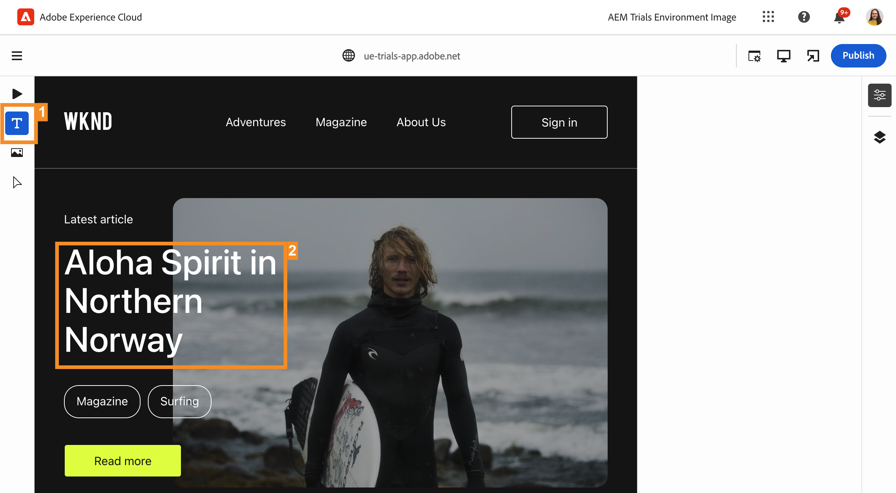
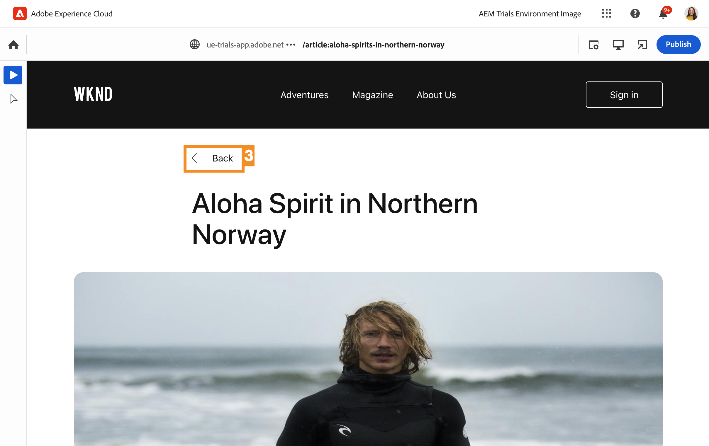

# Redigera i sammanhang {#editing-in-context}

>[!CONTEXTUALHELP]
>id="aemcloud_sites_trial_edit_inline_universal_editor"
>title="Redigera i sitt sammanhang"
>abstract="Se hur era headless-appar kan utnyttja den universella redigeraren för att ge dina författare lättanvända kontextredigeringar."

>[!CONTEXTUALHELP]
>id="aemcloud_sites_trial_edit_inline_universal_editor_guide"
>title="Starta den universella redigeraren"
>abstract="I den här guiden ska vi utforska den universella redigeraren och se hur den gör det möjligt för alla att redigera alla delar av ditt innehåll i alla implementeringar, vilket leder till förbättrad innehållshastighet.  Starta den här modulen på en ny flik genom att klicka nedan och följ sedan den här guiden."

>[!CONTEXTUALHELP]
>id="aemcloud_sites_trial_edit_inline_universal_editor_guide_footer"
>title="I den här modulen lärde du dig att anpassa innehåll i sitt sammanhang och på plats med den universella redigeraren."
>abstract=""

## Redigera text i kontext {#edit-text}

Redigering på plats och i sitt sammanhang kan ofta vara fördelaktigt jämfört med strukturerad redigering av headless-innehåll, som i Content Fragment-redigeraren, som du såg i tidigare moduler.

>[!NOTE]
>
>Om du vill använda den universella redigeraren i den här testversionen måste du använda Chrome som webbläsare och inte i Incognito-läge. Detta är en begränsning av testversionen, inte av Universal Editor.

Med den universella redigeraren kan du smidigt redigera text både i sitt sammanhang och på plats, vilket gör det enkelt och intuitivt att skapa innehåll.

1. Redigeraren bör läsas in som standard i **Text** läge. Om inte, tryck eller klicka på **Text** i fältet mode till vänster om redigeraren.

1. Tryck eller klicka på titeln för den senaste artikeln för att redigera den.

   

1. Komponenten markeras enligt en blå kant med en tabb som anger att det är en textkomponent. Det finns en markör i kanten som väntar på textinmatning. Ändra texten till `Aloha Spirit in Lofoten`.

   

1. Tryck på Enter eller tryck eller klicka utanför textkomponenten så sparas ändringarna automatiskt.

Den universella redigeraren sparar ändringarna automatiskt i redigeringsmiljön. Du måste fortfarande publicera dem så att läsarna kan se dem, vilket vi gör i ett senare steg.

## Redigera media i kontext {#edit-media}

Du kan också byta ut bilder samtidigt som du behåller innehållet genom att använda den universella redigeraren.

1. Ändra redigeraren till **Media** genom att trycka på eller klicka på **Media** på skrivskenan.

1. Tryck eller klicka på surfarens bild för att markera den.

1. I komponentspåret kan du se detaljerna för resursen. Tryck eller klicka **Ersätt**.

   

1. I **Välj resurser** bläddra nedåt och tryck eller klicka på `surfer-wave-02.JPG` för att markera den.

1. Tryck eller klicka **Välj** i **Välj resurser** -fönstret.

   

Bilden ersätts med den bild du har markerat.

## Upplev ert innehåll som er Reader {#emulators}

Med den universella redigeraren kan du interagera med ditt innehåll i dess sammanhang och se innehållet så som det levereras till användarnas enheter.

1. Som standard återger redigeraren skrivbordsversionen av ditt innehåll. Tryck eller klicka på emulatorknappen längst upp till höger i redigeraren för att ändra målenheten.

   

1. Reader kan finnas på olika enheter med olika proportioner, så redigeraren erbjuder emuleringslägen för att se hur sidan kommer att visas för användarna. Välj till exempel alternativet för mobil enhet i stående läge.

   

1. Se innehållsändringen i redigeraren. Emulatorns ikon ändras också för att återspegla det läge emulatorn är i. Tryck eller klicka var som helst utanför emulatormenyn för att stänga den och interagera med innehållet.

1. Återställa emulatorn till skrivbordsläge.

Du kan också ange exakta dimensioner för emulatorn och rotera den emulerade enheten för att kunna visa innehållet på valfri målenhet.

## Förhandsgranska och publicera {#preview}

Eftersom du behöver trycka eller klicka på innehållet för att markera det i redigeraren kan du inte följa länkar eller interagera med innehållet genom att trycka eller klicka när det är i redigeringsläge. I förhandsgranskningsläget kan du följa länkarna i ditt innehåll och uppleva det som användarna gör innan de publicerar det.

1. Tryck eller klicka i fältet mode till vänster om redigeraren **Förhandsgranska**.

1. Tryck eller klicka på **Läs mer** för huvudartikeln.

   

1. Bläddra i artikeln och använd sedan **Bakåt** för att gå tillbaka till huvudsidan.

   

1. Tryck eller klicka på **Publicera** längst upp till höger i redigeraren för att publicera ditt innehåll.

   

Ditt innehåll publiceras.

## Redigera innehållsfragment {#editing-fragments}

För att snabba upp redigeringen av innehåll när strukturerad redigering av headless-innehåll är mer fördelaktig än redigering på plats, ger den universella redigeraren snabb åtkomst även till Content Fragment-redigeraren.

1. Bläddra längre ned på sidan till sidan **Annonser** -avsnitt.

1. I fältet mode till vänster om redigeraren väljer du **Komponenter**. På så sätt kan du välja sidkomponenter i redigeraren.

1. Tryck eller klicka på någon av äventyren för att markera den.

   * Observera den markerade komponentens blå kontur. Fliken ska vara **referens** när ett innehållsfragment är markerat.
   * Eftersom den universella redigeraren tillåter att du markerar ett objekt på sidan, kan komponenter som är delar av ett innehållsfragment också markeras individuellt. Tryck eller klicka där det visas på bilden för att markera hela komponenten för innehållsfragment.

1. En ny **Redigera** visas på skrivlisten. Tryck eller klicka på **Redigera** om du vill öppna redigeraren för innehållsfragment på en ny flik.

På den nya fliken kan du nu redigera det innehållsfragment du har valt i den universella redigeraren.
